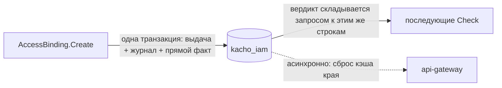

# Модель авторизации

Эта страница объясняет, **как Kachō решает, можно ли действие**. Доступ выражается не списком
правил в коде, а набором *отношений* между субъектами и объектами. Роль и привязка
([Role](/api/role), [AccessBinding](/api/access-binding)) — способ такие отношения *объявить*; в
рантайме проверка — запрос к реляционной форме в собственной базе IAM, разложенный по модели
прав.

## Ключевые понятия

<table>
  <thead><tr><th>Понятие</th><th>Смысл</th></tr></thead>
  <tbody>
    <tr><td><strong>Субъект</strong></td><td>Кто действует: <code>user:usr…</code> / <code>service_account:sva…</code> / <code>group:grp…#member</code></td></tr>
    <tr><td><strong>Объект</strong></td><td>Над чем: <code>account:acc…</code> / <code>project:prj…</code> / <code>vpc_network:enp…</code> / singleton <code>cluster:cluster_kacho_root</code></td></tr>
    <tr><td><strong>Отношение</strong></td><td>Связь субъект↔объект: <code>viewer</code> / <code>editor</code> / <code>admin</code> / verb-bearing <code>v_get</code>/<code>v_update</code>/… / <code>owner</code></td></tr>
    <tr><td><strong>Прямой факт</strong></td><td>Записанная тройка <code>(объект, отношение, субъект)</code> в базе IAM</td></tr>
    <tr><td><strong>Scope / tier</strong></td><td>Уровень иерархии привязки: CLUSTER ▶ ACCOUNT ▶ PROJECT</td></tr>
  </tbody>
</table>

## Явная per-object flat-модель

Модель Kachō — **явная и плоская**: доступ к объекту выражается прямыми отношениями на этом
объекте, без неявного каскада вниз по иерархии и без организационного уровня над аккаунтом.
Привязка на PROJECT-scope даёт доступ к ресурсам проекта; привязка на ACCOUNT-scope — к самому
аккаунту и его содержимому через явные отношения, которые IAM записывает. «Иерархия» — это набор
явных отношений, а не рекурсивная функция резолюции.

## Verb-bearing отношения

Центральный механизм — **verb-bearing отношения**. На каждый метод чтения/мутации ресурса
gateway проверяет **точное** отношение, соответствующее глаголу, а не грубое tier-отношение:

<table>
  <thead><tr><th>Метод</th><th>Требуемое отношение</th></tr></thead>
  <tbody>
    <tr><td><code>Get</code></td><td><code>v_get</code></td></tr>
    <tr><td><code>Update</code> / мутирующие <code>:verb</code> (AddMember, ...)</td><td><code>v_update</code></td></tr>
    <tr><td><code>Delete</code></td><td><code>v_delete</code></td></tr>
    <tr><td>per-resource <code>List</code> / <code>ListOperations</code> / <code>ListMembers</code></td><td><code>v_list</code></td></tr>
    <tr><td>Создание дочернего (Project/User/SA/Group/Role в Account)</td><td><code>editor</code> на контейнере</td></tr>
  </tbody>
</table>

`v_*`-отношения **развязаны** с tier-ролями: наличие `editor` на объекте не означает автоматически
`v_get` — verb-bearing грант выдаётся явно правилом роли. Это исключает завышение прав, когда
широкая tier-роль «протекает» в мелкие действия. Роль с правилом `{module: iam, resources:
[projects], verbs: [get, list]}` материализует `v_get`/`v_list` на объектах-проектах в пределах
scope привязки — и ровно их.

```mermaid
flowchart LR
  rpc["RPC Get(project prj_x)"] --> gw["gateway authz-middleware"]
  gw -->|"Check(user:usr_y, v_get, project:prj_x)"| iam["kacho-iam: реляционная форма"]
  iam -->|"allow"| ok["выполнить"]
  iam -->|"deny"| no["403 PERMISSION_DENIED"
```

## List — scope-filter, а не Check

Top-level `List` (Account / Project / User / ServiceAccount / Group / Role) **нельзя** гейтить
одним `Check`: у списка нет единого объекта, а `Check` на `project:*` выдал бы default-deny (403)
всем. Поэтому такие `List` **освобождены** от per-RPC Check на gateway и default-deny реализован
**фильтром страницы в handler'е**: возвращается `200` и только те ресурсы, что видит субъект.
Пустой список, если ничего не видно — **никогда 403**. Handler — авторитетный гейт видимости.

### Предикат страницы = отношение чтения

Строка попадает в страницу `List` **тогда и только тогда, когда вызывающий вправе прочитать этот
объект одиночным `Get`**. Предикат страницы и отношение, которым gateway гейтит `<Service>/Get`, —
одно и то же: **`v_get`**.

Это не сужение выданного доступа, а совпадение двух поверхностей. Ярусные отношения
(`viewer`/`editor`/`admin`) и глагольные (`v_*`) в модели **развязаны** — ни одно не выводится из
другого, — поэтому предикат, собранный из ярусных отношений, и `v_get` описывали бы разные
множества, и список расходился бы с чтением по id в обе стороны. Все три каскадных супер-уровня и
владелец аккаунта резолвят `v_get` структурно (`or super_admin`, у `account` — ещё `or owner`), а
реконсайлер эмитит `v_get` для каждой роли, объявляющей глагол `get`.

<table>
  <thead><tr><th>Тип объекта</th><th>Предикат страницы</th></tr></thead>
  <tbody>
    <tr><td><code>account</code> / <code>project</code> / <code>iam&#95;user</code> / <code>iam&#95;group</code> / <code>iam&#95;service&#95;account</code> / <code>iam&#95;access&#95;binding</code></td><td><code>v&#95;get</code></td></tr>
    <tr><td><code>iam&#95;role</code></td><td><code>viewer</code> ∪ <code>v&#95;list</code> — см. ниже</td></tr>
  </tbody>
</table>

`iam_role` — единственный тип, чьё чтение по id каталог прав не гейтит отношением вовсе
(`<exempt>`): одиночное чтение кастомной роли энфорсится **в сервисе** той же функцией, что
фильтрует страницу. Обе поверхности задают один вопрос и разойтись не могут.

### Стоимость страницы

Видимость резолвится **страницей**, а не перечислением всего, что доступно субъекту, поэтому
стоимость масштабируется размером страницы, а не населением типа. Ошибка резолюции прерывает её
целиком (fail-closed) — частично отфильтрованная страница не отдаётся никогда.

Раньше здесь стоял размен, которого больше нет. Перечисление доступного во внешнем хранилище
отношений имело **жёсткий серверный предел и не имело продолжения**: запрос не нёс поля страницы,
предел был общим на тип, а не по-арендаторным, и объект сверх предела становился владельцу
невидим **навсегда при живых правах**. Реляционная форма перечисляет курсором по собственной
таблице, поэтому предела нет by construction, а `nextPageToken` наконец означает то, что обещает
контракт.

:::warning Освобождение снимает authz, но не authN
`<exempt>`-RPC (List'ы, `Role.Get`, `WhoAmI`, `Account.Create`, `AccessBinding.Create`,
`PermissionCatalog`) не проходят per-RPC Check, но **анонима всё равно отвергает**
anti-anonymous интерсептор IAM (`UNAUTHENTICATED`). Освобождается только *авторизация*.
:::

## Owner и cluster-admin

- **Owner** аккаунта (`ownerUserId`) получает полный доступ к содержимому аккаунта через
  cluster-role owner-механику; при создании аккаунта заводится защищённая owner-привязка
  (`deletionProtection=true`).
- **cluster-admin** (`systemAdmin` на singleton `cluster:cluster_kacho_root`) — short-circuit:
  проходит любой per-resource Check. Это платформенный администратор.
- **grant-authority** — право *выдавать* доступ (`AccessBinding.Create`): владелец
  аккаунта-владельца scope ИЛИ FGA `admin` на объекте scope. Проверяется в handler'е, т.к. тип
  объекта scope зависит от запроса.

## Step-up (ACR floor)

`required_acr_min=2` — **минимальный уровень свежести аутентификации** (second-factor): если ACR
токена ниже требуемого, запрос отклоняется независимо от наличия отношения. Service→service-вызовы
(SA-principal) освобождены от ACR-floor.

Floor стоит на **узком наборе** RPC, а не на пользовательской поверхности целиком: из 289 записей
каталога прав его несут 24, из них 22 — в IAM. Критерий — операция меняет posture безопасности:
выдача учётных данных (`UserTokenService.Issue`/`Revoke`, `SAKeyService.Issue`/`Revoke`), выдача и
отзыв прав (`AccessBindingService.Create`/`Update`/`Delete`/`Revoke`, `InternalClusterService.
GrantAdmin`/`RevokeAdmin`, `RoleService.Update`/`Delete`, `GroupService.AddMember`/`RemoveMember`),
блокировка и приглашение пользователя, включение/выключение ServiceAccount, необратимое удаление
(`AccountService`/`ProjectService`/`GroupService`.`Delete`).

Рутинные чтения и обычный CRUD ресурсов floor **не несут**: сплошной step-up превратил бы
повторную аутентификацию в фоновый шум, на который перестают смотреть, и ничего бы не защитил.

## Условия на кортежах

Условие — предикат, который обязан быть истинным, чтобы отношение считалось действующим. Условия
объявлены в модели прав и вычисляются при проверке по контексту запроса, собранному на краю:

<table>
  <thead><tr><th>Условие</th><th>Семантика</th></tr></thead>
  <tbody>
    <tr><td><code>mfa&#95;fresh</code></td><td>acr=3 (passkey/FIDO2) + <code>webauthn</code> в amr + MFA не старше 15 минут</td></tr>
    <tr><td><code>non&#95;expired</code></td><td><code>now() &lt; valid&#95;until</code></td></tr>
    <tr><td><code>source&#95;ip&#95;in&#95;range</code></td><td>Source IP входит в один из настроенных CIDR</td></tr>
    <tr><td><code>jit&#95;window</code></td><td>Разрешено в течение <code>ttl&#95;seconds</code> после активации</td></tr>
    <tr><td><code>business&#95;hours</code></td><td>Пн–Пт в интервале <code>[start&#95;h, end&#95;h)</code> в настроенном TZ</td></tr>
    <tr><td><code>device&#95;compliant</code></td><td>WebAuthn device-attestation в списке одобренных AAGUID</td></tr>
  </tbody>
</table>

**Условие задаёт сервер, а не тенант.** Оно навешивается там, где его объявляет сама модель: тип
`cluster` принимает субъекта в отношение `console` только `with mfa_fresh`, тип
`compute_instance` — так же для `ssh`/`console`. Ключ условия выбирает платформа при написании
модели; в запросе на выдачу прав условие не передаётся.

:::warning Привязка условия не несёт
`AccessBinding` **не имеет** полей условия. Теги `9`/`14` и имена `condition_id` /
`builtin_condition` в контракте зарезервированы (`reserved`), тенантского ресурса условия и его
REST-поверхности не существует. Ни один путь принятия решения эти поля не читал, поэтому они сняты
с контракта целиком, а не оставлены «на будущее»: поле, которое принимают и не читают, обещает
возможность, за которую никто не отвечает. Будущий дизайн условий на выдаче начнётся с чистого
номера поля.
:::

## Где хранится право и когда оно начинает действовать

Роли и привязки лежат в Postgres IAM — и **решение о доступе вычисляется там же**. Мутация
привязки в одной транзакции пишет строку выдачи, строку журнала намерений и прямой факт,
складываемый из неё триггером журнала. Отдельного хранилища отношений, до которого право должно
«доехать», не существует.

Владение ресурсами других сервисов (VPC / Compute / NLB) регистрируется через
`InternalIAMService.RegisterResource` — модули пишут отношение не сами, а через IAM.



:::tip Право действует с момента фиксации
`Operation.done=true` означает, что выдача **уже действует**: вызов, идущий мимо кэша края, видит
её сразу. Отстать может кэш прав на api-gateway — его сброс идёт очередью, — поэтому первый вызов
сразу после создания привязки стоит повторить с небольшим отступом. Повтор нужен из-за **кэша**,
а не из-за распространения права.
:::

:::note Здесь была задержка распространения — её больше нет
Прежняя редакция обещала «~0.6–2 c пропагации», пока право доезжало до внешнего хранилища
отношений очередью. Ни хранилища, ни очереди к нему не существует, и состояние «привязка создана,
но право ещё не действует» **невыразимо by construction**. Цена размена названа прямо:
недоступность базы IAM теперь означает отказ в доступе целиком — раньше это выглядело как две
независимые поломки, но и тогда было одной (каскад супер-доступа читался из тех же строк).
:::

## Fail-closed

Недоступность базы IAM на пути запроса → отказ (`UNAVAILABLE`), не «разрешить по умолчанию». Internal-периметр (`:9091`) mTLS-обязателен и всё равно гейтит каждый RPC. Анонимный
запрос отвергается везде. Модель — **secure-by-default**; см. также
[Особенности дизайна](/advanced/design-decisions).
