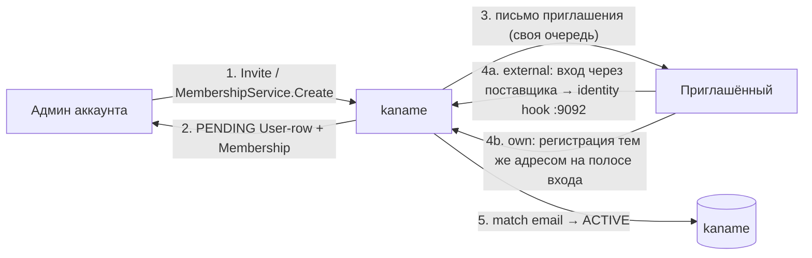
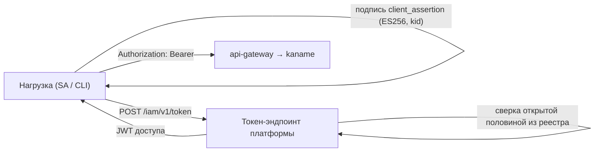

# Идентичность и токены

Эта страница объясняет, **как в Kaname появляется личность и как она аутентифицируется**. Ответ
зависит от **посадки личности** установки — ключа `authn.identity-provider`, — и посадок две.
Умолчания у ключа нет намеренно: незаданное значение — отказ старта с именем ключа.

<table>
  <thead><tr><th></th><th><code>external</code></th><th><code>own</code></th></tr></thead>
  <tbody>
    <tr><td>кто проверяет человека</td><td>внешний поставщик удостоверений (Ory Kratos + Ory Hydra)</td><td>сама служба: свои способы входа, своя сессия</td></tr>
    <tr><td>кто держит форму входа</td><td>самообслуживание поставщика (страницы <code>/login</code>, <code>/registration</code>, <code>/settings</code>, <code>/recovery</code>, которые раздаёт консоль платформы)</td><td>консоль платформы; тела форм уходят на <a href="/api/auth-lane">полосу входа</a> службы через край</td></tr>
    <tr><td>печенье сессии</td><td><code>ory_kratos_session</code> — печенье поставщика</td><td><code>kaname_session</code> — наше; срок <code>authn.login.session-ttl</code>, гасится выходом на стороне сервера</td></tr>
    <tr><td>уровень уверенности сессии</td><td>из <code>session.authenticator_assurance_level</code> поставщика: <code>aal1</code> → <code>1</code>, <code>aal2</code> → <code>2</code></td><td>объявляет сама сессия: пароль → <code>1</code>, пароль плюс код по времени или запасной код → <code>2</code></td></tr>
    <tr><td>второй фактор</td><td>заводится в самообслуживании поставщика (<code>/settings</code>): код по времени, запасные коды</td><td>заводится на полосе входа: <code>/iam/v1/auth/second-factor/&#42;</code>, церемония повышения — <code>/iam/v1/auth/step-up</code></td></tr>
    <tr><td>восстановление доступа</td><td>поток поставщика (код письмом); служба узнаёт о завершении хуком <code>InternalUserService.OnRecoveryCompleted</code> на <code>:9092</code> и гасит сессии</td><td>наш код письмом: <code>/iam/v1/auth/recovery</code> → <code>/iam/v1/auth/recovery/complete</code></td></tr>
    <tr><td>программные токены</td><td colspan="2">на обеих посадках выпускает платформа своим подписантом там, где объявлен её токен-эндпоинт (<code>authn.token-signing</code> + <code>authn.client-token</code>); под <code>external</code> без него — внешний OAuth-сервер</td></tr>
    <tr><td>что обязательно при старте</td><td>три адреса поставщика и корень доверия к нему</td><td>слушатель полосы входа, величины полосы (<code>authn.login.&#42;</code>), обёртка секретов второго фактора, окно свежести, своя чеканка</td></tr>
  </tbody>
</table>

:::warning Посадка `own` — состояние на линии, названное с предикатом
Пять причин, по которым страж посадки отказывал `own` при старте (kaname#21), на линии
`release/iam-lines` закрыты: наблюдатель провязки читает собранную полосу, а не литерал, и
предъявляемые уровни — `["1","2"]`. **Не измерен остаток предиката снятия — живой старт
восьми слушателей под `own`.** Пока kaname#21 открыта, а боевой профиль чарта объявляет
`identityProvider: external`, читайте `own` как посадку, чьи условия старта названы, но
подъём которой ещё не подтверждён прогоном. Предикат:

```sh
go test ./cmd/kaname/ -run TestEveryLaneIsEitherProfiledOrProvablyUnreachable -v   # что говорит страж о полосе own
grep -n 'identityProvider:' deploy/values.prod.yaml                                   # что объявляет боевой профиль
```
:::

## Действующие лица

<table>
  <thead><tr><th>Компонент</th><th>Роль</th><th>Посадка</th></tr></thead>
  <tbody>
    <tr><td><strong>kaname</strong></td><td>Личность платформы (User — одна строка на человека) и её членства в аккаунтах, реестр удостоверений, модель прав; под <code>own</code> — ещё способы входа человека, его сессия и второй фактор</td><td>обе</td></tr>
    <tr><td><strong>api-gateway</strong></td><td>Проверяет удостоверение на каждом внешнем запросе: JWT доступа в <code>Authorization: Bearer</code> либо печенье сессии; под <code>own</code> ретранслирует формы входа на слушатель полосы входа</td><td>обе</td></tr>
    <tr><td><strong>Ory Kratos</strong></td><td>Хранилище личностей и интерактивный вход (пароль / passkey / восстановление); дёргает хуки службы на <code>:9092</code></td><td><code>external</code></td></tr>
    <tr><td><strong>Ory Hydra</strong></td><td>OAuth 2.0 / OIDC authorization server: <code>authorization_code</code> для человека; программные токены там, где токен-эндпоинт платформы не объявлен</td><td><code>external</code></td></tr>
  </tbody>
</table>

## User — личность платформы

Ресурс [User](/api/user) — **одна строка на человека** на всю платформу, независимо от числа
его аккаунтов. Под `external` поле `externalId` хранит `sub` из поставщика, а `email`
используется для сопоставления при первом входе; под `own` внешней личности нет, и
сопоставление идёт по адресу почты на регистрации.

Принадлежность аккаунтам выражает отдельный ресурс — [Membership](/api/membership), и их у
одного человека может быть несколько.

:::note Здесь было написано обратное — «проекция в пределах одного аккаунта»
Прежняя редакция утверждала, что одной внешней личности соответствует несколько User-строк, по
одной на аккаунт. Так было, пока человек был строкой **в** аккаунте, и утверждение пережило
свой предмет.

Оно не удалено, а перевёрнуто на месте, потому что читалось как **граница безопасности**: по
нему выходило, что запрет входа (`Block`) действует в пределах аккаунта, а идентификатор
человека годится ключом внешнего справочника только вместе с аккаунтом. Верно обратное по
обоим пунктам — см. [User](/api/user).
:::

### Поток приглашения и активации



1. Админ вызывает `UserService.Invite(email)` либо `MembershipService.Create` — заводится
   `PENDING`-строка личности (если её ещё нет) и членство в аккаунте.
2. Письмо приглашения составляет и отправляет сама служба — намерение ставится в очередь
   `invite_mail_outbox` той же транзакцией, что и строка. Ссылки первого входа письмо и ответ
   **не несут**: доступ даёт владение почтовым ящиком. Письмо уходит, пока личность не вошла ни
   разу (`inviteStatus = PENDING`), — и на первом приглашении, и на повторном, в пределах
   `invite.mailRateLimit`; не дошло — `UserService.ResendInvite`. Пока почтовый узел не
   объявлен (`inviteMail.relay`, `inviteMail.from`), письмо не уходит, и это видно счётчиком
   исходов отправки.
3. Первый вход — по посадке. Под `external` приглашённый входит через поставщика, и тот дёргает
   **identity-hook** службы (слушатель `:9092`, mTLS): служба сопоставляет адрес с
   `PENDING`-строкой, переводит её в `ACTIVE` и заполняет `externalId`. Под `own` приглашённый
   **регистрируется тем же адресом** на [полосе входа](/api/auth-lane): регистрация активирует
   строку и второго личного аккаунта не заводит.
4. Первый вход переводит в `ACTIVE` **все** приглашённые членства человека разом.

`inviteStatus` отражает состояние личности: `PENDING` (приглашён, не входил) → `ACTIVE` (вошёл)
→ `BLOCKED` (отключён администратором облака). Принял ли человек приглашение **в конкретный
аккаунт**, отвечает `Membership.state`.

:::info Bootstrap-root
Первый администратор кластера задаётся через `KANAME_BOOTSTRAP_ROOT_EMAIL`: при первом входе
пользователя с этим email ему выдаётся cluster-admin, разрывая «курицу и яйцо» первичной настройки.
:::

## Сессия человека — по посадке

Под `external` сессия принадлежит поставщику: край на каждом запросе спрашивает у него
`/sessions/whoami` по печенью `ory_kratos_session`, читает субъекта и уровень
`authenticator_assurance_level`, и сверяет момент аутентификации с отсечкой отзыва службы
(выход, смена пароля, блокировка).

Под `own` сессия — **наша запись**. Полоса входа выдаёт печенье `kaname_session`
(`HttpOnly; Secure; SameSite=Lax`, срок `authn.login.session-ttl`); край на каждом запросе
спрашивает службу `InternalHumanSessionService.Resolve` на внутреннем слушателе — ничего не
кэшируя, потому что кэшированный ответ нельзя отозвать выходом или блокировкой. Выход
(`/iam/v1/auth/logout`) гасит запись на стороне сервера; смена пароля и завершение
восстановления гасят **все** сессии человека.

Ответ «сессии нет» **один** на все причины — неизвестный носитель, погашенная запись, истёкший
срок, заблокированная личность: причины видны только в счётчиках и журнале службы.

## Токены — OAuth 2.0, издателей может быть два

Программная аутентификация (без интерактивного входа) идёт по стандарту OAuth 2.0. **Кто выпускает
токен, зависит от установки:** там, где объявлен токен-эндпоинт платформы, его выпускает платформа
своим подписантом; где не объявлен — внешний OAuth-сервер (это возможно только под `external`).
Издатель записан в самом токене, поэтому определить его можно по токену, а не по догадке.

Интерактивный вход человека токен-эндпоинт платформы не обслуживает ни на одной посадке: вида
выдачи `authorization_code` он не принимает. Человек входит либо у поставщика (`external`), либо
на полосе входа службы (`own`); удостоверение для терминала он выпускает уже своей сессией —
[Первое удостоверение](/first-credential).

Два вида кредов, симметричных по устройству (см. [Токены доступа](/api/tokens)):

<table>
  <thead><tr><th>Кред</th><th>Субъект</th><th>Применение</th><th>ID-префикс маппинга</th></tr></thead>
  <tbody>
    <tr><td><strong>SAKey</strong></td><td>ServiceAccount</td><td>Рабочие нагрузки, CI, интеграции</td><td><code>soc</code></td></tr>
    <tr><td><strong>UserToken</strong></td><td>User</td><td>CLI и скрипты от имени человека</td><td><code>uoc</code></td></tr>
  </tbody>
</table>

При выпуске (`Issue`) kaname генерирует пару ECDSA P-256 и возвращает приватный ключ
**ровно один раз**. Секрет нигде не хранится: у kaname остаётся открытая половина ключа и
строка реестра, по идентификатору которой клиент и разрешается при обмене.

У **персонального** токена (`uoc`) клиента у внешнего поставщика больше не заводится: `clientId`
и `keyId` в ответе выпуска — одно и то же значение, идентификатор строки. У токенов прежнего
выпуска поле `hydraClientId` непусто, и отчеканенные для них внешним поставщиком access-токены
действительны до собственного истечения.

### Обмен ключа на JWT доступа



- **`private_key_jwt`** (по умолчанию): клиент подписывает `client_assertion` приватным ключом и
  обменивает его на JWT доступа — на токен-эндпоинте платформы (`POST /iam/v1/token`), а на
  установке `external` без него — у внешнего OAuth-сервера (`POST /oauth2/token`).
- **`jwt-bearer` (федерация)**: внешняя нагрузка (CI-runner, k8s-под, внешний OIDC IdP) предъявляет
  **свой** OIDC-JWT токен-эндпоинту платформы. Ключ выдаётся с `trustedSubjects[]` — записями
  `(issuer, subjectPattern, publicKeyPem, keyAlgorithm)`, которые ложатся в **наш** перечень
  доверенных издателей и ограничивают, какие внешние `iss`/`sub` вправе представлять этот SA.
  Подпись внешнего утверждения проверяется ключом издателя **из этого перечня**: решение о
  доверии постороннему принимаем мы, и принимается оно на пути запроса. `audience[]` управляет
  `aud`-claim'ом JWT доступа для внешних consumer'ов (STS, workload-identity-federation) — и тем
  же полем **сужает ключ**: адресаты, не названные в нём, по этому ключу не выдаются.

## Проверка на краю

Все внешние запросы несут удостоверение: JWT доступа в `Authorization: Bearer` либо печенье
сессии человека (имя — по посадке, таблица выше). `api-gateway` проверяет его (подпись, срок,
издатель, отзыв — либо резолв сессии) и извлекает принципала до того, как запрос дойдёт до
доменного сервиса. Далее принципал участвует в per-RPC authz-Check (см.
[Модель авторизации](/architecture/authz)).

**`UNAUTHENTICATED` (401) приходит по четырём причинам, и ответ на все четыре один:**

1. удостоверения нет, либо оно неизвестно (опечатка, чужой издатель);
2. срок истёк;
3. удостоверение отозвано — выход, смена пароля, блокировка личности, отзыв токена;
4. **недостаточный уровень аутентификации** для этого вызова: глагол несёт порог `2`, а сессия
   или токен объявляют `1` — см. [Модель авторизации](/architecture/authz#step-up).

Различимый отказ сообщал бы предъявителю, какая половина предъявленного неверна, поэтому в
ответе подсказки нет и не будет; причина видна в журнале края и счётчиках службы.

:::warning Сессия vs токен
Универсальный 401/403 на **всех** эндпоинтах (и read, и write) с печеньем сессии обычно означает
истёкшую или погашенную сессию, а не баг эндпоинта: UI показывает кэшированные чтения, но
записи падают `AUTHN_REQUIRED`. Долгоживущие OAuth-токены (SAKey/UserToken) в такую ловушку не
попадают.
:::
