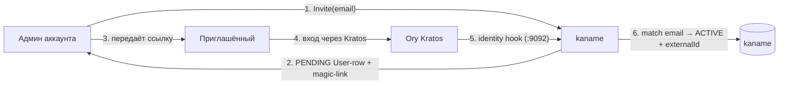
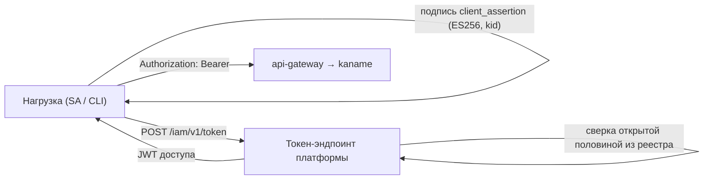

# Идентичность и токены

Эта страница объясняет, **как в Kachō появляется личность и как она аутентифицируется**. IAM не
хранит пароли и не обслуживает форму входа сам — это вынесено в Ory-стек: **Kratos** (личности и
интерактивный вход) и **Hydra** (OAuth 2.0 authorization server). IAM хранит *проекцию* личности
(ресурс User), маппинг на OAuth-клиентов (ключи и токены) и всю модель прав. Такое разделение даёт
зрелый, проверенный слой аутентификации и чистый control-plane сверху.

:::info Издателей токенов может быть два — читайте по установке, а не по этой странице
Платформа выпускает **программные** токены сама там, где объявлен её токен-эндпоинт, и в этом
случае издателем является она. Где он не объявлен, программные токены по-прежнему выпускает
внешний OAuth-сервер. **Интерактивный вход человека остаётся за внешним поставщиком на любой
установке.** Издатель записан в самом токене — это и есть способ узнать, с какой установкой вы
имеете дело.
:::

## Действующие лица

<table>
  <thead><tr><th>Компонент</th><th>Роль</th></tr></thead>
  <tbody>
    <tr><td><strong>Ory Kratos</strong></td><td>Хранилище личностей + интерактивный вход (пароль / passkey / recovery). Каждая identity — глобальная запись</td></tr>
    <tr><td><strong>Ory Hydra</strong></td><td>OAuth 2.0 / OIDC authorization server: обслуживает <strong>интерактивный вход</strong> человека (<code>authorization_code</code>) на любой установке; хранит OAuth-клиентов (JWK) и выпускает программные токены там, где токен-эндпоинт платформы не объявлен</td></tr>
    <tr><td><strong>kaname</strong></td><td>Личность платформы (User — одна строка на человека) и её членства в аккаунтах, маппинг OAuth-клиентов, модель прав</td></tr>
    <tr><td><strong>api-gateway</strong></td><td>Проверяет JWT доступа на каждом внешнем запросе (Bearer)</td></tr>
  </tbody>
</table>

## User — личность платформы

Ресурс [User](/api/user) — **одна строка на человека** на всю платформу, независимо от числа
его аккаунтов. Поле `externalId` хранит `sub` из провайдера аутентификации; `email`
используется для сопоставления при первом входе.

Принадлежность аккаунтам выражает отдельный ресурс — [Membership](/api/membership), и их у
одного человека может быть несколько.

:::note Здесь было написано обратное — «проекция в пределах одного аккаунта»
Прежняя редакция утверждала, что одной внешней личности соответствует несколько User-строк, по
одной на аккаунт. Так было, пока человек был строкой **в** аккаунте, и утверждение пережило
свой предмет.

Оно не удалено, а перевёрнуто на месте, потому что читалось как **граница безопасности**: по
нему выходило, что запрет входа (`Block`) действует в пределах аккаунта, а идентификатор
человека годится ключом внешнего справочника только вместе с аккаунтом. Верно обратное по
обоим пунктам — см. [User](/api/user).
:::

### Поток приглашения и активации

1. Админ вызывает `UserService.Invite(email)` — backend создаёт `PENDING`-строку.
2. `Operation.metadata` несёт `magicLinkUrl` (recovery/magic-link Kratos). Автоотправка письма
   со ссылкой существует; пока почтовый узел не объявлен (`inviteMail.relay`,
   `inviteMail.from`), письмо не уходит и ссылку передаёт админ.
3. Приглашённый входит через Kratos.
4. При успешном входе Kratos дёргает **identity-hook** IAM (listener `:9092`, mTLS): IAM
   сопоставляет email с `PENDING`-строкой, переводит её в `ACTIVE` и заполняет `externalId`.

`inviteStatus` отражает состояние: `PENDING` (приглашён, не входил) → `ACTIVE` (вошёл) → `BLOCKED`
(отключён администратором).

:::info Bootstrap-root
Первый администратор кластера задаётся через `KANAME_BOOTSTRAP_ROOT_EMAIL`: при первом входе
пользователя с этим email ему выдаётся cluster-admin, разрывая «курицу и яйцо» первичной настройки.
:::

## Токены — OAuth 2.0, издателей может быть два

Программная аутентификация (без интерактивного входа) идёт по стандарту OAuth 2.0. **Кто выпускает
токен, зависит от установки:** там, где объявлен токен-эндпоинт платформы, его выпускает платформа
своим подписантом; где не объявлен — внешний OAuth-сервер, как прежде. Издатель записан в самом
токене, поэтому определить его можно по токену, а не по догадке.

Интерактивный вход человека к этому не относится: его обслуживает внешний поставщик на **любой**
установке — вида выдачи `authorization_code` токен-эндпоинт платформы не принимает.

Два вида кредов, симметричных по устройству (см. [Токены доступа](/api/tokens)):

<table>
  <thead><tr><th>Кред</th><th>Субъект</th><th>Применение</th><th>ID-префикс маппинга</th></tr></thead>
  <tbody>
    <tr><td><strong>SAKey</strong></td><td>ServiceAccount</td><td>Рабочие нагрузки, CI, интеграции</td><td><code>soc</code></td></tr>
    <tr><td><strong>UserToken</strong></td><td>User</td><td>CLI и скрипты от имени человека</td><td><code>uoc</code></td></tr>
  </tbody>
</table>

При выпуске (`Issue`) kaname генерирует пару ECDSA P-256 и возвращает приватный ключ
**ровно один раз**. Секрет нигде не хранится: у kaname остаётся открытая половина ключа и
строка реестра, по идентификатору которой клиент и разрешается при обмене.

У **персонального** токена (`uoc`) клиента у внешнего поставщика больше не заводится: `clientId`
и `keyId` в ответе выпуска — одно и то же значение, идентификатор строки. У токенов прежнего
выпуска поле `hydraClientId` непусто, и отчеканенные для них внешним поставщиком access-токены
действительны до собственного истечения.

### Обмен ключа на JWT доступа

- **`private_key_jwt`** (по умолчанию): клиент подписывает `client_assertion` приватным ключом и
  обменивает его на JWT доступа — на токен-эндпоинте платформы (`POST /iam/v1/token`), а на
  установке без него у внешнего OAuth-сервера (`POST /oauth2/token`).
- **`jwt-bearer` (федерация)**: внешняя нагрузка (CI-runner, k8s-под, внешний OIDC IdP) предъявляет
  **свой** OIDC-JWT токен-эндпоинту платформы. Ключ выдаётся с `trustedSubjects[]` — записями
  `(issuer, subjectPattern, publicKeyPem, keyAlgorithm)`, которые ложатся в **наш** перечень
  доверенных издателей и ограничивают, какие внешние `iss`/`sub` вправе представлять этот SA.
  Подпись внешнего утверждения проверяется ключом издателя **из этого перечня**: решение о
  доверии постороннему принимаем мы, и принимается оно на пути запроса. `audience[]` управляет
  `aud`-claim'ом JWT доступа для внешних consumer'ов (STS, workload-identity-federation) — и тем
  же полем **сужает ключ**: адресаты, не названные в нём, по этому ключу не выдаются.

## Проверка на gateway

Все внешние запросы несут JWT доступа в `Authorization: Bearer`. `api-gateway` валидирует токен
(подпись, срок, issuer) и извлекает принципала до того, как запрос дойдёт до доменного сервиса.
Отсутствующий/невалидный токен → `UNAUTHENTICATED` (401). Далее принципал участвует в per-RPC
authz-Check (см. [Модель авторизации](/architecture/authz)).

:::warning Сессия vs токен
Универсальный 401/403 на **всех** эндпоинтах (и read, и write) с cookie-сессией обычно означает
истёкшую сессию, а не баг эндпоинта: UI показывает кэшированные чтения, но записи падают
`AUTHN_REQUIRED`. Долгоживущие OAuth-токены (SAKey/UserToken) в такую ловушку не попадают.
:::
