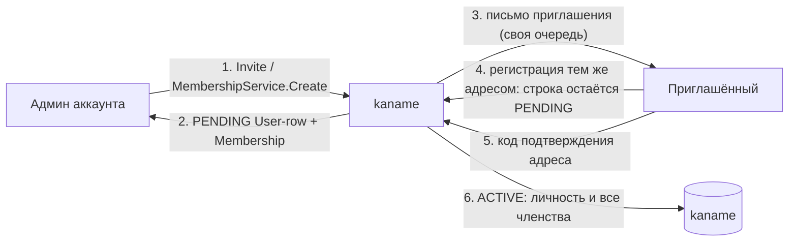
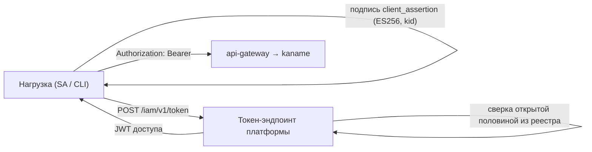

# Идентичность и токены

Эта страница объясняет, **как в Kaname появляется личность и как она аутентифицируется**.
Посадка личности у службы одна: человека проверяет сама служба. Внешнего поставщика
удостоверений нет. Ключа, выбирающего посадку, нет ни в чарте, ни в окружении: значение
`authn.identityProvider` чарт отвергает при отрисовке, переменную `KANAME_AUTHN__IDENTITY_PROVIDER`
служба отвергает на старте — вслух и при любом значении.

<table>
  <thead><tr><th></th><th>как устроено</th></tr></thead>
  <tbody>
    <tr><td>кто проверяет человека</td><td>сама служба: свои способы входа, своя сессия</td></tr>
    <tr><td>кто держит форму входа</td><td>консоль платформы; тела форм уходят на <a href="/api/auth-lane">полосу входа</a> службы через край</td></tr>
    <tr><td>печенье сессии</td><td><code>kaname_session</code> — наше; срок <code>authn.login.session-ttl</code>, гасится выходом на стороне сервера</td></tr>
    <tr><td>уровень уверенности сессии</td><td>объявляет сама сессия: пароль → <code>1</code>, пароль плюс код по времени или запасной код → <code>2</code></td></tr>
    <tr><td>второй фактор</td><td>заводится на полосе входа: <code>/iam/v1/auth/second-factor/&#42;</code>, церемония повышения — <code>/iam/v1/auth/step-up</code></td></tr>
    <tr><td>восстановление доступа</td><td>наш код письмом: <code>/iam/v1/auth/recovery</code> → <code>/iam/v1/auth/recovery/complete</code></td></tr>
    <tr><td>программные токены</td><td>выпускает платформа своим подписантом на своём токен-эндпоинте (<code>authn.token-signing</code> + <code>authn.client-token</code>); боевой старт без эндпоинта не поднимается</td></tr>
    <tr><td>что обязательно при старте</td><td>слушатель полосы входа, величины полосы (<code>authn.login.&#42;</code>), обёртка секретов второго фактора, окно свежести, своя чеканка, токен-эндпоинт</td></tr>
  </tbody>
</table>

:::note Посадка — состояние, измеренное живым стартом
Пять причин, по которым страж посадки отказывал своему входу при старте, закрыты (kaname#21):
наблюдатель провязки читает собранную полосу, а не литерал, и предъявляемые уровни —
`["1","2"]`. Служба поднята поставляемым чартом; замер и условия, которые он потребовал, — в
INSTALL.md §1. Что говорит об этом дерево:

```sh
go test ./internal/apps/kaname/config/ -run 'RetiredPostureKey|WithoutAPostureKey' -v   # ключа посадки нет, требования — на каждом боевом старте
go test ./deploy/ -run 'RetiredPosture' -v                                              # чарт ключ не читает и отвергает вслух
```
:::

## Действующие лица

<table>
  <thead><tr><th>Компонент</th><th>Роль</th></tr></thead>
  <tbody>
    <tr><td><strong>kaname</strong></td><td>Личность платформы (User — одна строка на человека) и её членства в аккаунтах, реестр удостоверений, модель прав, способы входа человека, его сессия и второй фактор</td></tr>
    <tr><td><strong>api-gateway</strong></td><td>Проверяет удостоверение на каждом внешнем запросе: JWT доступа в <code>Authorization: Bearer</code> либо печенье сессии; ретранслирует формы входа на слушатель полосы входа</td></tr>
  </tbody>
</table>

## User — личность платформы

Ресурс [User](/api/user) — **одна строка на человека** на всю платформу, независимо от числа
его аккаунтов. Внешней личности нет, и сопоставление идёт по адресу почты на регистрации.

Принадлежность аккаунтам выражает отдельный ресурс — [Membership](/api/membership), и их у
одного человека может быть несколько.

:::warning Граница безопасности — человек, а не аккаунт
Строка User одна на человека, поэтому запрет входа (`Block`) действует во всех аккаунтах
человека сразу, а идентификатор человека годится ключом внешнего справочника сам по себе, без
аккаунта. Вывести человека из одного аккаунта — это `RemoveFromAccount`, а не `Block` — см.
[User](/api/user).
:::

### Поток приглашения и активации


```mermaid
flowchart LR
  admin["Админ аккаунта"] -->|"1. Invite / MembershipService.Create"| iam["kaname"]
  iam -->|"2. PENDING User-row + Membership"| admin
  iam -->|"3. письмо приглашения (своя очередь)"| user["Приглашённый"]
  user -->|"4. регистрация тем же адресом: строка остаётся PENDING"| iam
  user -->|"5. код подтверждения адреса"| iam
  iam -->|"6. ACTIVE: личность и все членства"| pg[("kaname")]
```

1. Админ вызывает `UserService.Invite(email)` либо `MembershipService.Create` — заводится
   `PENDING`-строка личности (если её ещё нет) и членство в аккаунте.
2. Письмо приглашения составляет и отправляет сама служба — намерение ставится в очередь
   `invite_mail_outbox` той же транзакцией, что и строка. Одноразового предъявителя письмо и
   ответ **не несут** (ссылку на страницу входа письмо несёт, если объявлен
   `inviteMail.loginUrl`): доступ даёт владение почтовым ящиком. Письмо уходит, пока приглашение не
   активировано (`inviteStatus = PENDING`), — и на первом приглашении, и на повторном, в пределах
   `invite.mailRateLimit`; не дошло — `UserService.ResendInvite`. Без почтового узла
   (`inviteMail.relay`, `inviteMail.from`) служба в боевом режиме не стартует; вне его письмо не
   уходит, и это видно счётчиком исходов отправки.
3. Регистрация: приглашённый заводит способ входа **тем же адресом** на
   [полосе входа](/api/auth-lane). Способ входа и сессия ложатся на строку приглашения — второй
   строки личности регистрация не заводит, — но приглашение она **не активирует**: строка
   остаётся `PENDING`, сессия — в [положении подтверждения](/api/auth-lane#verification-position),
   а письмо с кодом подтверждения ставится той же транзакцией. Приглашение, истёкшее к
   регистрации, её отвергает (`REGISTRATION_REFUSED`).
4. Приглашение активируется подтверждением адреса: код из письма, предъявленный
   `POST /iam/v1/auth/verify-email/confirm` до истечения срока приглашения, той же транзакцией
   пишет личности `externalId`, отчеканенный полосой в момент подтверждения, заводит ей личный
   аккаунт и переводит в `ACTIVE` её, а вместе с ней — **все** приглашённые членства человека
   разом. Истёкшее либо снятое приглашение не активируется: `INVITE_NOT_VALID`, отметки нет,
   выход — повторное приглашение.

`inviteStatus` отражает состояние личности: `PENDING` (приглашён, приглашение не активировано)
→ `ACTIVE` (личность активна) → `BLOCKED` (отключён администратором облака). Принял ли человек
приглашение **в конкретный аккаунт**, отвечает `Membership.state`.

:::info Bootstrap-root
Первый администратор кластера задаётся через `KANAME_BOOTSTRAP_ROOT_EMAIL`: как только у этого
адреса появляется личность в состоянии `ACTIVE` **с подтверждённым адресом**, петля посева
(повтор каждые 10 с) выдаёт ей cluster-admin, разрывая «курицу и яйцо» первичной настройки.
Пока адрес не подтверждён, проход ничего не выдаёт и повторяется — это видно исходом
`not_verified` ряда `kaname_bootstrap_admin_attempts_total`.
:::

## Сессия человека

Сессия — **наша запись**. Полоса входа выдаёт печенье `kaname_session`
(`HttpOnly; Secure; SameSite=Lax`, срок `authn.login.session-ttl`); край на каждом запросе
спрашивает службу `InternalHumanSessionService.Resolve` на внутреннем слушателе — ничего не
кэшируя, потому что кэшированный ответ нельзя отозвать выходом или блокировкой. Выход
(`/iam/v1/auth/logout`) гасит запись на стороне сервера; смена пароля и завершение
восстановления гасят **все** сессии человека. Свои живые сессии человек видит сам — с моментами
и описанием клиента, каким его назвал выдавший сессию запрос, — и выходит из выбранной или из
всех, кроме текущей, не покидая текущую ([свои сессии](/api/auth-lane#own-sessions)); снятая так
сессия перестаёт действовать на следующем же запросе, вместе со всем, что в ней выдано.

Адрес почты — канал восстановления, и меняет его только сам человек: запросом смены из
**свежей** сессии и кодом, пришедшим на **новый** адрес ([смена адреса](/api/auth-lane#email-change)).
Исход смены гасит все **прочие** сессии человека, текущей выдаёт новый носитель, снимает живые
коды восстановления и уведомляет **прежний** адрес; занятость нового адреса на запросе не
раскрывается.

Ответ «сессии нет» **один** на все причины — неизвестный носитель, погашенная запись, истёкший
срок, заблокированная личность: причины видны только в счётчиках и журнале службы.

## Токены — OAuth 2.0, издатель один

Программная аутентификация (без интерактивного входа) идёт по стандарту OAuth 2.0. Токен
выпускает платформа своим подписантом на своём токен-эндпоинте; боевой старт без эндпоинта не
поднимается. Издатель записан в самом токене.

Человек входит на полосе входа службы и удостоверение для терминала выпускает уже своей
сессией — [Первое удостоверение](/first-credential).

Два вида кредов (см. [Токены доступа](/api/tokens)). Общее у них — устройство строки реестра
(идентификатор строки и есть имя клиента при обмене) и то, что оба выдают виды `KEYPAIR` и
`SECRET`. Остальное различается, и различие стоит знать до того, как планировать ротацию:

<table>
  <thead><tr><th></th><th>SAKey</th><th>UserToken</th></tr></thead>
  <tbody>
    <tr><td>Субъект · применение</td><td>ServiceAccount · рабочие нагрузки, CI, интеграции</td><td>User · CLI и скрипты от имени человека</td></tr>
    <tr><td>ID-префикс строки</td><td><code>soc</code></td><td><code>uoc</code></td></tr>
    <tr><td>Выдаваемые виды</td><td><code>KEYPAIR</code>, <code>SECRET</code>, <code>FEDERATED</code></td><td><code>KEYPAIR</code>, <code>SECRET</code>; <code>FEDERATED</code> отвергается <code>INVALID_ARGUMENT</code></td></tr>
    <tr><td><code>ttlSeconds = 0</code> у <code>KEYPAIR</code></td><td>умолчание установки (умолчание процесса — 90 суток)</td><td>бессрочно</td></tr>
    <tr><td>Сколько на субъекта</td><td>несколько (N:1)</td><td>несколько (N:1)</td></tr>
    <tr><td>Снятие субъекта</td><td>не проходит, пока у учётки есть ключи (<code>ON DELETE RESTRICT</code>) — сначала отзовите ключи</td><td>уносит его токены каскадом (<code>ON DELETE CASCADE</code>)</td></tr>
  </tbody>
</table>

**Ротация ключа служебной учётки — с перекрытием.** Ключей у учётки может быть несколько, поэтому
порядок такой: выпустите новый ключ, переключите нагрузку на него, убедитесь, что старый больше
не предъявляется, и только затем отзовите старый (`SAKeyService.Revoke`). Простоя у нагрузки при
этом нет. Отзывать старый ключ **до** выпуска нового незачем —
так вы получите окно, в котором у нагрузки нет действующего удостоверения.

Вид `KEYPAIR` при выпуске (`Issue`) получает от kaname пару ECDSA P-256, и приватный ключ
возвращается **ровно один раз**. Приватная половина нигде не хранится: у kaname остаётся открытая
половина ключа и строка реестра, по идентификатору которой клиент и разрешается при обмене. Вид
`SECRET` — одна строка, от которой служба хранит только свёртку. Вид `FEDERATED` своей пары не
получает вовсе: утверждение подписывает внешний издатель из перечня доверенных субъектов.

У ключа (`soc`) и у персонального токена (`uoc`) одно имя — идентификатор строки: `clientId` и
`keyId` в ответе выпуска — одно и то же значение, и им же утверждение называет себя (`iss` и
`sub`) у конечной точки выдачи токенов платформы. Второго имени у удостоверения нет.

### Обмен ключа на JWT доступа


```mermaid
flowchart LR
  wl["Нагрузка (SA / CLI)"] -->|"подпись client_assertion (ES256, kid)"| wl
  wl -->|"POST /iam/v1/token"| iam["Токен-эндпоинт платформы"]
  iam -->|"сверка открытой половиной из реестра"| iam
  iam -->|"JWT доступа"| wl
  wl -->|"Authorization: Bearer"| agw["api-gateway → kaname"]
```

- **`private_key_jwt`** (по умолчанию): клиент подписывает `client_assertion` приватным ключом и
  обменивает его на JWT доступа на токен-эндпоинте платформы (`POST /iam/v1/token`).
- **`jwt-bearer` (федерация)**: внешняя нагрузка (CI-runner, k8s-под, внешний OIDC IdP) предъявляет
  **свой** OIDC-JWT токен-эндпоинту платформы. Ключ выдаётся с `trustedSubjects[]` — записями
  `(issuer, subjectPattern, publicKeyPem, keyAlgorithm)`, которые ложатся в **наш** перечень
  доверенных издателей и ограничивают, какие внешние `iss`/`sub` вправе представлять этот SA.
  Подпись внешнего утверждения проверяется ключом издателя **из этого перечня**: решение о
  доверии постороннему принимаем мы, и принимается оно на пути запроса. `audience[]` управляет
  `aud`-claim'ом JWT доступа для внешних consumer'ов (STS, workload-identity-federation) — и тем
  же полем **сужает ключ**: адресаты, не названные в нём, по этому ключу не выдаются.

## Проверка на краю

Все внешние запросы несут удостоверение: JWT доступа в `Authorization: Bearer` либо печенье
сессии человека (`kaname_session`, таблица выше). `api-gateway` проверяет его (подпись, срок,
издатель, отзыв — либо резолв сессии) и извлекает принципала до того, как запрос дойдёт до
доменного сервиса. Далее принципал участвует в per-RPC authz-Check (см.
[Модель авторизации](/architecture/authz)).

**`UNAUTHENTICATED` (401) приходит по четырём причинам, и ответ на все четыре один:**

1. удостоверения нет, либо оно неизвестно (опечатка, чужой издатель);
2. срок истёк;
3. удостоверение отозвано — выход, смена пароля, блокировка личности, отзыв токена;
4. **недостаточный уровень аутентификации** для этого вызова: глагол несёт порог `2`, а сессия
   или токен объявляют `1` — см. [Модель авторизации](/architecture/authz#step-up).

Различимый отказ сообщал бы предъявителю, какая половина предъявленного неверна, поэтому в
ответе подсказки нет и не будет; причина видна в журнале края и счётчиках службы.

:::warning Сессия vs токен
Универсальный 401/403 на **всех** эндпоинтах (и read, и write) с печеньем сессии обычно означает
истёкшую или погашенную сессию, а не баг эндпоинта: UI показывает кэшированные чтения, но
записи падают `AUTHN_REQUIRED`. Долгоживущие OAuth-токены (SAKey/UserToken) в такую ловушку не
попадают.
:::
