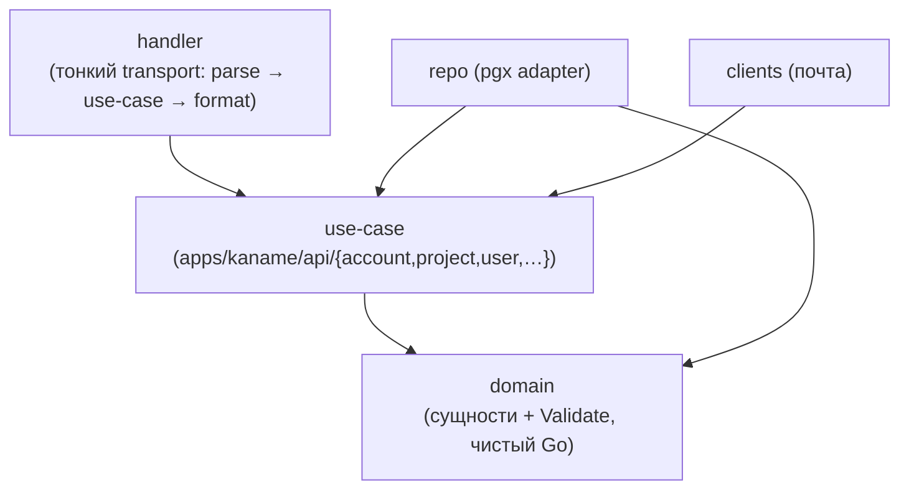
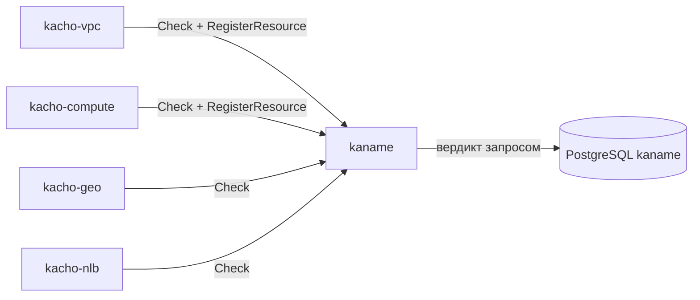

# Архитектура

Эта страница описывает внутреннее устройство Kaname: слоистую (clean) архитектуру,
database-per-service, интеграцию с провайдерами идентичности, набор listener'ов и место
сервиса в платформе как leaf-узла и центрального авторизатора. Внешний контракт — на
[страницах API](/api/overview); модель прав и потоки идентичности вынесены в отдельные разделы:
[Авторизация](/architecture/authz) и [Идентичность и токены](/architecture/identity).

## Чистая архитектура

Сервис следует строгому правилу зависимостей: транспорт зависит от бизнес-логики, бизнес-логика —
от домена, а домен не зависит ни от чего, кроме stdlib и сгенерённых стабов контракта
(`pkg/api/...`; сами `.proto` лежат в `proto/`).

<table>
  <thead><tr><th>Слой</th><th>Где</th><th>Ответственность</th></tr></thead>
  <tbody>
    <tr><td><strong>domain</strong></td><td><code>internal/domain/</code></td><td>Сущности + <code>Validate()</code>; закрытые наборы (verbs, subject-types). Только stdlib + proto</td></tr>
    <tr><td><strong>use-case</strong></td><td><code>internal/apps/kaname/api/&lt;resource&gt;/</code></td><td>Бизнес-логика; определяет port-интерфейсы (Repo, Client). Не импортирует transport</td></tr>
    <tr><td><strong>repo (adapter)</strong></td><td><code>internal/repo/</code></td><td>Реализация портов на handwritten pgx; SQLSTATE → sentinel; outbox-emit в TX</td></tr>
    <tr><td><strong>clients (adapter)</strong></td><td><code>internal/clients/</code></td><td>Почтовый отправитель. Дороги к прежнему издателю здесь больше нет: последняя — обмен докерного контура — снята (kaname#494)</td></tr>
    <tr><td><strong>handler</strong></td><td><code>internal/handler/</code></td><td>Тонкий transport: parse → use-case → format. Без бизнес-логики</td></tr>
    <tr><td><strong>authz</strong></td><td><code>internal/authzguard</code>, <code>authzmap</code>, <code>authztypes</code></td><td>Интерсепторы, permission-map, verb→relation, объектные типы</td></tr>
    <tr><td><strong>composition root</strong></td><td><code>cmd/kaname/</code></td><td>Единственное место wiring (serve.go); <code>cmd/migrator/</code> — миграции</td></tr>
  </tbody>
</table>

Переиспользуемое (pgx-пул, grpc-сервер/клиент, config, observability, LRO-operations, ids) приходит
из `pkg/` монорепо — не дублируется в сервисе.

## База данных — database-per-service

Kaname владеет схемой `kaname` в PostgreSQL и не делит её ни с кем. Within-service
инварианты выражены на уровне БД (FK / UNIQUE / CHECK / partial-UNIQUE / CAS), а не
software-проверками. Ключевые группы таблиц: аккаунты / проекты / пользователи / сервис-аккаунты /
группы (+ `group_members`) / роли / привязки доступа, плюс audit-outbox, журнал намерений
`fga_outbox` и его проекция `relation_fact`, из которой складывается прямой факт. Подробнее —
[Модель данных](/architecture/data-model).

:::note Within-service инварианты — на уровне БД
Уникальность имён в scope — partial UNIQUE; идемпотентность привязок — UNIQUE
(subject_type, subject_id, role_id, resource_type, resource_id); XOR-scope роли — CHECK
`roles_scope_xor`; OCC роли — `xmin`-snapshot. Service-слой лишь маппит SQLSTATE на gRPC-код
(`23505`→ALREADY_EXISTS, `23514`→INVALID_ARGUMENT, ...). Текст pgx наружу не утекает
(фиксированный INTERNAL).
:::

## Авторизация — реляционная форма в собственной базе

IAM — не только владелец модели прав, но и **точка её исполнения**. На каждый RPC (свой и чужой —
через `InternalIAMService.Check`) он складывает вердикт запросом к схеме `kaname`: прямой факт,
выдача роли на область, выдача по меткам, членство в группе.

Модель прав (`fga_model.fga`) описывает типы объектов
(`account` / `project` / `iam_user` / `vpc_network` / ...) и отношения
(`viewer` / `editor` / `admin` / verb-bearing `v_get`/`v_update`/... / `owner`). Из неё
**компилируется план вывода**: запрос спрашивает не про имя отношения буквально, а про каждый
источник, который модель признаёт основанием права.

Изменение прав (роль, привязка) действует **с момента фиксации транзакции** — отдельного
хранилища, до которого право должно доехать, нет. Полная модель — [Авторизация](/architecture/authz).

## Идентичность — свой вход

Человека проверяет сама служба: внешнего поставщика удостоверений нет, способы входа, сессия
(`kaname_session`) и второй фактор — записи самой службы, форма входа приходит на её слушатель
полосы входа от края. Посадка у службы одна.

**Программные токены платформа выпускает сама** там, где объявлена своя чеканка
(`authn.token-signing` + `authn.client-token`): у неё своя ключница, свой подписант и своя запись
публикуемого набора ключей. Без своего токен-эндпоинта ключевая пара и федеративный ключ не
выдаются вовсе — ни служебной учётке, ни человеку: обменять такой ключ было бы негде, и оба
глагола выдачи отвечают `FAILED_PRECONDITION` с именем настройки `authn.client-token.enabled`.

Токен-эндпоинт (`POST /iam/v1/token`) принимает четыре вида выдачи, и перечень закрыт:
`client_credentials` и `urn:ietf:params:oauth:grant-type:jwt-bearer` — программные полосы,
`authorization_code` и `refresh_token` — [церемония входа приложения](/api/oauth-ceremony). Иной
вид отвергается `400 unsupported_grant_type`; формы запроса — [Токены доступа](/api/tokens#token-endpoint-grants).
Человек входит только на полосе входа службы, а токен для терминала выпускает уже сессией.

Детали и потоки — [Идентичность и токены](/architecture/identity).

## Listener'ы

Сервис поднимает несколько gRPC-listener'ов с разной поверхностью и границей доверия:

<table>
  <thead><tr><th>Порт</th><th>Listener</th><th>Кто ходит · транспорт</th><th>Что обслуживает</th></tr></thead>
  <tbody>
    <tr><td><code>:9090</code></td><td>public</td><td>Tenant через <code>api-gateway</code> (TLS+JWT); peer-сервисы (mTLS)</td><td>Публичные RPC ресурсов + AuthorizeService + OperationService</td></tr>
    <tr><td><code>:9091</code></td><td>internal</td><td>Peer-сервисы (mTLS)</td><td><code>InternalIAMService</code> (<code>Check</code> / <code>RegisterResource</code> / ...) — authz-gate платформы</td></tr>
    <tr><td><code>:9095</code></td><td>metrics</td><td>Prometheus (cluster-internal)</td><td><code>/metrics</code></td></tr>
    <tr><td><code>:9100</code> (адрес объявляет профиль)</td><td>login lane</td><td>ровно край платформы (взаимный TLS, допуск по SAN)</td><td>Формы входа: регистрация, вход, выход, смена пароля, восстановление, второй фактор</td></tr>
  </tbody>
</table>

- **Production-режим** обязывает mTLS на публичном (`:9090`) и internal (`:9091`) listener'ах —
  иначе сервис не стартует (fail-closed, «refusing to start with insecure :9090/:9091», без
  «insecure downgrade»).
- **Internal (`:9091`) не считается доверенным**: он гейтит, кто может звать каждый RPC
  (defense-in-depth против lateral movement), а не «trusted, mTLS достаточно».

Подробнее о ключах — [Конфигурация](/install/configuration).

## Место в платформе — leaf + центральный авторизатор

По сборке IAM — **leaf-узел**: он не зависит ни от одного доменного сервиса (как kacho-geo). По
runtime — **центральный магнит вызовов**: каждый сервис зовёт `InternalIAMService.Check` на каждом
RPC, а vpc/compute дополнительно регистрируют владение своими ресурсами через
`RegisterResource` / `UnregisterResource` (модули не пишут отношения сами — только через IAM).

:::info Циклов нет
Рёбра `* → iam` однонаправлены — IAM не зовёт своих консументов обратно. Единственные исходящие
рёбра IAM — к инфраструктуре (Postgres, почтовый узел), не к доменным сервисам.
:::
