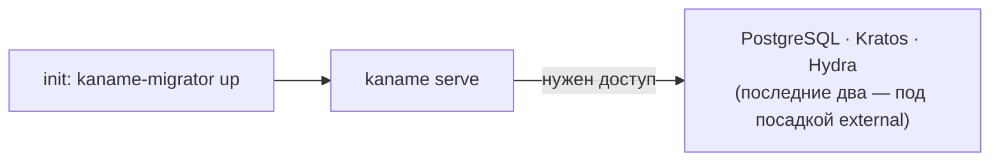

import CodeBlock from '@theme/CodeBlock'
import dedent from 'ts-dedent'

# Развёртывание

Kaname — Go-сервис, поставляемый Docker-образом и разворачиваемый в Kubernetes через
Helm-чарт (часть umbrella-стенда платформы). Эта страница описывает сборку образа, зависимости
рантайма и порядок запуска. Полный набор ключей конфигурации — на странице
[Конфигурация](/install/configuration).

## Зависимости рантайма

<table>
  <thead><tr><th>Зависимость</th><th>Роль · обязательность</th></tr></thead>
  <tbody>
    <tr><td><strong>PostgreSQL</strong></td><td>Хранилище <code>kaname</code> — обязательно</td></tr>
    <tr><td><strong>Ory Kratos</strong></td><td>Личности и интерактивный вход — для user-флоу</td></tr>
    <tr><td><strong>Ory Hydra</strong></td><td>OAuth 2.0 authorization server. <strong>Обязателен под посадкой личности <code>external</code></strong> (умолчание чарта): им входит человек и им же выпускаются программные токены, пока не объявлена своя чеканка. Что именно требуется от посадки — <a href="/install/configuration">Конфигурация</a></td></tr>
    <tr><td><strong>api-gateway</strong></td><td>Edge для tenant-трафика (TLS + JWT) — для внешнего доступа</td></tr>
    <tr><td><strong>Prometheus Operator</strong></td><td>Определение вида <code>PrometheusRule</code>, которым чарт везёт правила тревоги — <strong>обязателен, пока включена ручка <code>alertRules.enabled</code></strong> (умолчание — включена). Без него <code>helm install</code> отвергает установку целиком; что делать — в разделе «Что чарт создаёт в вашем кластере» ниже</td></tr>
  </tbody>
</table>

## Что чарт создаёт в вашем кластере

Чарт создаёт только эти объекты и ничего больше. Образ, базу и секреты, на которые он
ссылается, заводит тот, кто ставит, — координаты им называются в
[Конфигурации](/install/configuration).

| Объект | `apiVersion` | Вид заводит | Выключается |
|---|---|---|---|
| `ConfigMap` | `v1` | кластер сам | — |
| `Deployment` | `apps/v1` | кластер сам | — |
| `Service` | `v1` | кластер сам | — |
| `PrometheusRule` | `monitoring.coreos.com/v1` | **Prometheus Operator** | `alertRules.enabled=false` (умолчание — `true`) |

Три первых вида кластер служит сам: чтобы их создать, ставить заранее ничего не нужно.
Четвёртый — не служит.

### Если Prometheus Operator в кластере нет

Вид `PrometheusRule` заводит не Kubernetes, а Prometheus Operator. Пока определения этого вида
в кластере нет, установка отвергается **целиком** — не одна тревога, а весь релиз, — и отвечает
так:

```text
Error: INSTALLATION FAILED: unable to build kubernetes objects from release manifest:
resource mapping not found for name: "kaname" namespace: "" from "":
no matches for kind "PrometheusRule" in version "monitoring.coreos.com/v1"
ensure CRDs are installed first
```

Отказ этот приходит от Helm, а не от службы, и потому не называет ни ручки, ни того, что надо
поставить. Проверить заранее — одной командой, до `helm install`:

```bash
kubectl get crd prometheusrules.monitoring.coreos.com
```

Ответ `NotFound` означает выбор из двух, и оба законны:

1. **поставить Prometheus Operator** — тогда правила тревоги приедут вместе со службой, и
   переносить их в свою систему мониторинга руками не придётся;
2. **отказаться от правил тревоги** — `helm install ... --set alertRules.enabled=false`.
   Установка пройдёт, служба заработает полностью: ручка снимает только доставку правил.
   Их текст остаётся на странице [Наблюдаемость](/advanced/observability) — перенесите
   оттуда сами.

:::warning У второго пути есть цена, и она тихая
Правило, которое не поставлено, не звонит, а молчание неотличимо от исправности. Сильнее всего
это касается `KanameIdentityLedgerUnsampled`: оно звонит на **отсутствие** события, то есть там,
где симптома ждать неоткуда. Умолчание ручки стоит на `true` именно поэтому — цену ошибки несёт
та сторона, которая шумит.
:::

## Сборка образа

Двухстадийная сборка: компиляция Go-бинарей (`kaname` + `kaname-migrator`), затем минимальный
рантайм-образ.

<CodeBlock language="bash">
  {dedent`
    # локальная сборка бинарей
    make build
    make build-migrator

    # docker-образ
    docker build -t kaname:dev .
  `}
</CodeBlock>

## Порядок запуска



1. **Миграции** — `kaname-migrator up` накатывает схему `kaname` (обычно init-container перед
   основным подом).
2. **Сервис** — `kaname serve` поднимает listener'ы (`:9090` public, `:9091` internal,
   `:9092` hooks, `:9095` metrics).
3. **Модель авторизации** — вшита в образ сервиса и выводится из неё при проверке; при
   установке сеются system-роли и cluster-объект. Отдельного хранилища, куда модель надо
   «залить», и переменной с её версией больше нет.

## Установка поверх прежней базы — только чистая

Схема службы называется `kaname`. У установок, поднятых до переименования, она называлась
`kacho_iam`, и **пути перехода нет**: автоматического переноса служба не делает.

Обнаружив в своей базе схему `kacho_iam`, `kaname serve` **отказывает в старте** — до первой
записи — и называет в тексте отказа найденную схему, базу и следующий шаг. Это состояние
окружения, а не дефект продукта: чинит его оператор, и заводить задачу на продукт не нужно.

Почему отказ, а не перенос: без него служба увидела бы пустую схему `kaname`, начала бы
работать с нуля, а прежние строки остались бы рядом невидимыми — потерю арендатор заметил бы
по последствиям, а не от продукта. Миграция переименования при этом исполнялась бы в чужой
базе, за исход которой мы отвечать не можем.

Что делать — одно из двух:

1. **чистая база** — направьте `KANAME_REPOSITORY__POSTGRES__URL` на базу без схемы
   `kacho_iam` и накатите схему: `kaname-migrator up`;
2. **та же база** — решив судьбу прежних данных самостоятельно, снимите в ней схему
   `kacho_iam`. Служба такой операции за оператора не делает.

Отказ наступает и тогда, когда в базе есть **обе** схемы: какую из них читает служба, решал бы
порядок `search_path`, то есть данные выбирались бы молча.

## Проверка здоровья

- **Readiness / liveness** — сервис отдаёт готовность после успешного подключения к БД.
- **Метрики** — Prometheus `/metrics` на cluster-internal listener (`:9095`).

:::warning «Задеплоено» ≠ «работает»
Running-под и applied-миграции — не доказательство работоспособности. Реальные баги
(worker-principal, migration-divergence, domain-binding) видны только на живом стеке через
gateway. После деплоя обязателен E2E-прогон: логин, создание аккаунта/проекта, выдача роли и
проверка видимости — не полагайтесь на pod-health. См.
[Особенности дизайна](/advanced/design-decisions).
:::

## Production-профиль

В production-профиле включены mTLS на всех listener'ах, production-strict AuthN и `sslmode=require`
для БД. Сервис откажется стартовать без mTLS на публичном/internal listener'ах (fail-closed).
Детали ключей — [Конфигурация](/install/configuration).

## Откат выкатки

Неудачная выкатка откатывается в **три шага, и порядок в них несущий**. Схему
возвращают ДО образа: down-миграция лежит в том образе, который её принёс, и
вернув образ первым, вы останетесь без файла, которым откатывать.

Отдельно про то, чего `helm rollback` не делает сам: миграции едут
initContainer'ом и прогоняются `up` **на каждом старте пода**, поэтому возврат
образа перекатывает под и снова накатывает схему до головы своей цепочки.
Возврат образа сам по себе схему не возвращает.

### Шаг 1. Решить, нужен ли откат СХЕМЫ

| что несла выкатка | нужен ли откат схемы |
|---|---|
| только образ, миграций нет | нет — сразу шаг 3 |
| миграции аддитивные (новая таблица, новая колонка) | как правило нет: прежний код их не читает, и это самый дешёвый путь |
| миграция несовместима с прежним кодом (переименование, сужение типа, снятие колонки) | да — шаг 2 |
| миграция снесла таблицу или колонку | схему вернуть можно, **данные — нет**; см. рамку ниже |

### Шаг 2. Откатить схему — образом, который эту миграцию несёт

```bash
# ДО helm rollback, пока в поде ещё НОВЫЙ образ: у него есть down-файл.
kubectl -n <namespace> exec deploy/<деплой kaname> -- \
  /usr/local/bin/kaname-migrator status
kubectl -n <namespace> exec deploy/<деплой kaname> -- \
  /usr/local/bin/kaname-migrator down --target <версия, до которой откатываем>
```

### Шаг 3. Вернуть образ

```bash
helm history <релиз>
helm rollback <релиз> <ревизия>
```

:::danger `down` возвращает форму, а не данные
Down-миграция воссоздаёт схему **пустой**. Строки, которые снёс `DROP`, она не
возвращает: «восстановимо» про снос означает «восстановима схема». Единственный
путь назад для снесённых строк — резервная копия базы.

Продукт защищает это на своей стороне: накат считает живые строки в каждой
таблице, которую уронит ещё не применённая миграция, и **отказывает**, пока снос
не одобрен явно — переменной `KACHO_MIGRATOR_DROP_APPROVED` с именем конкретного
сноса. Отказ на выкатке стоит одной выкатки; восстановление из копии — сильно
дороже, и узнаёте вы о нужде в нём уже после.
:::

### Чем проверить, что откат состоялся

Проверять надо **три** вещи, и «под Ready» само по себе ни одной из них не
доказывает:

| что | чем |
|---|---|
| ревизия релиза вернулась | `helm history <релиз>` — последняя запись со статусом `deployed` |
| под работает нужным образом | `kubectl -n <namespace> get pod -l app=<деплой kaname> -o jsonpath='{..image}'` |
| схема на ожидаемой версии | `kaname-migrator status` — головная применённая версия |
| зависимости сервиса живы | `readinessProbe` спрашивает `/readyz`, поэтому `kubectl get pods` показывает готовность **по зависимостям**, а не по открытому сокету: под в `0/1` — это отказ зависимости, а не «ещё поднимается» |
