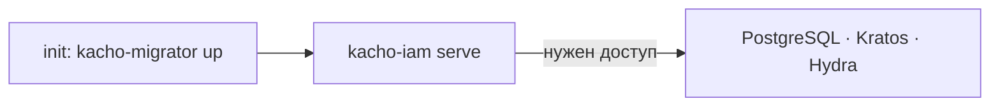

import CodeBlock from '@theme/CodeBlock'
import dedent from 'ts-dedent'

# Развёртывание

Kachō IAM — Go-сервис, поставляемый Docker-образом и разворачиваемый в Kubernetes через
Helm-чарт (часть umbrella-стенда платформы). Эта страница описывает сборку образа, зависимости
рантайма и порядок запуска. Полный набор ключей конфигурации — на странице
[Конфигурация](/install/configuration).

## Зависимости рантайма

<table>
  <thead><tr><th>Зависимость</th><th>Роль · обязательность</th></tr></thead>
  <tbody>
    <tr><td><strong>PostgreSQL</strong></td><td>Хранилище <code>kacho_iam</code> — обязательно</td></tr>
    <tr><td><strong>Ory Kratos</strong></td><td>Личности и интерактивный вход — для user-флоу</td></tr>
    <tr><td><strong>Ory Hydra</strong></td><td>OAuth 2.0 authorization server — для токенов (SAKey / UserToken)</td></tr>
    <tr><td><strong>api-gateway</strong></td><td>Edge для tenant-трафика (TLS + JWT) — для внешнего доступа</td></tr>
  </tbody>
</table>

## Сборка образа

Двухстадийная сборка: компиляция Go-бинарей (`kacho-iam` + `kacho-migrator`), затем минимальный
рантайм-образ.

<CodeBlock language="bash">
  {dedent`
    # локальная сборка бинарей
    make build
    make build-migrator

    # docker-образ
    docker build -t kacho-iam:dev .
  `}
</CodeBlock>

## Порядок запуска



1. **Миграции** — `kacho-migrator up` накатывает схему `kacho_iam` (обычно init-container перед
   основным подом).
2. **Сервис** — `kacho-iam serve` поднимает listener'ы (`:9090` public, `:9091` internal,
   `:9092` hooks, `:9095` metrics).
3. **Модель авторизации** — вшита в образ сервиса и выводится из неё при проверке; при
   установке сеются system-роли и cluster-объект. Отдельного хранилища, куда модель надо
   «залить», и переменной с её версией больше нет.

## Проверка здоровья

- **Readiness / liveness** — сервис отдаёт готовность после успешного подключения к БД.
- **Метрики** — Prometheus `/metrics` на cluster-internal listener (`:9095`).

:::warning «Задеплоено» ≠ «работает»
Running-под и applied-миграции — не доказательство работоспособности. Реальные баги
(worker-principal, migration-divergence, domain-binding) видны только на живом стеке через
gateway. После деплоя обязателен E2E-прогон: логин, создание аккаунта/проекта, выдача роли и
проверка видимости — не полагайтесь на pod-health. См.
[Особенности дизайна](/advanced/design-decisions).
:::

## Production-профиль

В production-профиле включены mTLS на всех listener'ах, production-strict AuthN и `sslmode=require`
для БД. Сервис откажется стартовать без mTLS на публичном/internal listener'ах (fail-closed).
Детали ключей — [Конфигурация](/install/configuration).

## Откат выкатки

Неудачная выкатка откатывается в **три шага, и порядок в них несущий**. Схему
возвращают ДО образа: down-миграция лежит в том образе, который её принёс, и
вернув образ первым, вы останетесь без файла, которым откатывать.

Отдельно про то, чего `helm rollback` не делает сам: миграции едут
initContainer'ом и прогоняются `up` **на каждом старте пода**, поэтому возврат
образа перекатывает под и снова накатывает схему до головы своей цепочки.
Возврат образа сам по себе схему не возвращает.

### Шаг 1. Решить, нужен ли откат СХЕМЫ

| что несла выкатка | нужен ли откат схемы |
|---|---|
| только образ, миграций нет | нет — сразу шаг 3 |
| миграции аддитивные (новая таблица, новая колонка) | как правило нет: прежний код их не читает, и это самый дешёвый путь |
| миграция несовместима с прежним кодом (переименование, сужение типа, снятие колонки) | да — шаг 2 |
| миграция снесла таблицу или колонку | схему вернуть можно, **данные — нет**; см. рамку ниже |

### Шаг 2. Откатить схему — образом, который эту миграцию несёт

```bash
# ДО helm rollback, пока в поде ещё НОВЫЙ образ: у него есть down-файл.
kubectl -n <namespace> exec deploy/<деплой kacho-iam> -- \
  /usr/local/bin/kacho-migrator status
kubectl -n <namespace> exec deploy/<деплой kacho-iam> -- \
  /usr/local/bin/kacho-migrator down --target <версия, до которой откатываем>
```

### Шаг 3. Вернуть образ

```bash
helm history <релиз>
helm rollback <релиз> <ревизия>
```

:::danger `down` возвращает форму, а не данные
Down-миграция воссоздаёт схему **пустой**. Строки, которые снёс `DROP`, она не
возвращает: «восстановимо» про снос означает «восстановима схема». Единственный
путь назад для снесённых строк — резервная копия базы.

Продукт защищает это на своей стороне: накат считает живые строки в каждой
таблице, которую уронит ещё не применённая миграция, и **отказывает**, пока снос
не одобрен явно — переменной `KACHO_MIGRATOR_DROP_APPROVED` с именем конкретного
сноса. Отказ на выкатке стоит одной выкатки; восстановление из копии — сильно
дороже, и узнаёте вы о нужде в нём уже после.
:::

### Чем проверить, что откат состоялся

Проверять надо **три** вещи, и «под Ready» само по себе ни одной из них не
доказывает:

| что | чем |
|---|---|
| ревизия релиза вернулась | `helm history <релиз>` — последняя запись со статусом `deployed` |
| под работает нужным образом | `kubectl -n <namespace> get pod -l app=<деплой kacho-iam> -o jsonpath='{..image}'` |
| схема на ожидаемой версии | `kacho-migrator status` — головная применённая версия |
| зависимости сервиса живы | `readinessProbe` спрашивает `/readyz`, поэтому `kubectl get pods` показывает готовность **по зависимостям**, а не по открытому сокету: под в `0/1` — это отказ зависимости, а не «ещё поднимается» |
