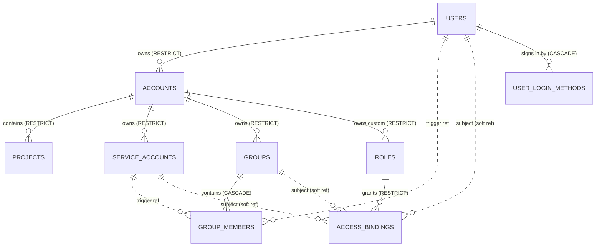

# kaname — ER-диаграмма (schema `kaname`)

Все FK / UNIQUE / CHECK / партиальные индексы / триггеры определены в миграциях
`internal/migrations/` (базовая — `0001_initial.sql`); они — источник истины
схемы. Здесь — обзорная диаграмма и заметки по нетривиальным связям.

## Notes

- `group_members.member_id` — без FK на `users.id`/`service_accounts.id`
  (Postgres FK не поддерживает альтернативную ссылку). Целостность —
  через триггер `group_members_member_exists_trg`
  (BEFORE INSERT/UPDATE → EXISTS-check в соответствующей таблице).

- `access_bindings.subject_id` / `resource_id` — без FK (subject полиморфен;
  resource — cross-service / cross-DB, database-per-service — FK через границу
  сервиса невозможен). Целостность — soft (use-case sync-validate + graceful
  dangling-ref на чтении).

- `accounts.owner_user_id` → `users.id` ON DELETE **RESTRICT** — User'а,
  владеющего Account'ами, удалить нельзя.

- `operations` (corelib pattern + IAM-extension principal_* полей) — для
  всех LRO мутаций (Create/Update/Delete/Move/AddMember/RemoveMember).

- `user_login_methods` — способ входа человека: строка на пару (`user_id`,
  `kind`), ключ — `users.id` (не внешний субъект и не почта), снятие человека
  уносит его способы каскадом. `verifier` — СЕКРЕТ (хеш пароля): копий в других
  таблицах нет и триггеров на таблице нет — держит гейт схемы
  `TestLoginVerifierStaysInsideTheSchema`
  (`internal/repo/kaname/pg/login_verifier_stays_inside_integration_test.go`).

- `users.email_verified_at` — подтверждённость ТЕКУЩЕГО значения `email`
  (NULL — не подтверждён). Любая смена `email` снимает её в том же операторе
  (триггер `users_email_change_drops_verification`); запись отметки сверяет
  значение адреса в своём операторе.
