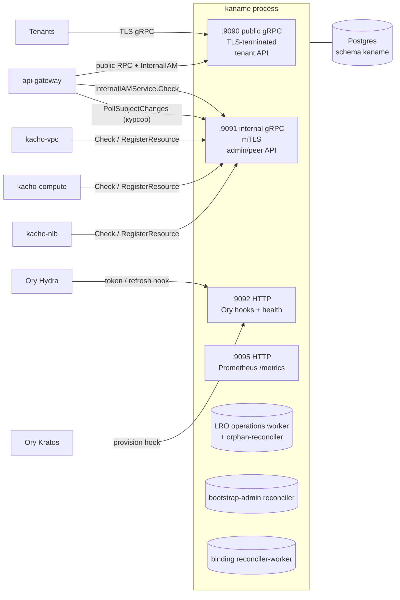
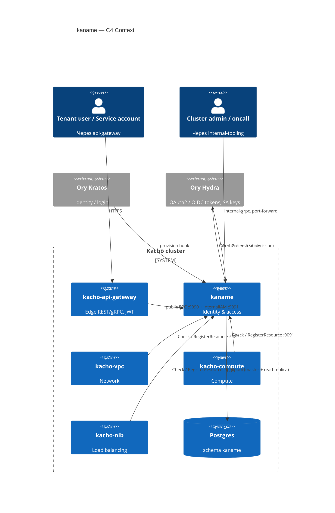

# 00. Обзор сервиса kaname

## Назначение

`kaname` — **identity & access management** сервис платформы Kachō. Он владеет
полной ресурсной моделью identity и поверх нее реализует runtime-авторизацию для
всего кластера.

**Ресурсная модель** (схема `kaname`, источник истины для всех сервисов):

- **Account** — top-level tenant (организация). Глобально-уникальное имя; владелец —
  единственный User (`owner_user_id`).
- **Project** — рабочее пространство-контейнер ресурсов внутри Account; уникальное имя
  per-Account; операция Move (atomic CAS).
- **User** — mirror identity, заполняется AuthN-хуком при первом входе.
- **ServiceAccount** — машинная identity; backing OAuth2-клиент в Ory Hydra.
- **Group** — набор субъектов (User / ServiceAccount) для group-grant.
- **Role** — набор permission'ов формата `<module>.<resource>.<verb>`; system-роли
  (seed с детерминированными id) + custom-роли per-Account.
- **AccessBinding** — грант `(subject) ↔ role ↔ (resource)`; действует с момента
  фиксации: намерение об отношении пишется в журнал `fga_outbox` той же транзакцией,
  и триггер журнала тут же складывает из него прямой факт.

**Плоскость авторизации** (живет поверх ресурсной модели):

- **Реляционная форма** (`internal/repo/kaname/pg/relverdict`) — единственный источник
  решения. Вердикт складывается запросом к собственной базе `kaname` из четырёх
  источников: прямой факт, выдача роли на область, выдача по меткам, членство в группе.
  Вывод отношений компилируется из модели прав (`services/iam/internal/authzplan`). Внешнего движка
  отношений нет — см. [`29-relational-verdict.md`](29-relational-verdict.md).
- **AuthorizeService** (публичный) — sync-проверка решений: `Check` / `BatchCheck` /
  `ListSubjects` / `ExpandRelations` / `WhoAmI`.
- **InternalIAMService.Check** — authz-gate, который каждый control-plane сервис
  (`kacho-vpc`, `kacho-compute`, `kacho-nlb`, `kacho-geo`) зовет перед мутацией.
- **PermissionCatalogService** — грантуемая таксономия `<module>.<resource>.<verb>`
  (backend-driven каталог прав для UI и валидации Role).
- **Cluster-admin grants** — internal-only `InternalClusterService`: time-bombed либо
  permanent привязки cluster-admin.

**AuthN-плоскость** (интеграция с Ory):

- **Hooks-listener** принимает webhooks Ory Hydra (`token` / `refresh`) и Ory Kratos
  (`provision`): на регистрации/входе вызывается `UpsertFromIdentity` — bootstrap
  Account/Project/AccessBinding для нового identity либо активация PENDING-invite.
- **SAKeyService** выдает Class A static service-account-ключи через OAuth2
  client-credentials Ory Hydra.

**Что делает:**

- хранит идентичности, проекты, роли, гранты;
- проводит мутации как async-операции (LRO) с polling-контрактом;
- авторизует запросы (вердикт реляционной формы + условия);
- записывает намерение об отношении в журнал `fga_outbox` внутри writer-tx, откуда
  триггер складывает прямой факт;
- обслуживает AuthN-хуки Ory и выдает SA-ключи.

**Что НЕ делает:**

- не валидирует JWT — это работа `api-gateway` (Hydra JWKS) и самой Ory Hydra;
- не управляет паролями пользователей — Ory Kratos;
- не хранит OAuth `client_secret` в plaintext — Hydra хранит, kaname отдает один раз
  и redact'ит;
- не выносит решение о доступе за пределы своей базы — вердикт складывается там же,
  где лежат выдачи, одной транзакцией с ними.

## Топология процесса

`kaname` (бинарник `cmd/kaname`) поднимает четыре сетевых слушателя и набор
фоновых worker'ов в одном процессе. Параллельный запуск — через
`golang.org/x/sync/errgroup` с общим shutdown-триггером
(SIGTERM / SIGINT или первая ошибка задачи).



Фоновые worker'ы:

- **LRO operations worker** — гоняет async-мутации к терминалу; orphan-reconciler
  закрывает осиротевшие `done=false`-операции умершего процесса по committed-реальности.
- **bootstrap-admin reconciler** — выдает `system_admin@cluster` пользователю из
  `KANAME_BOOTSTRAP_ROOT_EMAIL` (best-effort, no-op при пустом env).
- **binding reconciler-worker** — пере-материализует label-selector и by-name гранты
  при смене меток ресурса, доводит PENDING→ACTIVE и истекает TTL-гранты.

## Port-mapping (по умолчанию)

| Порт | Протокол | Назначение                                          | Конфиг-ключ                      |
|------|----------|-----------------------------------------------------|----------------------------------|
| 9090 | gRPC+TLS | public-API (tenant)                                 | `api-server.endpoint`            |
| 9091 | gRPC+mTLS| internal-API (admin, peer-call)                     | `api-server.internal-endpoint`   |
| 9092 | HTTP     | Ory hooks (Hydra token/refresh, Kratos provision) + `/healthz` `/readyz` | `authn.hooks-http-endpoint` |
| 9095 | HTTP     | Prometheus `/metrics`                               | `api-server.metrics-endpoint`    |

Все четыре слушателя поддерживают per-edge TLS (default-off в dev, fail-closed в
production: internal :9091 и public :9090 обязаны нести mTLS/TLS, иначе процесс не
стартует).

`api-gateway` (отдельный сервис) — единственная внешняя точка входа: он валидирует JWT
(Hydra JWKS), резолвит principal и проксирует JSON/REST `/iam/v1/<resource>` в `:9090`
через grpc-gateway. Tenant-вызовы из CLI/UI всегда идут через api-gateway, не напрямую в
порт 9090.

## Архитектурная диаграмма (C4-context)



## Плоскость авторизации (как принимается решение)

1. **Грант** — `AccessBindingService.Create` пишет 5-tuple в `kaname` И в той же
   транзакции кладёт намерение об отношении в журнал `fga_outbox`. Триггер журнала
   складывает из строки прямой факт **в той же транзакции**, поэтому «закоммичено» и
   «действует» совпадают.
2. **Сброс кэша края** — iam **никого не зовёт**: он лишь дописывает строку в журнал
   `subject_change_outbox` той же транзакцией. Читает журнал сам api-gateway
   (`InternalIAMService.PollSubjectChanges`, курсор по возрастанию `id`) и гасит свой
   кэш сам. Это про кэш, а не про право, и соединение здесь открывает **потребитель**:
   iam — лист графа рёбер и о своих потребителях не знает.
3. **Проверка** — на каждом RPC:
   - публичный путь: api-gateway зовёт `AuthorizeService.Check`;
   - peer-путь: `kacho-vpc` / `kacho-compute` / `kacho-nlb` / `kacho-geo` зовут
     `InternalIAMService.Check` перед мутацией (mTLS, fail-closed).
   - Оба упираются в один вердикт реляционной формы над строками `kaname`.
4. **Условие на выдаче** — модель прав объявляет условия (`mfa_fresh` и другие), и форма
   вычисляет их на каждой проверке по контексту запроса, собранному на крае. Ключ условия
   задаёт сервер; тенантской поверхности управления условиями нет.
5. **Владение чужими ресурсами** — consumer-сервисы регистрируют его через
   `InternalIAMService.RegisterResource` / `UnregisterResource`: модуль пишет намерение
   не сам, а через iam.

Детали — [`19-authorize.md`](19-authorize.md), [`21-internal-iam.md`](21-internal-iam.md),
[`29-relational-verdict.md`](29-relational-verdict.md).

## Внутренняя структура (Clean Architecture)

`internal/` строго разделен на слои:

```
domain/              # entities + newtypes + Validate(). stdlib + multierr only.
apps/kaname/
  api/<resource>/    # use-cases per RPC (slice-per-RPC).
  config/            # viper YAML config + env-resolvers.
  seed/              # system-role seed, bootstrap-admin, backfill/verify, workers.
repo/kaname/          # Reader/Writer port-interfaces (CQRS).
repo/kaname/pg/       # pgxpool + dto-mapping. Реализует Reader/Writer.
clients/             # peer-clients (Hydra, api-gateway authz-cache).
handler/             # тонкий gRPC transport (operation handler).
handler/iamhooks/    # HTTP-хуки Ory (token / refresh / provision) + health.
authzguard/          # caller-policy + anti-anonymous + viewer/acr-floor интерсепторы.
migrations/          # embed.FS goose-миграции.
errors/              # sentinel + WrapPgErr.
```

### Зарегистрированные RPC-сервисы

| Listener  | Сервис                          | Назначение                                             |
|-----------|---------------------------------|--------------------------------------------------------|
| `:9090`   | `AccountService`                | CRUD Account                                            |
| `:9090`   | `ProjectService`                | CRUD Project + Move                                     |
| `:9090`   | `UserService`                   | read/CRUD User (mirror)                                 |
| `:9090`   | `ServiceAccountService`         | CRUD ServiceAccount                                     |
| `:9090`   | `SAKeyService`                  | Issue / List / Revoke SA-ключей (Hydra)                |
| `:9090`   | `GroupService`                  | CRUD Group + member-операции                           |
| `:9090`   | `RoleService`                   | CRUD Role (system seed + custom)                       |
| `:9090`   | `AccessBindingService`          | Create / Delete (immutable)                            |
| `:9090`   | `AuthorizeService`              | Check / BatchCheck / ListSubjects / ExpandRelations / WhoAmI |
| `:9090`   | `PermissionCatalogService`      | грантуемая таксономия прав                              |
| `:9090`   | `OperationService`              | LRO Get / List / Cancel (corelib)                      |
| `:9090`   | `MembershipService`             | read Membership (Account ↔ User)                       |
| `:9090`   | `UserTokenService`              | Issue / List / Revoke пользовательских токенов         |
| `:9090`   | `LimitService`                  | CRUD Limit — величины пределов арендатора              |
| `:9090`   | `IdentityQuotaService`          | List квот личности (`kacho.cloud.quota.v1`)            |
| `:9091`   | `InternalIAMService`            | Check + Register/UnregisterResource (fgaproxy)         |
| `:9091`   | `AuthorizeService`              | тот же обработчик для peer-проверок по mTLS-ребру      |
| `:9091`   | `InternalClusterService`        | cluster-admin grants (time-bombed / permanent)         |
| `:9091`   | `InternalUserService`           | `UpsertFromIdentity` (mirror identity)                 |
| `:9091`   | `InternalOperationsService`     | cluster-wide admin operations feed                     |
| `:9091`   | `InternalSessionRevocationsService` | logout / force-logout + hot-path IsRevoked         |
| `:9091`   | `InternalInteractiveClientService` | CRUD InteractiveClient (OAuth2-клиенты консоли) |
| `:9091`   | `InternalLimitService`          | CRUD Limit + `Resolve` / `ListChangedSince` доменам    |
| `:9091`   | `InternalModuleService`         | `Plan` / `Apply` манифеста модуля + read               |
| `:9091`   | `InternalBootstrapTokenService` | `MintBootstrapToken` — удостоверение начальной настройки |

**Состав таблицы держит гейт, а не внимание.** Перечень уже расходился с деревом —
и расходился на ОБОИХ слушателях сразу. `services/iam/internal/check`
`TestOverviewPortTableMatchesRegistration` берёт регистрации РАЗБОРОМ
`cmd/kaname/grpc_register.go` (узлами дерева, а не поиском по образцу: имя
`Register…ServiceServer` законно стоит и в прозе) и требует совпадения по каждому
слушателю в обе стороны — служба без строки и строка без службы одинаково красные.

`AuthorizeService` дополнительно зарегистрирован на internal-listener: тот же обработчик
переиспользуется сервисами платформы поверх уже установленного mTLS-ребра `:9091`. Это не нарушает internal-vs-external (запрет #6):
запрещено публиковать `Internal.*` на external endpoint, а обратное — публичный сервис,
дополнительно доступный на cluster-internal listener, — штатный service→service-паттерн.

## Жизненный цикл запроса (типичный)

Создание ресурса через REST:

```mermaid
sequenceDiagram
    participant Cli as Tenant CLI / UI
    participant GW as api-gateway
    participant IAM as kaname :9090
    participant DB as Postgres

    Cli->>GW: POST /iam/v1/accounts<br/>Authorization: Bearer <JWT>
    GW->>GW: Validate JWT (Hydra JWKS)
    GW->>GW: Resolve principal (InternalIAMService.LookupSubject)
    GW->>IAM: gRPC AccountService.Create<br/>+ x-kacho-principal-* metadata
    IAM->>IAM: PrincipalExtract + AntiAnonymous guard
    IAM->>IAM: domain.Account.Validate()
    IAM->>DB: BEGIN; INSERT accounts; INSERT operations; INSERT fga_outbox<br/>(триггер: fga_outbox → relation_fact); COMMIT
    IAM-->>GW: Operation (done=false, id="iop_..")
    GW-->>Cli: 200 {operationId}

    Note over IAM,DB: async (LRO worker)
    IAM->>DB: UPDATE operations SET done=true, response=Account

    loop poll
        Cli->>GW: GET /operations/iop_..
        GW->>IAM: gRPC OperationService.Get
        IAM->>DB: SELECT operation
        IAM-->>GW: Operation (done=true, response=Account)
        GW-->>Cli: 200 {done:true, response:{id, name, ...}}
    end
```

## Зависимости

**Build-зависимости (Go):**

- `github.com/PRO-Robotech/kacho/pkg` — ids, operations (LRO table + worker),
  db (pgxpool), grpcsrv, observability, outbox/drainer, safeconv; а также shared-proto
  stubs (operation/validation/authz_options).
- `github.com/PRO-Robotech/kacho/pkg/api/kaname/cloud/iam/v1` — собственные
  доменные proto-stubs (генерируются локально из `proto/`).
- `github.com/jackc/pgx/v5` — Postgres driver.
- `github.com/spf13/viper` — конфиг.
- `golang.org/x/sync/errgroup` — параллельный запуск задач.
- `go.uber.org/multierr` — cumulative validation errors.

**Runtime-зависимости (peer):**

- Postgres 16 — schema `kaname`.
- Ory Hydra — OAuth2/OIDC tokens, backing-клиенты ServiceAccount, SA-ключи.
- Ory Kratos — identity / login (provision-хук).
- api-gateway — edge JWT-валидация и REST-проекция.

## Дальнейшее чтение

- Конкретный ресурс → [`01-account.md`](01-account.md) … [`10-operations.md`](10-operations.md).
- Authz-плоскость → [`19-authorize.md`](19-authorize.md),
  [`21-internal-iam.md`](21-internal-iam.md),
  [`29-relational-verdict.md`](29-relational-verdict.md).
- Conditions (CEL ABAC) — Отдельной главы про условия в этом каталоге нет, и это не пропуск оформления: поля условия сняты с контракта привязки (`reserved 6, 7` в `proto/kaname/cloud/iam/v1/access_binding_service.proto` — их никто не вычислял, и запрос обещал гейт, которого нет). Имя ненаписанной главы не воспроизводится как ссылка: она читается как существующая.
- Production deploy / эксплуатация → [`31-deployment.md`](31-deployment.md),
  [`32-observability.md`](32-observability.md), [`33-runbook.md`](33-runbook.md).
