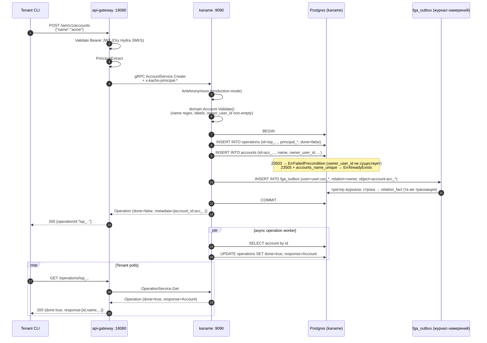

# 01. Account

## Назначение

**Account** — это **top-level tenant** в Kachō: «организация» как товар IAM.
Аккаунт изолирует ресурсы (Project, ServiceAccount, Group, Role, AccessBinding)
от других аккаунтов и привязан к ровно одному **owner-user**.

Account замещает связку `Organization` + `Cloud` из устаревшего
`kacho-resource-manager`: это единственный top-level контейнер, без
промежуточной сущности Organization.

**Use-cases:**
- Создание новой организации при signup-callback от Ory Kratos (через
  `InternalUserService.UpsertFromIdentity`).
- Перенос ресурсов между Account запрещен — каждый ресурс намертво привязан
  к Account через FK ON DELETE RESTRICT.
- Tenant-isolation основан на Account (`owner_user_id` определяет, кто
  доверенный admin данного аккаунта).

**Ограничения:**
- **Имя глобально уникально** (`UNIQUE accounts_name_unique`). Tenant'у
  показывается понятное сообщение `"Account with name <name> already exists"`.
- Удаление RESTRICT: нельзя удалить Account, пока существует хотя бы один
  Project / ServiceAccount / Group / custom-Role / AccessBinding в нем
  (`23503 foreign_key_violation` → `FailedPrecondition`).
- `owner_user_id` **hard-immutable**: в `updateMask` отвергается синхронно
  (`"ownerUserId is immutable after Account.Create"`). Пути сменить владельца аккаунта
  в дереве **нет вообще** — ни публичного, ни административного.

## Доменная модель

| Поле           | Тип                     | Обязательное | Immutable | Описание / валидация                                                  |
|----------------|-------------------------|--------------|-----------|-----------------------------------------------------------------------|
| `id`           | `AccountID` (`acc_...`) | да           | да        | `acc<17-char>` (`ids.NewID("acc")`). Длина 20.                        |
| `name`         | `AccountName`           | нет°         | нет       | `^[a-z0-9]([-a-z0-9]{0,61}[a-z0-9])?$` — единственная форма имени дерева (DNS label, RFC 1123). ° Пустое имя — законный вход: сервер подставляет имя, производное от `id`. |
| `description`  | `Description`           | нет          | нет       | `len ≤ 256`.                                                           |
| `labels`       | `Labels`                | нет          | нет       | map<key,val>, cardinality ≤64, key `^[a-z][-_./@a-z0-9]{0,62}$`, val ≤63. |
| `owner_user_id`| `UserID`                | да           | **да**    | FK → `users(id) ON DELETE RESTRICT`. Hard-immutable.                  |
| `created_at`   | `time.Time`             | да (server)  | да        | UTC, server-stamped.                                                  |

**ID prefix:** `acc` (см. `internal/domain/constants.go::PrefixAccount`).

**DB table:** `kaname.accounts` (`CREATE TABLE kaname.accounts` в `0001_initial.sql`).

**Sentinel errors → gRPC:**

| Sentinel                             | gRPC code           | Когда                                                  |
|--------------------------------------|---------------------|--------------------------------------------------------|
| `ErrNotFound`                        | `NOT_FOUND`         | `Get/Update/Delete` несуществующего id                 |
| `ErrAlreadyExists`                   | `ALREADY_EXISTS`    | Create с уже занятым `name`                            |
| `ErrFailedPrecondition`              | `FAILED_PRECONDITION` | Delete при наличии зависимых ресурсов / Owner-FK     |
| `ErrInvalidArg`                      | `INVALID_ARGUMENT`  | domain.Validate / immutable-field в UpdateMask         |

**FK contract:**

```
users(id) ──RESTRICT── accounts.owner_user_id
accounts(id) ──RESTRICT── projects.account_id
                       ── service_accounts.account_id
                       ── groups.account_id
                       ── roles.account_id (custom-role)
```

## Sequence diagram — Create



## API surface

### Public gRPC (порт 9090 TLS)

| RPC      | Sync/Async | Описание                                              |
|----------|------------|-------------------------------------------------------|
| `Create` | async      | Создает аккаунт. Возвращает Operation.                |
| `Get`    | sync       | Получает Account по id.                               |
| `List`   | sync       | Список аккаунтов (filter by `owner_user_id`, paging). |
| `Update` | async      | UpdateMask: `name`, `description`, `labels`.          |
| `Delete` | async      | Удаление. RESTRICT-FK если есть Project/SA/...        |

### REST mapping (через api-gateway)

| HTTP   | Path                              | gRPC mapping                |
|--------|-----------------------------------|------------------------------|
| POST   | `/iam/v1/accounts`                | `AccountService.Create`      |
| GET    | `/iam/v1/accounts/{accountId}`    | `AccountService.Get`         |
| GET    | `/iam/v1/accounts`                | `AccountService.List`        |
| PATCH  | `/iam/v1/accounts/{accountId}`    | `AccountService.Update`      |
| DELETE | `/iam/v1/accounts/{accountId}`    | `AccountService.Delete`      |

## Конфигурация

Account как ресурс не имеет отдельных env-vars — конфигурируется через
общие настройки сервиса (`repository.*`, `authn.*`). См. [`31-deployment.md`](31-deployment.md).

## Как пользоваться

### REST (curl)

```bash
# 1. Получить JWT через Ory Hydra client_credentials (OAuth2 token endpoint).
TOKEN=$(curl -s -X POST "$HYDRA_TOKEN_URL" \
  -d "grant_type=client_credentials" \
  -d "client_id=$HYDRA_CLIENT_ID" \
  -d "client_secret=$HYDRA_CLIENT_SECRET" \
  -d "scope=openid profile" | jq -r .access_token)

# 2. Create Account.
RESP=$(curl -s -X POST http://localhost:18080/iam/v1/accounts \
  -H "Authorization: Bearer $TOKEN" \
  -H "Content-Type: application/json" \
  -d '{"name":"acme","description":"Acme Corp","labels":{"env":"prod"}}')
# owner_user_id НЕ присылается: поле выходное, владельцем становится вызывающий.
# Присланное значение — sync INVALID_ARGUMENT, включая собственный верный id.
OP_ID=$(echo "$RESP" | jq -r .id)

# 3. Poll Operation. Путь домен-агностичен — без имени сервиса в начале.
while true; do
  R=$(curl -s "http://localhost:18080/operations/$OP_ID" -H "Authorization: Bearer $TOKEN")
  [ "$(echo "$R" | jq -r .done)" = "true" ] && break
  sleep 1
done
ACC_ID=$(echo "$R" | jq -r .response.id)
echo "Account created: $ACC_ID"

# 4. Get.
curl -s "http://localhost:18080/iam/v1/accounts/$ACC_ID" -H "Authorization: Bearer $TOKEN" | jq

# 5. List.
curl -s "http://localhost:18080/iam/v1/accounts?owner_user_id=usr_xxx" -H "Authorization: Bearer $TOKEN" | jq
```

### gRPC (grpcurl)

```bash
grpcurl -plaintext \
  -H "Authorization: Bearer $TOKEN" \
  -d '{"name":"acme"}' \
  localhost:9090 kaname.cloud.iam.v1.AccountService/Create
```

### Идемпотентность

Account.Create **не** идемпотентен — повторный вызов с тем же `name` вернет
`ALREADY_EXISTS`. Идемпотентность только у `AccessBinding.Create` (см.
[`08-access-binding.md`](08-access-binding.md)).

### Типичные ошибки

| Сценарий                                              | gRPC code             | HTTP | Текст                                              |
|-------------------------------------------------------|-----------------------|------|----------------------------------------------------|
| Имя занято                                            | `ALREADY_EXISTS`      | 409  | `Account with name acme already exists`            |
| `owner_user_id` не существует                         | `FAILED_PRECONDITION` | 400  | `owner_user_id usr_xxx not found`                  |
| Удаление при наличии Project                          | `FAILED_PRECONDITION` | 400  | `account is not empty (projects/...)`              |
| Невалидное имя                                        | `INVALID_ARGUMENT`    | 400  | `Illegal argument name: must match ^[a-z]...`      |
| Update с `ownerUserId` в mask                         | `INVALID_ARGUMENT`    | 400  | `ownerUserId is immutable after Account.Create`    |
| Account не найден                                     | `NOT_FOUND`           | 404  | `Account acc_xxx not found`                        |
| Темп заведения исчерпан                               | `RESOURCE_EXHAUSTED`  | 429  | `identity <ext> has reached its admission rate of 3 iam.account per 3600 seconds` |
| Величина темпа не назначена                           | `FAILED_PRECONDITION` | 400  | `identity <ext> has no admission rate stated for iam.account` |

### Потолок ТЕМПА заведения

Сколько аккаунтов у одной личности — держит потолок объёма (миграция `484002`).
Он не держит СКОРОСТЬ: пять заводятся за секунду, затем ещё пять с новой
подтверждённой почты. Потолок темпа (задача #618) отвечает на другой
вопрос — «сколько личность завела за окно» — и требует времени, а не только
числа.

| | потолок объёма | потолок темпа |
|---|---|---|
| носитель | личность (`users.external_id`) | она же |
| величина | `kaname.limits`, вид `iam.account` | `kaname.account_admission_rate_limits` |
| умолчание | 5 аккаунтов | 3 заведения за 3600 секунд |
| отказ | `QUOTA_EXCEEDED`, `KQ001` | `QUOTA_RATE_EXCEEDED`, `KQ004` |
| что делать вызывающему | ничего — предел терминален | **повторить в следующем окне** |
| что делать администратору | поднять предел | поднять величину или окно |

**Признак у отказов РАЗНЫЙ намеренно.** Код у обоих `RESOURCE_EXHAUSTED` — на
транспортном уровне «повтори позже» верно для обеих полос, — а различает их
`reason`-токен. Клиент, не различающий их, либо бросает работу там, где надо
повторить, либо повторяет вечно там, где повтор бесполезен.

**Первый аккаунт личности не отвергается по темпу НИКОГДА.** Личная область
заводится сама при первом входе, и отказ по темпу на этом пути был бы отказом во
входе. Свойство получается построением, а не веткой: первая запись личности
проходит ветвью вставки единственного оператора — то есть до всякого сравнения с
величиной — и не отвергается ни при какой её величине, включая ноль.

**Окно фиксированное, и плата за это названа:** на стыке двух окон личность
способна завести до 2N штук. Скользящее окно потребовало бы отметки каждого
заведения и уборки; для предела, чей предмет — сделать автоматизацию дорогой, а
не невозможной, двукратный всплеск на границе приемлем.

**Величины меняются администратором облака** правкой строки авторитета; они
читаются на пути записи тем же оператором, который списывает, поэтому изменение
действует немедленно и снимка, способного отстать, здесь не существует.
Собственной ручки API у этой величины сегодня НЕТ — она меняется в базе; заведение
ручки названо отдельным предметом и в этой работе не делалось.

## Как воспроизвести локально

Команды запускаются **от корня репозитория** (дерево одно, соседних репозиториев
стенда и сервиса рядом с ним нет).

```bash
# 1. Поднять стенд (kind + helm umbrella).
make -C deploy dev-up

# 2. Port-forward api-gateway.
kubectl -n kacho port-forward svc/api-gateway 18080:8080 &

# 3. Newman regression для Account.
./services/iam/tests/newman/scripts/run.sh --service iam-account

# 4. psql.
make -C deploy psql SVC=iam
# > SELECT id, name, owner_user_id, created_at FROM kaname.accounts LIMIT 10;

# 5. Integration tests.
go test -short -count=1 -timeout 120s ./services/iam/internal/repo/kaname/pg/

# 6. Логи сервиса.
make -C deploy logs-svc SVC=iam
```

> [!note] Набор выбирается флагом, а не переменной окружения
> Прогонщик присваивает своей переменной пустое значение первым делом, поэтому
> имя набора, переданное окружением, затиралось и прогонялись **все** коллекции
> сервиса. Команда при этом завершалась успехом — то есть выглядела исполненной,
> а спрашивала не то, о чём просил читатель.

## Подробности реализации

- **Use-cases:** `internal/apps/kaname/api/account/{create,get,list,update,delete}.go`.
- **Handler:** `internal/apps/kaname/api/account/handler.go` — тонкий transport.
- **Repo iface:** `internal/repo/kaname/account/iface.go` (Reader/Writer split).
- **Repo impl:** `internal/repo/kaname/pg/account_repo.go` (pgx + dto-mapping).
- **DB:** таблица `accounts` со столбцами `id, name, description, labels JSONB, owner_user_id, created_at`.
- **Indexes:** PK `accounts_pkey(id)`, UNIQUE `accounts_name_unique(name)`, INDEX
  `accounts_owner_idx(owner_user_id)`.
- **FK:** `accounts_owner_fk(owner_user_id) → users(id) ON DELETE RESTRICT`, объявлен
  **`DEFERRABLE INITIALLY DEFERRED`** (порядок посева не важен). Следствие для маппинга
  ошибок: `23503` по этому ключу приходит из `Commit()`, а не из `INSERT`.
- **CHECK:** `accounts_labels_valid CHECK (kacho_labels_valid(labels))`.
- **Намерение о владении:** Create-use-case кладёт кортеж владельца
  `(user:usr_xxx, owner, account:acc_xxx)` в журнал `kaname.fga_outbox` **в том же
  writer-tx**; триггер журнала складывает из строки прямой факт (`relation_fact`) там же.
  Отдельного дренажа наружу нет — владение действует с момента фиксации.
- **Transactional semantics:** INSERT account + INSERT operations + INSERT
  fga_outbox — одна транзакция; rollback → ни одной orphan-строки.

## Gotchas / известные ограничения

- **Глобально-уникальное имя** — namespace конфликтует между tenant'ами. В
  multi-tenant prod рекомендуется добавлять префикс tenant'а к `name`.
- **owner_user_id immutable, и заменить его нечем.** Здесь стояло обещание отдельного RPC
  передачи владения — такого RPC в контракте нет, тикета за ним не стоит, и «не реализован
  публично» читалось как «есть административный путь», которого тоже нет. Единственный способ
  сменить владельца сегодня — завести новый аккаунт: аккаунт создаётся самообслуживанием, и
  его владелец задаётся на создании навсегда. Понадобится передача владения — она заводится
  приёмкой и контрактом, а не строкой в этом перечне.
- **Delete cascade** — НЕТ. Все child-ресурсы (Project, SA, Group, ...) надо
  удалить вручную, иначе RESTRICT-блок. Каскадное удаление через границу
  сервиса не выполняется (только same-DB FK cascade).
- **Bootstrap path** — при первом signup-е User'а от Ory Kratos,
  `InternalUserService.UpsertFromIdentity` создает User + Account + Project +
  default-AccessBindings в одной транзакции; обходит per-resource Create
  use-case (см. [`21-internal-iam.md`](21-internal-iam.md)).

## Связанные компоненты

- [`02-project.md`](02-project.md) — Project (child Account-а).
- [`03-user.md`](03-user.md) — User (`owner_user_id`).
- [`07-role.md`](07-role.md) — Role (custom-роли account-scoped).
- [`21-internal-iam.md`](21-internal-iam.md) — `UpsertFromIdentity` bootstrap path.
- [`29-relational-verdict.md`](29-relational-verdict.md) — owner-tuple propagation.

## Ссылки на код

- `internal/domain/account.go` — entity + Validate.
- `internal/domain/types.go::AccountID, AccountName, validateResourceName` — newtypes.
- `internal/apps/kaname/api/account/` — use-cases.
- `internal/repo/kaname/pg/account_repo.go` — pg-impl.
- `internal/migrations/0001_initial.sql` — DDL `accounts`.
- `tests/newman/cases/iam-account-*.py` — black-box scenarios.
