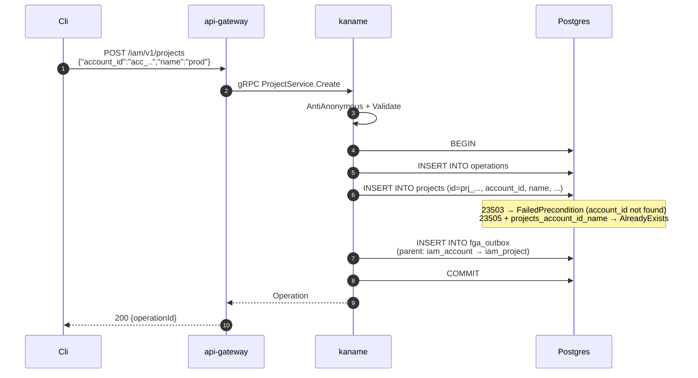

# 02. Project

## Назначение

**Project** — это ресурс, который группирует workload-сущности (Compute
instances, VPC networks, NLBs) внутри Account. Project — второй (и последний)
уровень иерархии владения Kachō: **Account → Project**, без промежуточных
сущностей. Он обеспечивает второй уровень изоляции внутри Account (например,
prod / staging / dev — это три Project одного Account).

> [!warning] Здесь была описана операция `Move` — её нет ни в одном слое дерева
> Перепись 2026-08-11 по пяти осям, каждая независима: RPC в `project_service.proto` — **нет**
> (объявлено шесть: `Get`, `List`, `Create`, `Update`, `Delete`, `ListOperations`);
> HTTP-правила с суффиксом-действием у этого сервиса — **нет** (шесть правил, все на
> `/iam/v1/projects…`); маршрута с этим суффиксом в таблице маршрутов шлюза под доменом iam —
> **нет** (два маршрута такой формы в дереве принадлежат nlb); файла use-case и метода
> репозитория — **нет**; истории у обоих (`git log -S`) — **пустая**, то есть операция не была
> снята, её здесь не было никогда.
>
> Прежняя редакция описывала её как «самый интересный flow»: диаграмма последовательности,
> строка в таблице RPC, строка в REST-отображении, команда `curl`, разбор идемпотентности,
> два замечания о конкурентности и имя метода репозитория — **семь мест**, ни одно из которых
> не имело предмета. Страница арендатора (`content/api/project.mdx`) про `Move` не говорит
> ничего и была права; расходились не два документа между собой, а один документ с деревом.
>
> `account_id` **hard-immutable**: он отвергается в `updateMask` сообщением
> `"accountId is immutable after Project.Create"`. Пути сменить владеющий аккаунт у проекта
> сегодня **не существует** — ни обычного, ни специального. Если такой путь понадобится, он
> заводится приёмкой и контрактом, а не возвращением этого раздела.

**Use-cases:**
- Управление группами ресурсов внутри Account (Compute/VPC/LB-ресурсы
  ссылаются на `project_id` как scope).
- AccessBinding на `project` resource_type грантит права на все
  ресурсы внутри Project (через FGA hierarchy).

**Ограничения:**
- **Имя уникально per-Account** (`UNIQUE projects_account_name_unique`).
- **Непустой проект не удаляется.** Состав проекта служба знает СВОЕЙ базой:
  владельцы ресурсов пяти доменов регистрируют каждый объект в зеркале
  `kaname.resource_mirror` (внутренний глагол `RegisterResource`), а проектные
  роли лежат в `kaname.roles` под ключом `roles_project_fk ON DELETE RESTRICT`.
  Удаление — ОДИН оператор писателя: две охраны `NOT EXISTS` (зеркало без
  семейства `iam.*`, таблица ролей) плюс зонд, отвечающий, что удерживает.
  Владельцев служба на удалении не спрашивает и не вправе — она лист графа
  вызовов. Приёмка — `docs/engineering/acceptance/non-empty-project-is-not-deleted.md`.
- `account_id` **hard-immutable**: в `updateMask` отвергается `INVALID_ARGUMENT`
  (`"accountId is immutable after Project.Create"`). Операции переноса проекта между
  аккаунтами в дереве нет.

## Доменная модель

| Поле          | Тип                       | Обязательное | Immutable | Описание / валидация                                  |
|---------------|---------------------------|--------------|-----------|--------------------------------------------------------|
| `id`          | `ProjectID` (`prj_...`)   | да           | да        | `prj<17-char>`. Длина 20.                              |
| `account_id`  | `AccountID`               | да           | да        | FK → `accounts(id) ON DELETE RESTRICT`.                |
| `name`        | `ProjectName`             | нет°         | нет       | `^[a-z0-9]([-a-z0-9]{0,61}[a-z0-9])?$` (DNS label, RFC 1123). ° Пустое — сервер подставит имя от `id`. |
| `description` | `Description`             | нет          | нет       | `len ≤ 256`.                                            |
| `labels`      | `Labels`                  | нет          | нет       | ≤64 пар, ключ regex, val ≤63.                          |
| `created_at`  | `time.Time`               | да (server)  | да        | UTC.                                                   |

**ID prefix:** `prj` (`domain.PrefixProject`).
**DB table:** `kaname.projects` (`CREATE TABLE kaname.projects` в `0001_initial.sql`).

**Sentinel errors:**

| Sentinel                | gRPC code              | Когда                                              |
|-------------------------|-------------------------|----------------------------------------------------|
| `ErrNotFound`           | `NOT_FOUND`             | id не найден                                       |
| `ErrAlreadyExists`      | `ALREADY_EXISTS`        | name занят в данном Account                        |
| `ErrReferenceInUse`     | `FAILED_PRECONDITION`   | Delete непустого проекта: `Project <id> is not empty (<вид>: <число>, …)`, признак `REFERENCE_IN_USE` — в операции |
| `ErrInvalidArg`         | `INVALID_ARGUMENT`      | domain.Validate / immutable-field в UpdateMask     |

**FK contract:**

```
accounts(id) ──RESTRICT── projects.account_id
projects(id) ──RESTRICT── roles.project_id            (единственный ключ на projects)
projects(id) ·· без ключа ·· resource_mirror.parent_project_id
                             (ресурсы чужих модулей: зеркало живёт в той же базе,
                              но ключа не несёт — окно доставки объявлено контрактом)
```

## Sequence diagram — Create



## API surface

### Public gRPC (порт 9090)

| RPC      | Sync/Async | Описание                                                  |
|----------|------------|-----------------------------------------------------------|
| `Create` | async      | Создает Project в Account.                                |
| `Get`    | sync       | Получает по id.                                           |
| `List`   | sync       | Список (filter by `account_id`, paging).                  |
| `Update` | async      | UpdateMask: `name`, `description`, `labels`.              |
| `Delete` | async      | Удаление; непустой проект отвергается в операции с перечнем видов и чисел. |
| `ListOperations` | sync | Журнал операций над этим Project.                        |

### REST mapping

| HTTP    | Path                                  | gRPC mapping             |
|---------|---------------------------------------|---------------------------|
| POST    | `/iam/v1/projects`                    | `ProjectService.Create`   |
| GET     | `/iam/v1/projects/{projectId}`        | `ProjectService.Get`      |
| GET     | `/iam/v1/projects?account_id=...`     | `ProjectService.List`     |
| PATCH   | `/iam/v1/projects/{projectId}`        | `ProjectService.Update`   |
| DELETE  | `/iam/v1/projects/{projectId}`        | `ProjectService.Delete`   |
| GET     | `/iam/v1/projects/{projectId}/operations` | `ProjectService.ListOperations` |

## Конфигурация

Project как ресурс не имеет отдельных env-vars.

## Как пользоваться

### REST (curl)

```bash
# Create.
RESP=$(curl -s -X POST http://localhost:18080/iam/v1/projects \
  -H "Authorization: Bearer $TOKEN" \
  -H "Content-Type: application/json" \
  -d '{"account_id":"acc_xxx","name":"prod","description":"Production env","labels":{"env":"prod"}}')
OP_ID=$(echo "$RESP" | jq -r .id)
# poll операцию ...
PRJ_ID=$(echo "$R" | jq -r .response.id)

# List в Account.
curl "http://localhost:18080/iam/v1/projects?account_id=acc_xxx" \
  -H "Authorization: Bearer $TOKEN" | jq
```

### gRPC (grpcurl)

```bash
grpcurl -plaintext -H "Authorization: Bearer $TOKEN" \
  -d '{"account_id":"acc_xxx","name":"prod"}' \
  localhost:9090 kaname.cloud.iam.v1.ProjectService/Create
```

### Идемпотентность

Project.Create — не идемпотентен (повторный вызов с тем же name в том же аккаунте →
`AlreadyExists`).

### Типичные ошибки

| Сценарий                                  | gRPC code             | HTTP | Текст                                                            |
|-------------------------------------------|------------------------|------|------------------------------------------------------------------|
| Имя занято в Account                      | `ALREADY_EXISTS`       | 409  | `Project with name prod already exists in account acc_xxx`       |
| `account_id` не существует                | `FAILED_PRECONDITION`  | 400  | `account_id acc_xxx not found`                                   |
| Update с `account_id` в mask              | `INVALID_ARGUMENT`     | 400  | `accountId is immutable after Project.Create`                    |
| Project не найден                         | `NOT_FOUND`            | 404  | `Project prj_xxx not found`                                      |

## Как воспроизвести локально

Команды запускаются **от корня репозитория**.

```bash
make -C deploy dev-up
kubectl -n kacho port-forward svc/api-gateway 18080:8080 &

# Newman. Набор выбирается флагом: имя, переданное окружением, прогонщик
# затирает первым делом, и прогон молча уходит на весь сервис.
./services/iam/tests/newman/scripts/run.sh --service iam-project

# psql.
make -C deploy psql SVC=iam
# > SELECT id, account_id, name FROM kaname.projects;

# Integration tests.
go test -short -count=1 -timeout 120s -run TestProject \
  ./services/iam/internal/repo/kaname/pg/...
```

## Подробности реализации

- **Use-cases:** `internal/apps/kaname/api/project/{create,get,list,update,delete}.go`.
- **Handler:** `internal/apps/kaname/api/project/handler.go`.
- **Repo iface:** `internal/repo/kaname/project/iface.go`.
- **Repo impl:** `internal/repo/kaname/pg/project_repo.go`.
- **DB:** таблица `projects` со столбцами `id, account_id, name, description, labels JSONB, created_at`.
- **Indexes:** PK `projects_pkey(id)`, UNIQUE `projects_account_name_unique(account_id, name)`,
  INDEX `projects_account_idx(account_id)`.
- **FK:** `projects_account_fk → accounts(id) ON DELETE RESTRICT`.
- **CHECK:** `projects_labels_valid`.
- **FGA hierarchy:** при Create — tuple `(iam_account:acc…, parent, iam_project:prj…)`.
  Родитель проекта не меняется в течение его жизни: `account_id` immutable.

## Gotchas / известные ограничения

- **Delete не cascade'ит cross-service и не спрашивает владельцев** — проект с
  зарегистрированными ресурсами чужих модулей отвергается по зеркалу
  (`Project <id> is not empty (vpc.network: 2)`). Что отказ НЕ гарантирует:
  строка зеркала приходит после коммита владельца, и регистрация, обогнавшая
  удаление, ложится с родителем, которого нет (`IAM-PNE-1-13`); такие строки
  называет проход по зеркалу на старте (стадия S2 приёмки). Consumer-сервис
  по-прежнему обязан грациозно переживать dangling-ref — деградированный
  статус, не паника.

## Связанные компоненты

- [`01-account.md`](01-account.md) — owner Account-а.
- [`08-access-binding.md`](08-access-binding.md) — bindings на `project` resource_type.
- [`07-role.md`](07-role.md) — project-scoped custom roles.
- [`29-relational-verdict.md`](29-relational-verdict.md) — FGA hierarchy propagation.

## Ссылки на код

- `internal/domain/project.go`
- `internal/apps/kaname/api/project/`
- `internal/repo/kaname/pg/project_repo.go`
- `internal/migrations/0001_initial.sql` — DDL `projects`
