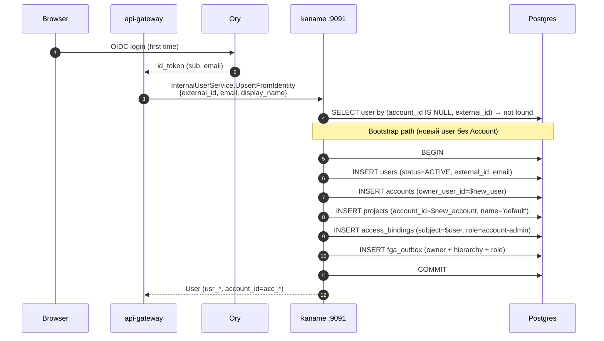

# 03. User

## Назначение

**User** — mirror identity-сущности из внешнего IdP (Ory Kratos). В Kachō
у User'а нет паролей и MFA-настроек — этим занимается IdP. Сервис `kaname`
хранит только то, что нужно для авторизации и audit'a: `external_id` (subject
из OIDC-токена), `email`, `display_name`, `account_id`, `invite_status`.

Особенность: **публичный** `UserService` НЕ имеет метода `Create` — пользователи
создаются ТОЛЬКО двумя путями:

1. **Self-signup** через OIDC-callback (Ory Kratos logged in → api-gateway вызывает
   `InternalUserService.UpsertFromIdentity`).
2. **Invite-flow** через `UserService.Invite` — admin создает PENDING-запись с
   `external_id=""`, Kratos шлет magic-link, при первом login заполняется
   `external_id`.

**Use-cases:**
- Mirror identity для AccessBinding (`subject_type=user`, `subject_id=usr_*`).
- Audit-trail: principal в operations / audit_outbox.
- Invite-flow для tenant-onboarding'a (admin приглашает по email).

**Ограничения:**
- `external_id` immutable (изменение → identity-mismatch).
- `account_id` immutable.
- Создавать User напрямую нельзя — только через Invite или UpsertFromIdentity.

## Доменная модель

| Поле           | Тип              | Обязательное | Immutable | Описание                                                            |
|----------------|------------------|--------------|-----------|---------------------------------------------------------------------|
| `id`           | `UserID`         | да           | да        | `usr<17-char>`. Длина 20.                                           |
| `account_id`   | `AccountID`      | да           | **да**    | FK → `accounts(id)`.                                                |
| `external_id`  | `ExternalSubject`| зависит от status | **да** | OIDC `sub` (Ory). PENDING → "", ACTIVE/BLOCKED → non-empty.         |
| `email`        | `Email`          | да           | нет       | `^[^\s@]+@[^\s@]+\.[^\s@]+$`, ≤254.                                 |
| `display_name` | `DisplayName`    | нет          | нет       | len 1..128.                                                          |
| `invite_status`| `InviteStatus`   | да           | нет       | `PENDING | ACTIVE | BLOCKED`. Меняется ТОЛЬКО действиями `Block`/`Unblock`, НЕ через `Update`. |
| `invited_by`   | `UserID`         | нет          | да        | Кто пригласил (для PENDING). "" если self-signup.                   |
| `created_at`   | `time.Time`      | да (server)  | да        | UTC.                                                                |

**DB CHECK `users_invite_status_consistency`:**
```
PENDING ⇔ external_id = '';  ACTIVE/BLOCKED ⇔ external_id <> ''
```

**Partial UNIQUE:** `users_account_external_id_unique ON (account_id, external_id) WHERE external_id <> ''`.

**ID prefix:** `usr`.
**DB table:** `kaname.users` (`CREATE TABLE kaname.users` в `0001_initial.sql`).

**FK contract:**

```
accounts(id) ──RESTRICT── users.account_id
users(id) ──RESTRICT── accounts.owner_user_id  (circular at bootstrap — см. раздел «Подробности реализации»)
users(id) ──RESTRICT── access_bindings.subject_id (когда subject_type='user')
```

## Sequence diagram — Invite-flow

```mermaid
sequenceDiagram
    autonumber
    participant Admin as Tenant admin
    participant GW as api-gateway
    participant IAM as kaname :9090
    participant DB as Postgres
    participant Kratos as Kratos
    participant Invitee as Invitee inbox
    participant Ory as Ory

    Admin->>GW: POST /iam/v1/users:invite<br/>{"account_id":"acc","email":"bob@x","role_id":"rol_..."}
    GW->>IAM: gRPC UserService.Invite
    IAM->>IAM: AntiAnonymous + Validate (email)
    IAM->>DB: BEGIN
    IAM->>DB: INSERT INTO operations
    IAM->>DB: INSERT INTO users (status=PENDING, external_id='', invited_by=$admin)
    IAM->>DB: INSERT INTO access_bindings (subject=user:usr_pending, role_id, scope=project)
    IAM->>DB: INSERT INTO fga_outbox (role-tuple + hierarchy)
    IAM->>DB: COMMIT
    IAM->>Kratos: POST /admin/recovery/link (magic-link delivery)
    Kratos->>Invitee: Email с magic-link
    IAM-->>GW: Operation
    GW-->>Admin: 200 {operationId, userId:"usr_pending"}

    Note over Invitee,Ory: ─── ASYNC: invitee кликает по link ───
    Invitee->>Ory: clicks link → OIDC login flow
    Ory->>GW: OIDC callback (id_token c "sub":"ory-sub-xyz", email)
    GW->>IAM: gRPC InternalUserService.UpsertFromIdentity<br/>{external_id:"ory-sub-xyz", email:"bob@x"}
    IAM->>DB: SELECT user WHERE account_id=? AND email=? AND status=PENDING
    alt Existing PENDING
        IAM->>DB: UPDATE users SET external_id=$sub, status=ACTIVE WHERE id=usr_pending
    else No PENDING row
        IAM->>DB: INSERT users (status=ACTIVE, external_id=$sub, ...)
    end
    IAM-->>GW: User (ACTIVE, usr_id)
    GW-->>Invitee: Set-Cookie session ; 302 → tenant-UI
```

## Sequence diagram — UpsertFromIdentity (self-signup bootstrap)



## API surface

### Public gRPC (порт 9090)

| RPC      | Sync/Async | Описание                                              |
|----------|------------|-------------------------------------------------------|
| `Get`    | sync       | Получает User по id.                                  |
| `List`   | sync       | Список (filter by `account_id`).                      |
| `Invite` | async      | Создает PENDING-User + AccessBinding + Kratos magic-link |
| `Update` | async      | Единственное mutable-поле — `labels`.                 |
| `Delete` | async      | Удаление. RESTRICT-FK если есть AccessBinding.        |
| `Block`  | async      | Участие в Account'е запрещено. Идемпотентно по состоянию; `v_update` + порог повышенной аутентификации. |
| `Unblock`| async      | Участие разрешено снова. Та же форма и то же право.   |
| ~~`Create`~~ | — | **Намеренно отсутствует.** Используйте Invite или OIDC self-signup. |

### Internal gRPC (порт 9091)

| RPC                    | Описание                                                    |
|------------------------|-------------------------------------------------------------|
| `UpsertFromIdentity`   | OIDC-callback creates/updates User (+ bootstrap Account/Project). |
| `Get`                  | Admin Get.                                                  |

### REST mapping

| HTTP    | Path                              | gRPC mapping              |
|---------|-----------------------------------|----------------------------|
| GET     | `/iam/v1/users/{userId}`          | `UserService.Get`         |
| GET     | `/iam/v1/users`                   | `UserService.List`        |
| POST    | `/iam/v1/users:invite`            | `UserService.Invite`      |
| PATCH   | `/iam/v1/users/{userId}`          | `UserService.Update`      |
| DELETE  | `/iam/v1/users/{userId}`          | `UserService.Delete`      |
| POST    | `/iam/v1/users/{userId}:block`    | `UserService.Block`       |
| POST    | `/iam/v1/users/{userId}:unblock`  | `UserService.Unblock`     |

## Административный запрет участию (`:block` / `:unblock`)

**Предмет — СТРОКА ЧЛЕНСТВА, а не человек.** `users` — строка на пару (личность,
Account); одна личность держит по строке на каждый Account. Запрет принадлежит тому
Account'у, который его наложил, и администратор Account A не выключает человека в
Account B.

**Инвариант схемы, который важно знать оператору:** миграция 0011 держит
глобальный частичный UNIQUE по `external_id` среди `ACTIVE`-строк — «одна
действующая строка на личность». Поэтому набор строк личности это одно действующее
членство плюс сколько угодно запрещённых, и запрет действующего членства лишает
личность единственной действующей строки: аутентификация прекращается везде. Это
следствие инварианта схемы, а не области действия записи.

Следствие для снятия: снять запрет со второй строки, когда у личности уже есть
действующая, **нельзя** — `ALREADY_EXISTS` («User with external_id already
exists»). Сначала запретите действующее членство, потом возвращайте нужное.

**Почему действие, а не поле `Update`.** У пустой `update_mask` семантика полной
замены объекта, а enum в proto3 неотличим от незаданного: клиент, не приславший
поле, запретил бы участие каждому, кого коснулся. У действия маски нет. Плюс это
СОБЫТИЕ, и след обязан уметь это сказать: `iam.user.blocked` / `iam.user.unblocked`
(не `iam.user.updated` с полем внутри). `invite_status` в `update_mask` → 400 с
текстом, называющим действия.

**Идемпотентно по состоянию, а не по переходу**: запрет уже запрещённого — успех.
След пишется и на повторе: кто-то с правом попросил.

**Кто вправе** — `identity_suspender` на `iam_user`, то есть администратор владеющего
Account'а (`super_admin: admin from account`) и, каскадом, администратор облака.
Обычный участник этого права на своей строке не держит, поэтому снять запрет с себя
нельзя — и это осознанно: восстановление пароля блокировку не снимает
(самостоятельное действие не отменяет административное). Порог повышенной
аутентификации — интерактивный; машинный принципал от него освобождён.

**Что НЕ делает.** Уже выданный access-токен доживает свой срок. Немедленно
прекращается ВЫДАЧА нового — на каждой двери (хук токена, хук обновления, выдача
персонального токена, резолв субъекта на краю). Отсечка живых сессий
(`user_token_revocations`) здесь не применяется намеренно: её область — вся
личность, и она обрубила бы сессии там, где личность активна законно. Для «выгнать
человека целиком» есть `ForceLogout`.

**PENDING не блокируется и не разблокируется** → `FAILED_PRECONDITION`
«User \<id\> is not active». У приглашения нет подтверждённой личности (DB-CHECK
`users_invite_status_consistency`), а перевод приглашённого в действующего — это
активация при первом входе, свой путь. Приглашение отзывают, а не разблокируют.

## Конфигурация

**Своих ручек у приглашения нет.** Предикат: `grep -rhoE 'KANAME_KRATOS_[A-Z0-9]*'`
по всему дереву даёт **ноль** вхождений (замер 2026-08-06).

> [!note] Здесь стояли две переменные под админ-API поставщика личности — их нет
> Прежняя редакция объявляла адрес и токен админского API Kratos с YAML-двойниками
> и описывала dev-заглушку клиента. Ни переменных, ни YAML-ключей, ни самого клиента
> в дереве нет: клиент удалён, и об этом прямо сказано в шапке
> `internal/apps/kaname/api/user/invite.go`. Приглашение создаёт строку пользователя в
> состоянии PENDING и (опционально) привязку доступа; **чем именно** приглашённый
> активирует строку — вход через поставщика личности, ссылка, помощь администратора —
> вынесено за пределы сервиса. Имена переменных не воспроизводятся: в обратных кавычках
> они читаются как живые ручки, которые кто-нибудь пропишет в чарт.

## Как пользоваться

### Invite (curl)

```bash
# Создает PENDING-User в Account acc_xxx с role rol_viewer на project prj_yyy.
curl -X POST http://localhost:18080/iam/v1/users:invite \
  -H "Authorization: Bearer $TOKEN" \
  -H "Content-Type: application/json" \
  -d '{
    "account_id":"acc_xxx",
    "email":"bob@example.com",
    "role_id":"rol_viewer",
    "project_id":"prj_yyy"
  }'
# → {operationId, user_id:"usr_..."}
```

### Get / List

```bash
curl http://localhost:18080/iam/v1/users/usr_xxx -H "Authorization: Bearer $TOKEN"
curl "http://localhost:18080/iam/v1/users?account_id=acc_xxx" -H "Authorization: Bearer $TOKEN"
```

### gRPC InternalUpsertFromIdentity (admin only)

```bash
grpcurl -plaintext -d '{
  "external_id":"ory-sub-xyz",
  "email":"alice@example.com",
  "display_name":"Alice"
}' localhost:9091 kaname.cloud.iam.v1.InternalUserService/UpsertFromIdentity
```

### Идемпотентность

`UpsertFromIdentity` идемпотентен по `(account_id, external_id)`: повторный
вызов с тем же `external_id` возвращает уже созданный User row без `ALREADY_EXISTS`.

### Типичные ошибки

| Сценарий                                  | gRPC code             | HTTP | Текст                                          |
|-------------------------------------------|------------------------|------|------------------------------------------------|
| Email занят в Account (PENDING)           | `ALREADY_EXISTS`       | 409  | `User with email already invited`              |
| Email невалиден                           | `INVALID_ARGUMENT`     | 400  | `Illegal argument email: invalid format`       |
| Delete user, на которого ссылается binding| `FAILED_PRECONDITION`  | 400  | `user is referenced by access_bindings`        |
| Update с `externalId` (через internal)    | `INVALID_ARGUMENT`     | 400  | `externalId is immutable after User.Create`    |
| Update с `inviteStatus` в маске           | `INVALID_ARGUMENT`     | 400  | `inviteStatus is not updatable; use UserService.Block / UserService.Unblock` |
| Block/Unblock на PENDING-приглашении      | `FAILED_PRECONDITION`  | 400  | `User <id> is not active`                      |
| Block/Unblock по отсутствующему id        | `NOT_FOUND`            | 404  | `User <id> not found`                          |
| Unblock, когда у личности уже есть ACTIVE | `ALREADY_EXISTS`       | 409  | `User with external_id already exists`         |

## Как воспроизвести локально

Команды запускаются **от корня репозитория**.

```bash
make -C deploy dev-up
kubectl -n kacho port-forward svc/api-gateway 18080:8080 &

./services/iam/tests/newman/scripts/run.sh --service iam-user

# psql:
make -C deploy psql SVC=iam
# > SELECT id, account_id, email, invite_status, external_id FROM kaname.users LIMIT 10;

# Integration: invite-flow + UpsertFromIdentity.
go test -short -count=1 -timeout 120s \
  -run "TestUser|TestUpsertFromIdentity|TestInvite" \
  ./services/iam/internal/repo/kaname/pg/...
```

## Подробности реализации

- **Use-cases:** `internal/apps/kaname/api/user/` (`get.go`, `list.go`, `delete.go`,
  `invite.go`, `internal_upsert.go`, `set_blocked.go`, `update.go`, `audit.go`).
- **Handler:** `internal/apps/kaname/api/user/handler.go` (public); internal-полоса —
  `internal_upsert.go` и `internal_on_recovery.go` в том же каталоге (отдельного файла
  с обобщённым именем внутреннего обработчика здесь нет).
- **Repo:** `internal/repo/kaname/pg/user_repo.go` + `user_pool_repo.go` (Hydra hooks).
- **Bootstrap path:** `UpsertFromIdentity` создает User + Account + Project +
  AccessBindings в одной transaction, минуя per-resource `CreateUseCase`.
  FGA tuples — все в одном `fga_outbox` batch.
- **Invite-flow:** `users.invited_by` хранит admin'а; на match'е (`account_id,
  email, status=PENDING`) Upsert обновляет PENDING-row → ACTIVE с
  `external_id := <new sub>`.
- **DB:** таблица `users` со столбцами `id, account_id, external_id, email,
  display_name, invite_status, invited_by, created_at`.
- **Indexes:** PK `users_pkey(id)`; partial UNIQUE `users_account_external_id_unique`
  `WHERE external_id <> ''`; UNIQUE `users_account_email_unique(account_id, lower(email))`;
  INDEX `users_email_idx(lower(email))`, partial `users_email_pending_idx`,
  `users_active_external_id_idx`.
- **CHECK:** `users_invite_status_consistency` (PENDING ⇔ external_id='').

## Gotchas / известные ограничения

- **PENDING row blocks email re-invite** — если Bob уже приглашен (PENDING),
  повторный `Invite` с тем же email вернет `ALREADY_EXISTS`. Admin должен
  Delete + повторить, либо ждать первого login (PENDING → ACTIVE автоматом).
- **Bootstrap circular FK** — Account.owner_user_id → users(id); first User
  создается ДО Account (within-tx INSERT users → INSERT accounts с
  owner_user_id=just-created). Postgres допускает forward-ref внутри одной TX.
- **Email — НЕ уникален** глобально (даже не per-Account, кроме PENDING).
  Один человек может быть User'ом в N аккаунтах через одну email-у.
- **Self-signup vs invite race** — если Bob делает self-signup в момент,
  когда Alice его invite'ит, есть окно, в котором создаются 2 row:
  bootstrap (ACTIVE, отдельный Account) + PENDING-invite. Деталь в работе.

## Связанные компоненты

- [`01-account.md`](01-account.md) — Account создается вместе с первым User'ом.
- [`08-access-binding.md`](08-access-binding.md) — bindings на `subject_type=user`.
- [`21-internal-iam.md`](21-internal-iam.md) — `UpsertFromIdentity` детали.

## Ссылки на код

- `internal/domain/user.go`
- `internal/apps/kaname/api/user/`
- `internal/repo/kaname/pg/user_repo.go`, `user_pool_repo.go`
- `internal/migrations/0001_initial.sql` (таблица пользователей)
- `tests/newman/cases/iam-user.py`
