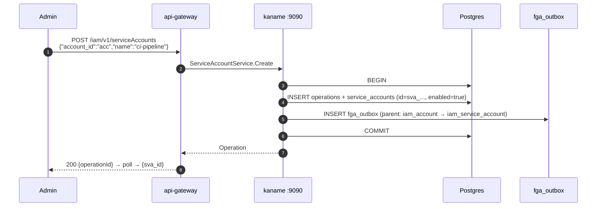

# 04. ServiceAccount

## Назначение

**ServiceAccount** (SA) — это machine identity внутри Account / Project. SA
получает токены не через интерактивный OIDC login, а через **OAuth2
client_credentials** по выпущенным SA-ключам (private_key_jwt,
см. [`05-sa-keys.md`](05-sa-keys.md)).

У каждого SA-ключа есть своя строка реестра в kaname, и кроме неё у ключа нет
ничего: обменивает его токен-эндпоинт платформы, а регистрации у внешнего
поставщика выдача не заводит (kaname#362) — см. [`05-sa-keys.md`](05-sa-keys.md)
и [`architecture/sa-key-issuance-leaves-the-provider.md`](../architecture/sa-key-issuance-leaves-the-provider.md).
Сама учётка — запись в базе службы; её поля — §Доменная модель.

**Use-cases:**
- Сервисная учетка для CI/CD pipeline (терраформ применяет ресурсы как SA).
- Машинная учетка для нагрузки в кластере (Pod аутентифицируется выданным SA-ключом).
- Backend-к-backend RPC (один из сервисов Kachō зовет другой как SA).

**Ограничения:**
- `account_id` immutable.
- Имя уникально per-Account.
- SA-ключи (`sa_keys`) — отдельный sub-resource (см. [`05-sa-keys.md`](05-sa-keys.md)).
- `enabled=false` закрывает КАЖДЫЙ путь выдачи нового токена или ключа
  (обмен на токен-эндпоинте платформы, `SAKeyService.Issue`, docker-token) и
  снимает уже выданные: переход в `false` пишет отсечку по учётке (триггер
  `service_account_deactivation_cuts_minted_tokens`), и правило отзыва наших
  токенов (`internal/tokenrevocation`) отвергает на предъявлении токен, выпущенный
  учётке раньше отсечки.

## Доменная модель

| Поле          | Тип                       | Обязательное | Immutable | Описание                                          |
|---------------|---------------------------|--------------|-----------|---------------------------------------------------|
| `id`          | `ServiceAccountID`        | да           | да        | `sva<17-char>`. Длина 20.                         |
| `account_id`  | `AccountID`               | да           | **да**    | FK → `accounts(id) ON DELETE RESTRICT`.           |
| `name`        | `SvcAccountName`          | нет°         | нет       | `^[a-z0-9]([-a-z0-9]{0,61}[a-z0-9])?$` (DNS label, RFC 1123). ° Пустое — сервер подставит имя от `id`. |
| `description` | `Description`             | нет          | нет       | len ≤256.                                          |
| `enabled`     | `bool`                    | да           | нет       | default `true`. Меняется ТОЛЬКО действиями `Disable`/`Enable`, НЕ через `Update`. |
| `created_at`  | `time.Time`               | да (server)  | да        | UTC.                                              |

**ID prefix:** `sva`.
**DB table:** `kaname.service_accounts` (`CREATE TABLE kaname.service_accounts` в `0001_initial.sql`).

**FK contract:**

```
accounts(id) ──RESTRICT── service_accounts.account_id
service_accounts(id) ──RESTRICT── service_account_oauth_clients.sva_id
service_accounts(id) ──RESTRICT── access_bindings.subject_id (когда subject_type='service_account')
```

## Sequence diagram — Create


```mermaid
sequenceDiagram
    autonumber
    participant Admin
    participant GW as api-gateway
    participant IAM as kaname :9090
    participant DB as Postgres
    participant Out as fga_outbox

    Admin->>GW: POST /iam/v1/serviceAccounts<br/>{"account_id":"acc","name":"ci-pipeline"}
    GW->>IAM: ServiceAccountService.Create
    IAM->>DB: BEGIN
    IAM->>DB: INSERT operations + service_accounts (id=sva_..., enabled=true)
    IAM->>Out: INSERT fga_outbox (parent: iam_account → iam_service_account)
    IAM->>DB: COMMIT
    IAM-->>GW: Operation
    GW-->>Admin: 200 {operationId} → poll → {sva_id}
```

Выпуск первого ключа — диаграмма «Issue» в [`05-sa-keys.md`](05-sa-keys.md).
Второй её копии здесь нет: две диаграммы одного выпуска расходятся молча.

## API surface

### Public gRPC (порт 9090)

| RPC       | Sync/Async | Описание                                        |
|-----------|------------|-------------------------------------------------|
| `Create`  | async      | Создает SA в Account (опционально в Project).   |
| `Get`     | sync       | Получает SA по id.                              |
| `List`    | sync       | Список (filter by `account_id`).                |
| `Update`  | async      | UpdateMask: `name`, `description`, `labels`.    |
| `Disable` | async      | Учётка больше не аутентифицируется. Идемпотентно; `v_update` + порог повышенной аутентификации. |
| `Enable`  | async      | Учётка аутентифицируется снова. Идемпотентно; тот же гейт. |
| `Delete`  | async      | RESTRICT-FK если есть active bindings/ключи.    |

**Почему `enabled` НЕ поле маски.** У `Update` пустая маска по конвенции платформы
означает полную замену объекта, а `bool` в proto3 неотличим от неприсланного —
поэтому очевидный вариант «ещё одно поле маски» позволил бы клиенту отключить
учётку, просто его не заполнив. Поле не добавляли. Плюс отключение — событие
(«учётку вывели из эксплуатации»), а не правка атрибута, и в журнале оно обязано
читаться событием: `iam.service_account.disabled` / `.enabled`.

**Про порог повышенной аутентификации.** Он ИНТЕРАКТИВНЫЙ: машинный принципал от
него освобождён платформенным правилом, поэтому для служебной учётки эти RPC
стоят ровно столько же, сколько `Update`. Кто вправе вызвать — решает отношение
`v_update`, то же самое и на том же объекте, что у `Update`.

**Порядок между двумя одновременными запросами не гарантирован** — мутации
асинхронные, поэтому `Enable`, отправленный РАНЬШЕ, может закоммититься ПОЗЖЕ
`Disable`. В инциденте состояние следует перечитывать (`Get` отдаёт `enabled`), а
не полагаться на то, что применён последний отправленный запрос.

SA-ключи — отдельный service (см. [`05-sa-keys.md`](05-sa-keys.md)).

### REST mapping

| HTTP    | Path                                          | gRPC mapping                       |
|---------|-----------------------------------------------|------------------------------------|
| POST    | `/iam/v1/serviceAccounts`                     | `ServiceAccountService.Create`     |
| GET     | `/iam/v1/serviceAccounts/{saId}`              | `ServiceAccountService.Get`        |
| GET     | `/iam/v1/serviceAccounts`                     | `ServiceAccountService.List`       |
| PATCH   | `/iam/v1/serviceAccounts/{saId}`              | `ServiceAccountService.Update`     |
| POST    | `/iam/v1/serviceAccounts/{saId}:disable`      | `ServiceAccountService.Disable`    |
| POST    | `/iam/v1/serviceAccounts/{saId}:enable`       | `ServiceAccountService.Enable`     |
| DELETE  | `/iam/v1/serviceAccounts/{saId}`              | `ServiceAccountService.Delete`     |

## Конфигурация

Своих ключей настройки у служебной учётки нет: сборка её use-case'ов
(`cmd/kaname/wiring.go`, блок `ServiceAccountService`) не передаёт им ни одной
величины настройки, и ни создание, ни правка, ни отключение, ни снятие учётки
ключом настройки не выбираются.

Выдачу её ключей настраивают ключи, перечисленные в
[`05-sa-keys.md`](05-sa-keys.md) §Конфигурация. Справочник посадки —
`docs/content/install/configuration.mdx`, перечень обязательных величин —
`INSTALL.md` §3; описи настроек здесь не заводится.

## Как пользоваться

### REST (curl)

```bash
# Create.
RESP=$(curl -s -X POST http://localhost:18080/iam/v1/serviceAccounts \
  -H "Authorization: Bearer $TOKEN" \
  -H "Content-Type: application/json" \
  -d '{"account_id":"acc_xxx","name":"ci-pipeline"}')
SA_ID=...

# Get.
curl http://localhost:18080/iam/v1/serviceAccounts/$SA_ID -H "Authorization: Bearer $TOKEN"

# Disable — учётка перестаёт получать новые токены и ключи.
# Действие, а не поле маски: маску можно забыть, действие — нет.
# Требует сессии с повышенной аутентификацией (acr=2).
curl -X POST http://localhost:18080/iam/v1/serviceAccounts/$SA_ID:disable \
  -H "Authorization: Bearer $STEPUP_TOKEN" -d '{}'

# Enable — обратно. Оба действия идемпотентны: запрос состояния, в котором
# учётка уже находится, успешен.
curl -X POST http://localhost:18080/iam/v1/serviceAccounts/$SA_ID:enable \
  -H "Authorization: Bearer $STEPUP_TOKEN" -d '{}'
```

### gRPC

```bash
grpcurl -plaintext -H "Authorization: Bearer $TOKEN" \
  -d '{"account_id":"acc_xxx","name":"ci-pipeline"}' \
  localhost:9090 kaname.cloud.iam.v1.ServiceAccountService/Create
```

### Идемпотентность

Не идемпотентен (имя занято → AlreadyExists).

### Типичные ошибки

| Сценарий                                          | gRPC code             | HTTP | Текст                                                    |
|---------------------------------------------------|------------------------|------|----------------------------------------------------------|
| Имя занято в Account                              | `ALREADY_EXISTS`       | 409  | `ServiceAccount with name ci-pipeline already exists`    |
| Delete при оставшейся строке ключа                | `FAILED_PRECONDITION`  | 400  | `resource is still referenced by other resources; release those references before deleting it` |
| Delete при active AccessBinding                   | `FAILED_PRECONDITION`  | 400  | `ServiceAccount <id> has active access bindings and cannot be deleted` |

## Как воспроизвести локально

Команды запускаются **от корня репозитория**.

```bash
make -C deploy dev-up
kubectl -n kacho port-forward svc/api-gateway 18080:8080 &

# Newman:
./services/iam/tests/newman/scripts/run.sh --service iam-service-account

# psql:
make -C deploy psql SVC=iam
# > SELECT id, account_id, name, enabled FROM kaname.service_accounts;

# Integration:
go test -short -count=1 -timeout 120s -run TestServiceAccount \
  ./services/iam/internal/repo/kaname/pg/...
```

## Подробности реализации

- **Use-cases:** `internal/apps/kaname/api/service_account/{create,get,list,update,delete,set_enabled}.go`.
- **Handler:** `internal/apps/kaname/api/service_account/handler.go`.
- **Repo:** `internal/repo/kaname/pg/service_account_repo.go`.
- **Внешнего поставщика нет ни у учётки, ни у её ключей:** выпуск пишет строку
  реестра, отзыв её снимает, и вызова за пределы службы нет ни в одном из них
  (шапка `internal/apps/kaname/api/sa_keys/usecases.go`; подробно —
  [`05-sa-keys.md`](05-sa-keys.md)). Сама учётка — запись в БД.
- **DB:** `service_accounts(id, account_id, name, description, labels, enabled, created_at)`.
- **Indexes:** PK, UNIQUE `service_accounts_account_name_unique`, INDEX по account/project.
- **CHECK:** имя через `labels_valid`-style helper.

## Gotchas / известные ограничения

- **Две отсечки, у каждой свой предмет.** `Disable` снимает токены учётки, по
  какому бы её ключу они ни были выпущены (см. §Ограничения). `SAKeyService.Revoke`
  снимает то, что отчеканено по одному ключу, и учётку не трогает (см.
  [`05-sa-keys.md`](05-sa-keys.md), диаграмма «Revoke»).
- **Проектной области у SA нет.** Поле `project_id` снято с контракта и из схемы
  (миграция 0071): его не принимал ни один запрос, не писала ни одна запись и не
  выбирало чтение агрегата — значение было пустым всегда и у всех, а claim,
  который из него выводился, не читал никто. Понадобятся проектные служебные
  учётки — их заводит отдельная подсистема со своей приёмкой.
- **Учётку с ключами не снять.** Внешний ключ
  `service_account_oauth_clients_sva_fk` объявлен `ON DELETE RESTRICT`
  (`internal/migrations/0001_initial.sql`): `Delete` учётки, у которой осталась
  хоть одна строка ключа, завершается `FAILED_PRECONDITION`, поэтому ключи
  отзываются до него (`SAKeyService.Revoke`, [`05-sa-keys.md`](05-sa-keys.md)).
  Снаружи службы снимать нечего — регистрации у внешнего поставщика у ключа нет.

## Связанные компоненты

- [`05-sa-keys.md`](05-sa-keys.md) — выпуск/отзыв OAuth-ключей.
- [`08-access-binding.md`](08-access-binding.md) — bindings на subject_type=service_account.

## Ссылки на код

- `internal/domain/service_account.go`
- `internal/apps/kaname/api/service_account/`
- `internal/repo/kaname/pg/service_account_repo.go`
- `internal/migrations/0001_initial.sql` — DDL `service_accounts`
