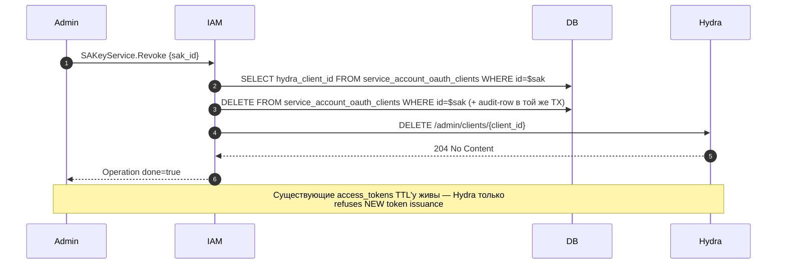

# 05. ServiceAccount Keys (OAuth-credentials: private_key_jwt)

## Назначение

**SA Keys** — асимметричные ключи (ECDSA P-256), через которые ServiceAccount
получает access_token у Ory Hydra по grant'у `client_credentials` с
`token_endpoint_auth_method = private_key_jwt` (RFC 7521/7523).

Каждый ключ — это **kacho-выпущенная** пара (`private_key`, `public_jwk`):

- **`private_key_pem`** — отдается клиенту ОДИН РАЗ в ответе `IssueSAKey`,
  никогда не хранится в kaname.
- **`public_key`** — регистрируется в Hydra как JWK при создании OAuth-клиента
  (`jwks={keys:[...]}`); kaname держит SPKI-PEM-копию в
  `service_account_oauth_clients.public_key_pem` для диагностики ротаций.

Hydra **не получает** `client_secret` — его в системе больше нет. Запрос
access_token: клиент сам подписывает JWT-assertion приватным ключом, кладет
в `client_assertion`, POST'ит к `/oauth2/token`. Hydra валидирует подпись
против зарегистрированного public JWK.

**Защита приватного ключа:** `private_key_pem` показывается **один раз** в
ответе `IssueSAKey`. После этого `OpsResponseRedactor`
(`internal/repo/kaname/pg/ops_response_redactor.go`) выполняет single-statement
UPDATE на `operations.response_data`, замещая поле `private_key_pem` на
`"<redacted>"` (а также legacy `client_secret`, который теперь всегда пустой).
Повторный `GET /operations/{id}` после redaction даст response без ключа.
Это защищает от replay через operation-id.

**Преимущества над client_secret_basic (legacy):**

- ✅ private_key никогда не покидает client после issuance.
- ✅ Hydra DB не хранит секрета (только public_jwk).
- ✅ Strong crypto (asymmetric ES256 vs shared secret).
- ✅ Стандартный паттерн асимметричной аутентификации service-аккаунтов.

**Use-cases:**

- Issue первого ключа при provision'е SA.
- Ротация: Issue новый ключ → обновить CI/secrets → Revoke старый.
- Revoke компрометированного ключа.

**Ограничения:**

- Обмен ключа идёт **у одного издателя**, и какого — решает посадка: на
  переведённом контуре наш `POST /iam/v1/token`, иначе прежний (и тогда без
  него `Issue` падает `Unavailable`). Федеративный ключ остаётся у прежнего —
  см. врезку ниже.
- `private_key_pem` не восстановим после первого ответа (no "show key again").
- `enabled=false` SA → Issue блокируется (снять состояние — действием
  `ServiceAccountService.Disable`/`Enable`, см. [`04-service-account.md`](04-service-account.md)).
- Алгоритм фиксирован на `ES256` (RS256 / EdDSA — будущее расширение).

## Доменная модель — `service_account_oauth_clients`

| Поле                  | Тип                  | Обязательное | Immutable | Описание                                  |
|-----------------------|----------------------|--------------|-----------|-------------------------------------------|
| `id`                  | TEXT (`soc_...`)     | да           | да        | id записи (не Hydra-client-id).           |
| `sva_id`              | `ServiceAccountID`   | да           | да        | FK → `service_accounts(id)`.              |
| `hydra_client_id`     | TEXT                 | да           | да        | имя, которым клиент себя называет. UNIQUE. См. врезку ниже. |
| `description`         | TEXT                 | нет          | —         | Free-form, ≤256 chars.                    |
| `created_by_user_id`  | TEXT                 | да           | да        | Ответственный за выпуск (audit). В запросе поле необязательно: край подставляет человеку — вызывающего, служебной учётке — владельца аккаунта целевой учётки. |
| `created_at`          | TIMESTAMPTZ          | да (server)  | да        | UTC.                                      |
| `expires_at`          | TIMESTAMPTZ          | нет          | —         | Срок жизни ключа. **Энфорсится** (см. ниже). NULL = бессрочный. |
| `last_used_at`        | TIMESTAMPTZ          | нет          | —         | Best-effort touch.                        |
| `public_key_pem`      | TEXT (SPKI PEM)      | да           | да        | SPKI ECDSA P-256 public key.              |
| `key_algorithm`       | TEXT                 | да           | да        | `ES256` (`RS256`/`EdDSA` future).         |

**ID prefix:** `soc` (запись в БД, формат `soc_[crockford-17]`).

> **Кто назначает `hydra_client_id` — зависит от посадки (задача #1120).**
> Пока контур не переведён на свою чеканку, имя назначает прежний издатель, и
> колонка несёт его зеркало. На переведённом контуре (объявлен токен-эндпоинт
> платформы, `authn.client-token.enabled`) зеркала у него **не заводится вовсе**,
> имя назначаем мы, и оно совпадает с `id` записи — то есть в ответе выдачи
> `clientId` равен `keyId`. Разбор, граница федеративной полосы и окно двух
> издателей числом —
> [`../architecture/sa-key-issuance-leaves-the-provider.md`](../architecture/sa-key-issuance-leaves-the-provider.md).

**DB table:** `kaname.service_account_oauth_clients` (squashed baseline
`internal/migrations/0001_initial.sql`).

**FK contract:** CASCADE delete при удалении SA (в БД); но Hydra clients
надо явно удалять через `RevokeSAKey` (см. Gotchas).

### Срок жизни ключа (`expires_at`)

Выставляется на Issue: явный `ttl_seconds` → иначе `KANAME_SAKEY_DEFAULT_TTL`
(90d) → иначе NULL. Потолок — `KANAME_SAKEY_MAX_TTL` (365d), запрос сверх него
отвергается `InvalidArgument` до регистрации клиента в Hydra.

Энфорсится на пути обмена ключа на токен одним предикатом
(`expires_at != NULL && expires_at <= now`). Путей было два; докер-полоса выбыла из них вместе
с приёмом ключевого материала в поле пароля — она принимает только базовый токен доступа, и
срок его проверяет авторитет базового удостоверения, а не эта таблица:

| Путь | Точка проверки | Что видит клиент |
|---|---|---|
| Провайдер: `client_assertion` → Hydra `/oauth2/token` | token-hook (`TokenEnrichmentService`) → 403 | Hydra отказывает в выдаче |
| Docker-token `/iam/token` | — | ключ здесь **не предъявляется**: полоса принимает только базовый токен доступа |

Граница включительная: в момент `expires_at` ключ уже мёртв. Сравнение — по
инстанту (не по настенным полям), поэтому зона хранения роли не играет.

**`NULL` = бессрочный, а не невалидный.** Так лежит bootstrap-admin-маппинг (#58)
и все строки, созданные до появления TTL-ручек. Ограничивать их время — работа
выдающей стороны (конфигурационный ключ `sakey-default-ttl`, поле `AuthN.SAKeyDefaultTTL`),
а не проверяющей.

Уже выданный access-token переживает истечение ключа: он живёт свой
`access_token_lifespan` (per-client, `KANAME_SAKEY_ACCESS_TOKEN_TTL`). Гейт
закрывает выдачу НОВЫХ токенов, не отзывает старые. Жнеца просроченных строк нет —
строка остаётся, ключ просто перестаёт работать.

## Sequence diagram — Issue

```mermaid
sequenceDiagram
    autonumber
    participant Admin
    participant GW as api-gateway
    participant IAM as kaname :9090
    participant DB as Postgres
    participant Hydra as Ory Hydra
    participant Redactor as OpsResponseRedactor

    Admin->>GW: POST /iam/v1/serviceAccounts/{saId}/keys
    GW->>IAM: SAKeyService.Issue
    IAM->>DB: SELECT sa WHERE id=$saId
    alt sa.enabled=false
        IAM-->>GW: FailedPrecondition "ServiceAccount <id> is disabled and cannot be issued a key"
    end
    IAM->>IAM: ecdsa.GenerateKey(P-256) → {priv_pem, pub_pem, jwk(kid=soc_…)}
    alt контур переведён на свою чеканку (#1120)
        IAM->>IAM: имя клиента := id записи; к прежнему издателю обращения нет
    else контур не переведён
        IAM->>Hydra: POST /admin/clients<br/>{grant_types:["client_credentials"],<br/> token_endpoint_auth_method:"private_key_jwt",<br/> jwks:{keys:[pub_jwk]}, scope, audience}
        Hydra-->>IAM: 201 {client_id}  (NO client_secret)
    end
    IAM->>DB: BEGIN
    IAM->>DB: INSERT service_account_oauth_clients<br/>(soc_id, sva_id, hydra_client_id, public_key_pem, key_algorithm, declared_audiences)
    IAM->>DB: COMMIT
    IAM->>DB: UPDATE operations<br/>SET done=true, response=IssueSAKeyResponse{client_id, private_key_pem, public_key_pem, algorithm:"ES256", key_id:soc_…}
    IAM-->>GW: Operation (done=true, response с private_key_pem)
    GW-->>Admin: 200 {client_id, private_key_pem, public_key_pem, algorithm, key_id}

    Note over Redactor,DB: Sync after MarkDone (idempotent)
    Redactor->>DB: SELECT response_type, response_data FROM operations WHERE id=$opId
    Redactor->>Redactor: Unmarshal Any → IssueSAKeyResponse
    Redactor->>Redactor: private_key_pem := "<redacted>"<br/>client_secret := "<redacted>" (legacy field)
    Redactor->>DB: UPDATE operations SET response_data=$new WHERE id=$opId

    Note over Admin,DB: Повторный GET /operations/$opId — secret отсутствует
    Admin->>GW: GET /operations/iop_..
    GW->>IAM: OperationService.Get
    IAM-->>GW: Operation (response с client_secret="<redacted>")
```

## Sequence diagram — Revoke



## API surface

### Public gRPC (порт 9090)

| RPC       | Sync/Async | Описание                                              |
|-----------|------------|-------------------------------------------------------|
| `Issue`   | async      | Выпускает OAuth-ключ. Secret в response (один раз).   |
| `Revoke`  | async      | Удаляет строку маппинга + Hydra client.               |
| `List`    | sync       | Список ключей для SA (без секретов).                  |

### REST mapping

| HTTP    | Path                                                | gRPC mapping           |
|---------|-----------------------------------------------------|------------------------|
| POST    | `/iam/v1/serviceAccounts/{saId}/keys`               | `SAKeyService.Issue`   |
| DELETE  | `/iam/v1/serviceAccounts/{saId}/keys/{keyId}`       | `SAKeyService.Revoke`  |
| GET     | `/iam/v1/serviceAccounts/{saId}/keys`               | `SAKeyService.List`    |

> [!note] Обе таблицы называли методы длинными именами — так зовутся сообщения
> запроса и use-case'ы, но не RPC
> Контракт объявляет три метода короткими именами (выпуск, список, отзыв); длинные
> формы живут в именах сообщений (`IssueSAKeyRequest`) и в именах use-case'ов Go.
> Ошибка была устойчива к проверке свежести: живая перепроверка координаты вида
> «сервис.метод» ищет **имя метода** по всему дереву контрактов, а `IssueSAKey`
> там встречается — в имени сообщения. Отсюда правило: пару «сервис + метод»
> сверять с объявлением **этого** сервиса, а не с наличием слова.

## Конфигурация

| Env var                                | YAML key                                  | Default | Описание                          |
|----------------------------------------|-------------------------------------------|---------|-----------------------------------|
| `KANAME_HYDRA_ADMIN_URL`            | `extapi.hydra.admin-url`                  | —       | URL Hydra admin API.              |
| `KANAME_HYDRA_ADMIN_TOKEN`          | `extapi.hydra.admin-token`                | —       | Bearer для Hydra admin.           |

## Как пользоваться

### Issue

```bash
RESP=$(curl -s -X POST http://localhost:18080/iam/v1/serviceAccounts/$SA_ID/keys \
  -H "Authorization: Bearer $TOKEN" \
  -d '{"description":"CI runner key"}')
OP_ID=$(echo "$RESP" | jq -r .id)
# poll до done=true; путь домен-агностичен — без имени сервиса в начале
RESULT=$(curl -s "http://localhost:18080/operations/$OP_ID" -H "Authorization: Bearer $TOKEN")
CLIENT_ID=$(echo "$RESULT" | jq -r .response.client_id)
KEY_ID=$(echo    "$RESULT" | jq -r .response.key_id)
echo "$RESULT" | jq -r .response.private_key_pem > sa.key  # ← сохранить;
                                                            #   потом <redacted>
echo "$RESULT" | jq -r .response.public_key_pem  > sa.pub
echo "CLIENT_ID=$CLIENT_ID  KEY_ID=$KEY_ID  ALG=ES256"
```

### Получить SA access_token у Hydra (private_key_jwt, RFC 7521/7523)

```bash
# 1. Подписываем JWT-assertion sa.key'ом. Пример на python-jose:
python3 <<'PY' > assertion.txt
import time, json, uuid
from jose import jwt
priv = open('sa.key').read()
claims = {
  "iss": "$CLIENT_ID", "sub": "$CLIENT_ID",
  "aud": "$HYDRA_PUBLIC_URL/oauth2/token",
  "exp": int(time.time()) + 60, "jti": uuid.uuid4().hex,
}
print(jwt.encode(claims, priv, algorithm="ES256",
                 headers={"kid": "$KEY_ID"}))
PY

# 2. POST к Hydra с client_assertion (НЕТ basic-auth, нет client_secret).
curl -X POST "$HYDRA_PUBLIC_URL/oauth2/token" \
  -d "grant_type=client_credentials" \
  -d "client_id=$CLIENT_ID" \
  -d "client_assertion_type=urn:ietf:params:oauth:client-assertion-type:jwt-bearer" \
  -d "client_assertion=$(cat assertion.txt)" \
  -d "audience=$AUDIENCE" \
  -d "scope=kacho.api"
```

### Revoke

```bash
curl -X DELETE http://localhost:18080/iam/v1/serviceAccounts/$SA_ID/keys/$KEY_ID \
  -H "Authorization: Bearer $TOKEN"
```

### List

```bash
curl http://localhost:18080/iam/v1/serviceAccounts/$SA_ID/keys -H "Authorization: Bearer $TOKEN" | jq
# → [{id, hydraClientId, createdAt, expiresAt, lastUsedAt, name, labels}]
```

### Идемпотентность

`IssueSAKey` НЕ идемпотентен — каждый вызов создает новый client в Hydra.

`RevokeSAKey` идемпотентен **успехом**: повторный отзыв, отзыв идентификатора,
которого не было никогда, и отзыв ключа ЧУЖОЙ учётки дают один и тот же исход —
операция завершается успешно, ответ несёт `keyId` и `revokedAt`, снято при этом
ничего не было. Ключ чужой учётки вызов переживает: владение стоит внутри самого
оператора снятия, а не в проверке перед ним.

> Прежде исход был не один. Это противоречило приёмке базового токена
> (`BAT-1-44`, где исход повторного отзыва назван поимённо — успех) и вместе с
> тем расходилось с требованием скрытия существования (`security.md`
> §Hardening #6): пока исходов больше одного, по различию между ними узнают то,
> что скрытие обязано держать неразличимым. Исход теперь один, потому что ветки,
> на которой они могли бы разойтись, в коде больше нет — владение стоит внутри
> самого оператора снятия. Изменение и его потребители — задача #1216.

### Типичные ошибки

| Сценарий                             | gRPC code             | HTTP | Текст                                          |
|--------------------------------------|------------------------|------|------------------------------------------------|
| SA disabled                          | `FAILED_PRECONDITION`  | 400  | `ServiceAccount <id> is disabled and cannot be issued a key` |
| SA не найден                         | `NOT_FOUND`            | 404  | `ServiceAccount sva_xxx not found`             |
| Hydra недоступен                     | `UNAVAILABLE`          | 503  | `hydra admin api unreachable`                  |
| Anonymous IssueSAKey                 | `UNAUTHENTICATED`      | 401  | `anonymous principal rejected`                 |
| Anonymous Get operation с redacted   | `NOT_FOUND`            | 404  | (anti-replay guard — operation/anon)           |

## Как воспроизвести локально

Команды запускаются **от корня репозитория**.

```bash
make -C deploy dev-up        # включает Hydra
kubectl -n kacho port-forward svc/api-gateway 18080:8080 &

# Newman: отдельного набора «ключи SA» нет — они покрыты набором служебной
# учётки и набором токена по ключу.
./services/iam/tests/newman/scripts/run.sh --service iam-service-account
./services/iam/tests/newman/scripts/run.sh --service authz-sa-apitoken

# Integration (testcontainers + Hydra stub):
go test -short -count=1 -timeout 120s \
  -run "TestSAKey|TestOpsResponseRedactor|TestIssueSAKey" \
  ./services/iam/internal/clients/ ./services/iam/internal/apps/kaname/api/sa_keys/
```

> [!note] Прежняя команда звала набор, которого нет, и передавала имя набора
> переменной окружения, которую прогонщик обнуляет первым делом
> Набора с таким именем среди сгенерированных коллекций сервиса не существует, а
> имя, переданное окружением, затиралось — то есть команда завершалась успехом,
> прогнав **весь** сервис вместо запрошенного набора. Успех без предмета читается
> как исполненная проверка, поэтому обе половины исправлены разом.

## Подробности реализации

- **Handler и use-case живут в одном пакете** `internal/apps/kaname/api/sa_keys/`: точки входа
  `Handler.Issue` / `Handler.List` / `Handler.Revoke` в `handler.go`, выпуск ключа — `keys.go`,
  журналирование — `audit.go`. Отдельного файла со сводкой use-case'ов у пакета нет.
- **Hydra клиент:** `internal/clients/hydra_admin_client.go` + `hydra_oauth_clients.go`.
- **Repo:** SA-OAuth-clients-репо в `internal/repo/kaname/pg/` (через `NewSAOAuthClientRepo`).
- **Redactor:** `internal/repo/kaname/pg/ops_response_redactor.go`. SELECT
  `(response_type, response_data)` из `operations`, unmarshal `Any` →
  `IssueSAKeyResponse`, reflect-clear поле `private_key_pem` (+ legacy
  `client_secret`), UPDATE обратно. Idempotent (повторный clear no-op).
  Реализация без `jsonb_set` — operations хранит proto-bytes, не JSON.
- **AntiAnonymous integration:** `operationspb.Handler.Get` (общий слой) has anti-leak gate:
  если operation содержит secret-поле и principal anonymous — возвращает
  NotFound (даже если operation существует). См.
  `pkg/operations/operationspb/handler_test.go` (полоса сведена в общий слой).

## Gotchas / известные ограничения

- **Hydra DELETE не cascade'ит из БД** — если оператор сделал DELETE
  service_account напрямую SQL'ем, в БД через CASCADE удалятся записи
  `service_account_oauth_clients`, но в Hydra clients останутся! ВСЕГДА
  использовать API Revoke перед Delete SA.
- **Private-key видимость окно** — между MarkDone и UPDATE redaction есть
  окно миллисекунд, когда первый GET вернет `private_key_pem`. Это
  by-design — это и есть единственная допустимая видимость ключа.
- **Replay через operation-id** — даже после redaction оператор знает
  `operation_id`, но `response.private_key_pem` уже `<redacted>`. Legacy
  `response.client_secret` всегда пуст и тоже редактируется
  для wire-compat.
- **Hydra restart loses clients?** — нет, Hydra хранит в собственной БД;
  kaname держит `hydra_client_id` для ссылки + `public_key_pem` для
  диагностики ротаций.
- **Алгоритм фиксирован `ES256`** — domain.Validate допускает RS256/EdDSA
  для будущих расширений, но текущая ECDSA P-256-only генерация
  (`internal/apps/kaname/api/sa_keys/keys.go`) выставляет только `ES256`.
- **Legacy `client_secret` rows** — миграция в `0001_initial.sql` ставит
  DEFAULT '' для `public_key_pem` / `key_algorithm`, поэтому rows,
  выпущенные до перехода на private_key_jwt (если такие существуют в
  продуктивных стендах), не валятся при выборке; но через эти
  `hydra_client_id` все еще работает legacy `client_secret_basic`-flow на
  стороне Hydra. План миграции — отдельный rotation-эпик.

## Связанные компоненты

- [`04-service-account.md`](04-service-account.md) — родительский ресурс.
- [`10-operations.md`](10-operations.md) — operations + redactor.

## Ссылки на код

- `internal/apps/kaname/api/sa_keys/usecases.go` — `IssueSAKeyUseCase` /
  `RevokeSAKeyUseCase` / `ListSAKeysUseCase`.
- `internal/apps/kaname/api/sa_keys/keys.go` — `generateES256Key` (ECDSA P-256
  keypair → PKCS#8 / SPKI PEM + JWK).
- `internal/apps/kaname/api/sa_keys/handler.go`.
- `internal/clients/hydra_admin_client.go`,
  `hydra_oauth_clients.go` — `CreateOAuthClient` с `jwks` /
  `token_endpoint_auth_method=private_key_jwt`.
- `internal/repo/kaname/pg/ops_response_redactor.go` (тот же файл, что назван выше — прежде
  здесь стоял другой каталог, и две ссылки об одном предмете расходились).
- `internal/migrations/0001_initial.sql` — таблица
  `service_account_oauth_clients` (`public_key_pem`, `key_algorithm`).
- `pkg/operations/operationspb/handler_test.go` (полоса сведена в общий слой).
- `internal/service/token_enrichment_service.go` — SA-claims path
  (`kaname_principal_type=service_account`, `kaname_principal_id`,
  `kaname_account_id`).
- `cmd/kaname/hooks_mux.go` — `tokenEnrichSAAdapter` wiring.
