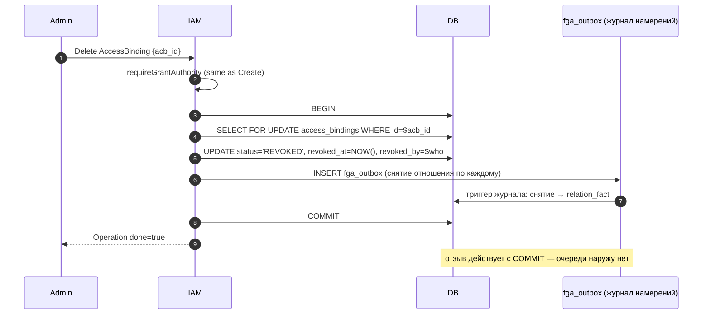

# 08. AccessBinding

## Назначение

**AccessBinding** — это связь `(subject_type, subject_id) ↔ role_id ↔
(resource_type, resource_id)`. Она и есть тот «грант», который превращает
запись в `roles` в **активное** право пользователя/SA/группы делать что-то с
ресурсом.

Grant-идентичность AccessBinding (5-tuple subject↔role↔resource) **immutable**:
чтобы ее сменить — Delete + Create, поэтому audit-trail прозрачен и каждый
«грант» отслеживается по времени. Mutable остаются только метаданные ресурса
(`labels`, `deletion_protection`) — они меняются через `Update`.

Создание — **strict-create**: дубль активного гранта (та же 5-tuple
`(subject_type, subject_id, role_id, resource_type, resource_id)` при
`revoked_at IS NULL`) ловится partial UNIQUE `access_bindings_active_grant_uniq`
и возвращает `ALREADY_EXISTS`. Прежний silent `ON CONFLICT DO UPDATE`-upsert
удален — он маскировал реальные дубль-гранты и засорял audit-trail.

**Use-cases:**
- Грант роли пользователю на проект (`subject=user:usr_*, role=viewer, resource=project:prj_*`).
- Грант SA на VPC-сеть.
- Грант группе на cluster-admin.
- Bootstrap при signup (Account owner gets `account-admin` binding).

**Ограничения:**
- Grant-идентичность (5-tuple) immutable; для смены — Delete+Create.
  Mutable метаданные (`labels`, `deletion_protection`) — через `Update`.
- `resource_id` — opaque (cross-service id, не валидируется на kacho-iam стороне).
- `status`: `PENDING` (reserved) / `ACTIVE` (steady) / `REVOKED` (terminal);
  обычный Create сразу дает `ACTIVE`.

## Доменная модель

| Поле                | Тип                          | Обязательное | Immutable | Описание                                            |
|---------------------|------------------------------|--------------|-----------|-----------------------------------------------------|
| `id`                | `AccessBindingID`            | да           | да        | `acb<17-char>`.                                      |
| `subject_type`      | `SubjectType`                | да           | да        | `user | service_account | group`.                    |
| `subject_id`        | `SubjectID`                  | да           | да        | id User/SA/Group.                                    |
| `role_id`           | `RoleID`                     | да           | да        | FK → `roles(id) ON DELETE RESTRICT`.                 |
| `resource_type`     | `ResourceType`               | да           | да        | Whitelist (см. ниже).                                |
| `resource_id`       | `string`                     | да           | да        | opaque (cross-service id).                           |
| `status`            | `AccessBindingStatus`        | да           | нет (CAS) | `PENDING | ACTIVE | REVOKED`. Default `ACTIVE`.    |
| `expires_at`        | `*time.Time`                 | нет          | нет       | TTL.                                                |
| `granted_by_user_id`| `UserID`                     | нет (audit)  | да        | Кто грантнул.                                       |
| `revoked_at`        | `*time.Time`                 | нет          | нет       | Stamp на REVOKED.                                   |
| `revoked_by_user_id`| `*UserID`                    | нет          | нет       | Кто revoked.                                        |
| `deletion_protection`| `bool`                      | нет          | нет (Update)| Защита от Delete; owner-binding ставит `true`.     |
| `labels`            | `map<str,str>`               | нет          | нет (Update)| Tenant-метки ресурса (label-selectable).           |
| `created_at`        | `time.Time`                  | да (server)  | да        | UTC.                                                |

**ID prefix:** `acb`.
**DB table:** `kacho_iam.access_bindings` (`CREATE TABLE kacho_iam.access_bindings` в `0001_initial.sql`).

**UNIQUE constraint:** partial UNIQUE `access_bindings_active_grant_uniq ON
(subject_type, subject_id, role_id, resource_type, resource_id) WHERE
revoked_at IS NULL` — основа strict-create (дубль активного гранта → 23505).

**ResourceType whitelist** (см. `internal/domain/types.go`):

```
cluster, account, project, vpc_network, vpc_subnet, vpc_address, vpc_route_table,
vpc_security_group, vpc_gateway, vpc_network_interface,
compute_instance,
loadbalancer_nlb, loadbalancer_target_group,
iam_account, iam_project, iam_user, iam_service_account, iam_group, iam_role,
*  (wildcard)
```

**State machine:** `PENDING → ACTIVE → REVOKED` (terminal). Transitions —
atomic CAS UPDATE с `WHERE status IN ('PENDING','ACTIVE')`. REVOKED irreversible.

## Sequence diagram — Create (strict-create + atomic emit-in-tx)

```mermaid
sequenceDiagram
    autonumber
    participant Caller as Admin / Service
    participant IAM as kacho-iam :9090
    participant Guard as authzguard
    participant FGAGate as Grant authority check
    participant DB as Postgres
    participant Out as fga_outbox (журнал намерений)
    participant Sub as subject_change_outbox (журнал)
    participant GW as api-gateway cache

    Caller->>IAM: Create AccessBinding<br/>{subject=user:usr_alice, role=rol_viewer, resource=project:prj_..}
    IAM->>Guard: RequireAuthenticated
    IAM->>IAM: domain.Validate
    IAM->>FGAGate: requireGrantAuthority(resource_type, resource_id)<br/>проверка admin на области
    alt caller не admin scope
        FGAGate-->>Caller: PermissionDenied
    end
    IAM->>DB: BEGIN
    IAM->>DB: INSERT operations (done=false)
    IAM->>DB: INSERT INTO access_bindings ... RETURNING ...
    Note over DB: Strict-create: дубль активного гранта →<br/>partial UNIQUE access_bindings_active_grant_uniq → 23505 → ErrAlreadyExists
    DB-->>IAM: row (acb_...)
    IAM->>IAM: authzmap.PermissionsToRelations(role.permissions) → relations
    IAM->>Out: INSERT fga_outbox (по отношению: (subject, relation, resource))
    Out->>DB: триггер журнала: строка → relation_fact
    IAM->>Sub: INSERT subject_change_outbox (subject_id для сброса кэша)
    IAM->>DB: COMMIT (всё одной транзакцией)
    IAM-->>Caller: Operation (done=true, response=AccessBinding)

    Note over DB,GW: право действует с COMMIT; асинхронен только сброс кэша края
    GW->>IAM: PollSubjectChanges(since_id) — край опрашивает САМ
    IAM->>Sub: SELECT ... WHERE id > since_id
    Sub-->>GW: партия строк + head_id
    GW->>GW: партия непуста → сброс кэша ЭТОЙ реплики

    Note over Caller,GW: ── Subsequent Check ──
    Caller->>GW: API call с JWT (subject=usr_alice)
    GW->>GW: cache miss (invalidated)
    GW->>IAM: InternalIAMService.Check (user, action, resource)
    IAM->>DB: вердикт реляционной формы
    DB-->>IAM: allowed=true
    IAM-->>GW: ALLOW
    GW-->>Caller: 200 (call passes)
```

## Sequence diagram — Delete



## API surface

### Public gRPC (порт 9090)

| RPC               | Sync/Async | Описание                                                            |
|-------------------|------------|---------------------------------------------------------------------|
| `Create`          | async      | Strict-create — дубль активного гранта → `ALREADY_EXISTS`.          |
| `Update`          | async      | UpdateMask: `labels`, `deletion_protection` (5-tuple immutable).    |
| `Delete`          | async      | Soft (status=REVOKED). После revoke re-grant дает новый id.         |
| `Get`             | sync       | По id.                                                              |
| `ListByScope`     | sync       | Все bindings на scope (resource_type, resource_id).                 |
| `ListBySubject`   | sync       | Bindings субъекта. Допуск общий с `ListSubjectPrivileges`; страница распорядителя аккаунта сужается построчно. |

### REST mapping

| HTTP    | Path                                                                            | gRPC mapping                            |
|---------|---------------------------------------------------------------------------------|------------------------------------------|
| POST    | `/iam/v1/accessBindings`                                                        | `AccessBindingService.Create`           |
| GET     | `/iam/v1/accessBindings/{accessBindingId}`                                      | `AccessBindingService.Get`              |
| PATCH   | `/iam/v1/accessBindings/{accessBindingId}`                                      | `AccessBindingService.Update`           |
| DELETE  | `/iam/v1/accessBindings/{accessBindingId}`                                      | `AccessBindingService.Delete`           |
| GET     | `/iam/v1/accessBindings:listByScope?resource_type=...&resource_id=...`          | `AccessBindingService.ListByScope`      |
| GET     | `/iam/v1/accessBindings:listBySubject?subject_type=...&subject_id=...`          | `AccessBindingService.ListBySubject`    |

## Конфигурация

> [!note] До стадии S6 здесь стояли две переменные окружения внешнего движка
> Прежняя редакция называла адрес движка и идентификатор его хранилища и оговаривала,
> что без второго выдача создаётся, а кортежи копятся в журнале до перезапуска.
> Ни переменных, ни этого состояния больше нет: право действует с фиксации, и
> «выдача создана, но не применена» невыразимо by construction.

Отдельной настройки у выдачи нет — она пишется той же базой, что и остальное
состояние службы.

## Как пользоваться

```bash
# Grant user 'usr_alice' роль 'rol_viewer' на project 'prj_yyy'.
curl -X POST http://localhost:18080/iam/v1/accessBindings \
  -H "Authorization: Bearer $TOKEN" \
  -d '{
    "subject_type":"user",
    "subject_id":"usr_alice",
    "role_id":"rol_viewer",
    "scope_type":"iam.project",
    "scope_id":"prj_yyy",
    "target":{"all_in_scope":{}}
  }'
# → Operation, после poll → AccessBinding с acb_id

# Strict re-create активного гранта — ALREADY_EXISTS (дубль не маскируется).
curl -X POST http://localhost:18080/iam/v1/accessBindings \
  -H "Authorization: Bearer $TOKEN" \
  -d '<тот же payload>'
# → 409 ALREADY_EXISTS (re-grant возможен только после Delete/revoke).

# List по scope.
curl "http://localhost:18080/iam/v1/accessBindings:listByScope?resource_type=project&resource_id=prj_yyy" \
  -H "Authorization: Bearer $TOKEN" | jq

# Revoke.
curl -X DELETE http://localhost:18080/iam/v1/accessBindings/$ACB_ID \
  -H "Authorization: Bearer $TOKEN"
```

### Типичные ошибки

| Сценарий                                  | gRPC code             | HTTP | Текст                                                |
|-------------------------------------------|------------------------|------|------------------------------------------------------|
| role_id не существует                     | `FAILED_PRECONDITION`  | 400  | `role_id rol_zzz not found`                          |
| Caller не имеет grant authority           | `PERMISSION_DENIED`    | 403  | `permission denied`                                  |
| Anonymous                                 | `PERMISSION_DENIED`    | 403  | `permission denied`                                  |
| resource_type вне whitelist               | `INVALID_ARGUMENT`     | 400  | `Illegal argument resource_type "foobar"`            |
| subject_type 'group' с member_id user'а   | `INVALID_ARGUMENT`     | 400  | `subject_id usr_xxx does not match subject_type group` |
| Delete на REVOKED binding                 | `FAILED_PRECONDITION`  | 400  | `access_binding already revoked`                     |

> [!warning] Отказ по правам НЕ РАЗЛИЧИМ по ответу — и это стоило целого разбора
>
> Две верхние строки прежде обещали разный текст: `caller cannot grant on this scope`
> для отказа по полномочию выдавать и `anonymous principal rejected` / 401 для
> неаутентифицированного. **Ни одной из этих строк в прод-коде нет** (проверено грепом
> по non-test дереву на ревизии `b2e2db72`: ноль вхождений каждой), а неаутентифицированный
> путь возвращает `PERMISSION_DENIED`, то есть 403, а не 401. Таблица описывала продукт,
> которого нет, и по ней уже писали ожидания.
>
> Сегодня по этому RPC отказывают **две разные проверки**, и обе отвечают побайтово
> одинаковым `permission denied`:
>
> 1. **край** — per-RPC Check из каталога прав: отношение удаления на объекте самой
>    привязки (наследуется от верхнего уровня, см. `fga_model.fga`);
> 2. **сервис** — собственное правило полномочия выдавать: то же требование, что у
>    Create («снять привязку вправе тот, кто вправе был бы её выдать»), проверяемое
>    против **объекта области** привязки, а не против самой привязки.
>
> Правило (2) **строже** объявленного в каталоге, поэтому расхождение fail-closed: лишнего
> доступа оно не даёт. Но право `iam.access_bindings.delete` при этом выдаётся и
> материализуется, а держателю без административного отношения на области — не работает,
> и по ответу он не отличит «край не пустил» от «сервис не пустил». Именно это сделало
> разбор дорогим: 403 не называет, кто его вынес.
>
> Приведение (1) и (2) к одному решению — **продуктовое решение об авторизации** (либо
> каталог перестаёт объявлять полосу, которой сервис не ограничивается, либо правило
> выражается в модели и снимается из кода — `security.md` §«Авторизация живёт в МОДЕЛИ»).
> Оно требует APPROVED acceptance-дока (ban #1) и здесь не принимается — эта врезка
> фиксирует **измеренное состояние**, чтобы док перестал описывать несуществующее.

## Как воспроизвести локально

Команды запускаются **от корня репозитория**.

```bash
make -C deploy dev-up
kubectl -n kacho port-forward svc/api-gateway 18080:8080 &

# Имя набора — то, под которым он сгенерирован; набора без суффикса переработки
# в дереве нет, и прежняя команда прогоняла весь сервис молча.
./services/iam/tests/newman/scripts/run.sh --service iam-access-binding-redesign

# psql:
make -C deploy psql SVC=iam
# > SELECT subject_type, subject_id, role_id, resource_type, resource_id, status FROM kacho_iam.access_bindings LIMIT 20;
# > SELECT * FROM kacho_iam.fga_outbox LIMIT 10;      -- журнал намерений
# > SELECT * FROM kacho_iam.relation_fact LIMIT 10;    -- проекция журнала
# > SELECT * FROM kacho_iam.subject_change_outbox LIMIT 10;

# Пробы привязки целиком — БЕЗ фильтра `-run`.
#
# Здесь стоял фильтр из пяти имён, ни одно из которых в дереве не существует
# (предикат: `grep -rl 'func TestAccessBindingFGAOutbox' --include='*_test.go' services/iam`
# → пусто). Такая команда выходит УСПЕХОМ, не исполнив ни одной пробы, — то есть
# читалась как зелёный прогон и им не была.
go test -short -count=1 -timeout 120s \
  ./services/iam/internal/apps/kacho/api/access_binding/ ./services/iam/internal/repo/kacho/pg/
```

## Подробности реализации

- **Use-cases:** `internal/apps/kacho/api/access_binding/{create,delete,get,list_by_resource,list_by_subject}.go`.
- **Handler:** `internal/apps/kacho/api/access_binding/handler.go`.
- **Repo:** `internal/repo/kacho/pg/access_binding_repo.go` — strict INSERT
  (без `ON CONFLICT`); дубль активной 5-tuple → 23505 → `ErrAlreadyExists`.
- **DB:** `access_bindings(id, subject_type, subject_id, role_id, resource_type,
  resource_id, status, condition_id, builtin_condition, expires_at, granted_by,
  revoked_at, revoked_by, deletion_protection, labels, created_at)`.
- **Indexes:** PK; partial UNIQUE `access_bindings_active_grant_uniq` ON 6-tuple
  `(subject_id, subject_type, role_id, resource_type, resource_id, target_digest)`
  `WHERE revoked_at IS NULL` (миграция `0055_access_binding_target.sql` — шестым членом
  добавлен `target_digest`); INDEX по subject; INDEX по resource.
- **CHECK:** `access_bindings_status_ck` (`PENDING`/`ACTIVE`/`REVOKED`);
  `access_bindings_resource_ck` — **регулярное выражение** `^[a-z][a-z0-9_]*$` либо `*`,
  не перечень допустимых типов; `access_bindings_subject_ck`;
  `access_bindings_revoked_consistency_ck`; `access_bindings_scope_ck` (миграция 0005).
- **Grant authority:** `requireGrantAuthority` → проверка отношения `admin` на области.
  Bootstrap-bypass через owner_user_id check на Account (см. `create.go`).
- **Эмиссия намерения в той же транзакции:** через
  `AccessBindingsW().EmitRelationWrite(ctx, …)` внутри writer-tx; отношения приходят из
  `authzmap.PermissionsToRelations(role.permissions)`. Триггер журнала складывает из
  строк прямой факт там же.
- **Subject-change emit:** строка `subject_change_outbox` с `subject_id` — намерение
  сбросить кэш края. iam её только **пишет**; читает журнал сам api-gateway
  (`PollSubjectChanges`, курсор). См. [`29-relational-verdict.md`](29-relational-verdict.md).
- **Anti-leak guards:** `ListBySubject` анонимно → ничего не вернёт
  (`list_by_subject_anti_leak_test.go`). Допуск у него и у `ListSubjectPrivileges`
  — ОДИН предикат (`subject_read_authority.go`, #1352), а страница полосы
  распорядителя аккаунта сужается построчно по `v_get` на выдаче, поэтому области
  в чужих аккаунтах в ответ не попадают (#1354). Сравнение полос между собой —
  `subject_read_authority_test.go`.

## Gotchas / известные ограничения

- **Strict-create — контракт**: повторный Create активного гранта → `ALREADY_EXISTS`
  (не silent no-op). Идемпотентность grant-retry — на стороне caller'а
  (повтор видит `ALREADY_EXISTS`, не скрытый upsert).
- **resource_id не валидируется** — kacho-iam не знает про конкретные id
  VPC/Compute ресурсов. Dangling-ref переживается (Check на удаленном
  ресурсе даёт `allowed=false`: прямого факта о нём в `relation_fact` нет).
- **Re-grant после revoke** — partial UNIQUE `access_bindings_active_grant_uniq`
  скоупится `WHERE revoked_at IS NULL`, поэтому после Delete (status=REVOKED,
  `revoked_at` set) повторный Create той же 5-tuple проходит и дает НОВЫЙ id.
  Активный дубль (`revoked_at IS NULL`) → 23505 → `ErrAlreadyExists`.
- **Выдача действует с фиксации.** До стадии S6 здесь было окно между `COMMIT` и
  вывозом строки журнала во внешний движок, в котором проверка отвечала
  `allowed=false`. Окна нет: прямой факт складывается той же транзакцией, а
  движка, до которого надо было доехать, не существует. Отстать может **кэш
  края** (край читает `subject_change_outbox` курсором и гасит кэш сам), и это
  отдельный предмет: вызов мимо кэша видит выдачу сразу.

## Связанные компоненты

- [`07-role.md`](07-role.md) — role_id ссылается сюда.
- [`29-relational-verdict.md`](29-relational-verdict.md) — FGA propagation chain.

## Ссылки на код

- `internal/domain/access_binding.go`
- `internal/apps/kacho/api/access_binding/`
- `internal/repo/kacho/pg/access_binding_repo.go`, `access_binding_fga_outbox_integration_test.go`, `access_binding_subject_change_integration_test.go`
- `internal/authzmap/`
- `internal/migrations/0001_initial.sql` — DDL `access_bindings`
