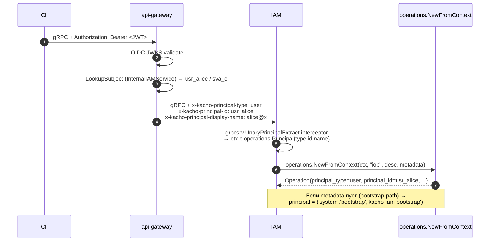

# 10. LRO Operations (`iop_...`)

## Назначение

**Operation** — это envelope над long-running async-операцией. Все мутирующие
RPC в kacho-iam возвращают `*operation.Operation` (никогда не сам ресурс) —
это API-contract `flat-resources + Operations`: мутации возвращают
`Operation` (async), не ресурс синхронно.

Реализация — общая таблица `pkg/operations` + **IAM-extension**
(три поля принципала: `principal_type`, `principal_id`, `principal_display_name`).

**Use-cases:**
- Async-tracking прогресса (Create Account → Operation → poll → done).
- Audit-trail (operation хранит, КТО вызвал RPC).
- Anti-replay (анонимный Get operation с redacted secret → 404).

**Ограничения:**
- Префикс `iop` (а НЕ `acc` или `opr`!) — чтобы api-gateway маршрутизация
  `OperationService.Get` не конфликтовала с AccountService.
- Operation immutable после `done=true`.
- `Cancel` для большинства IAM operations no-op (они sync-ish и быстро завершаются).

## Доменная модель

| Поле                       | Тип                  | Обязательное | Immutable | Описание                                       |
|----------------------------|----------------------|--------------|-----------|------------------------------------------------|
| `id`                       | string (`iop_...`)   | да           | да        | `iop<17-char>`.                                |
| `description`              | string               | да           | да        | Человечески читаемый label.                    |
| `created_at`               | TIMESTAMPTZ          | да (server)  | да        | UTC.                                           |
| `modified_at`              | TIMESTAMPTZ          | да (server)  | нет       | На каждое UPDATE.                              |
| `done`                     | bool                 | да           | нет       | false→true (one-way).                          |
| `metadata_type`            | TEXT (proto type URL)| —            | —         | `kacho.cloud.iam.v1.CreateAccountMetadata`.    |
| `metadata`                 | BYTEA (proto-Any)    | нет          | —         | `{account_id:"acc_..."}` etc.                  |
| `response_type` / `_data`  | TEXT / BYTEA         | нет          | редактируется секрет-redactor| Любая proto-message.       |
| `error_code` / `_message`  | int / TEXT           | нет          | —         | gRPC code + текст.                             |
| `principal_type`           | TEXT (IAM-extension) | да           | да        | `user | service_account | system`.             |
| `principal_id`             | TEXT (IAM-extension) | да           | да        | id или `bootstrap`.                            |
| `principal_display_name`   | TEXT (IAM-extension) | да           | да        | Email / SA-name / `kacho-iam-bootstrap`.       |

**DB table:** `kacho_iam.operations` (`CREATE TABLE kacho_iam.operations` в `0001_initial.sql`).

## Sequence diagram — типичный async RPC

```mermaid
sequenceDiagram
    autonumber
    participant Cli
    participant GW as api-gateway
    participant IAM as kacho-iam
    participant DB as Postgres
    participant Worker as Operations worker

    Cli->>GW: POST /iam/v1/accounts (mutation)
    GW->>IAM: gRPC Create + x-kacho-principal-* metadata
    IAM->>IAM: PrincipalExtract interceptor → ctx
    IAM->>IAM: operations.NewFromContext(ctx, "iop", description, metadata)<br/>(заполняет principal_*)
    IAM->>DB: BEGIN; INSERT operations (done=false, principal_*); INSERT accounts; COMMIT
    IAM-->>GW: Operation (done=false)
    GW-->>Cli: 200 {operationId:"iop_..."}

    Note over Worker,DB: Async: worker дорабатывает result
    Worker->>DB: SELECT operation; finalize state
    Worker->>DB: UPDATE operations SET done=true, response=... WHERE id=$opId

    loop Tenant poll
        Cli->>GW: GET /operations/iop_...
        GW->>IAM: gRPC OperationService.Get
        IAM->>DB: SELECT FROM operations WHERE id=$opId
        IAM-->>GW: Operation (done=true|false)
        GW-->>Cli: 200 {done, response | error}
    end
```

## Sequence diagram — PrincipalExtract chain



## API surface (`OperationService` через corelib)

| RPC      | Sync/Async | Описание                                          |
|----------|------------|---------------------------------------------------|
| `Get`    | sync       | Получает Operation по id.                          |
| `Cancel` | sync       | Для большинства IAM no-op (быстрые операции).     |

> [!note] Здесь стояла третья строка — списочный RPC с фильтрами по принципалу,
> состоянию и возрасту
> Такого метода у домен-агностичного контракта операций нет: он объявляет ровно два —
> получение по идентификатору и отмену. Ни фильтра по принципалу, ни по флагу
> завершённости, ни по возрасту не существует нигде: областные списки ниже принимают
> только идентификатор владельца, размер страницы и курсор. Строка описывала
> возможность, которой не было, и **исполняемая половина документа была написана по
> ней** — команда опроса в разделе «Как пользоваться» звала именно этот список.

### REST mapping

`OperationService` — **домен-агностичный** контракт (`proto/kacho/cloud/operation/operation_service.proto`),
поэтому его пути не несут имени сервиса; шлюз выбирает бэкенд по 3-символьному префиксу
id (`iop` → iam) в `gateway/internal/opsproxy/proxy.go`.

| HTTP    | Path                                       | gRPC mapping                |
|---------|--------------------------------------------|------------------------------|
| GET     | `/operations/{operation_id}`               | `OperationService.Get`       |
| POST    | `/operations/{operation_id}:cancel`        | `OperationService.Cancel`    |

Списки операций — **всегда в области своего ресурса**, отдельным RPC владельца:
`/iam/v1/accounts/{account_id}/operations`, `.../projects/{project_id}/operations`,
`.../users/{user_id}/operations`, `.../serviceAccounts/{service_account_id}/operations`,
`.../groups/{group_id}/operations`, `.../roles/{role_id}/operations`,
`.../accessBindings/{access_binding_id}/operations`, плюс аккаунт-широкий
`/iam/v1/accounts/{account_id}/operations:all` и админ-дамп `/iam/v1/internal/operations`
(cluster-internal).

> [!note] Здесь стояли три пути под собственным доменом сервиса и `List` без области
> Ни одного из них край не обслуживает: `OperationService` домен-агностичен, а
> списочного RPC без ресурса-владельца у него нет вовсе. Снятые адреса не
> воспроизводятся — процитированные, они читаются как живые маршруты.

## Конфигурация

**Настраиваемых снаружи ручек у этой подсистемы в iam нет.** Предикат:
`grep -rhoE 'KACHO_IAM_OPS_[A-Z0-9]*'` по всему дереву даёт **ноль** вхождений
(замер 2026-08-06). Параметры берутся из умолчаний общего пакета — период
фонового обхода бесхозных операций задан `operations.ReconcilerConfig` (30 s,
`pkg/operations/reconciler.go`), а сама постановка идёт в `pkg/operations`
(`Run`), не отдельным пулом воркеров с настраиваемым размером.

> [!note] Здесь стояла таблица из трёх переменных окружения — их нет ни одной
> Прежняя редакция объявляла число воркеров, период тика и срок хранения
> завершённых операций, каждую с YAML-двойником и дефолтом. Ни переменных, ни
> YAML-ключей, ни механизма срока хранения в дереве нет (`grep -rni retention`
> по общему пакету операций — ноль). Имена не воспроизводятся: в обратных
> кавычках они читаются как живые ручки, которые кто-нибудь пропишет в чарт.

## Как пользоваться

```bash
# Любой mutating RPC возвращает Operation.
OP=$(curl -s -X POST http://localhost:18080/iam/v1/accounts \
  -H "Authorization: Bearer $TOKEN" \
  -d '{"name":"foo"}' | jq -r .id)
echo "Operation: $OP"

# Poll до done. Путь домен-агностичен — без имени сервиса в начале.
while true; do
  R=$(curl -s "http://localhost:18080/operations/$OP" -H "Authorization: Bearer $TOKEN")
  if [ "$(echo "$R" | jq -r .done)" = "true" ]; then
    echo "$R" | jq
    break
  fi
  sleep 0.5
done

# Список операций — только в области ресурса-владельца, курсором.
curl "http://localhost:18080/iam/v1/accounts/$ACC_ID/operations:all?pageSize=20" \
  -H "Authorization: Bearer $TOKEN"
```

> [!note] Обе команды выше звали пути, которых край не обслуживает
> Опрос шёл под собственным доменом сервиса, а «список операций принципала» — по
> адресу, у которого нет ни маршрута, ни RPC, ни фильтра по принципалу (см. врезку
> к таблице поверхности выше). Таблица маршрутов в этом же документе была приведена
> к дереву раньше, чем команды, — и полсотни строк документ противоречил сам себе,
> причём ложным было именно то, что копируют в терминал. Снятые адреса здесь не
> воспроизводятся: процитированные, они читаются как живые.
>
> Хук свежести этого не поймал и не мог: он обнуляет каждую строку внутри
> огороженного блока, то есть исполняемую половину документа не читает вовсе.
> Поэтому правка по хуку обязана сопровождаться чтением документа целиком.

### Anti-replay для secret-носящих operations

`operationspb.Handler.Get` (общий слой `pkg/operations/operationspb`) имеет anti-leak guard:

- Если operation содержит проторесповс с secret-field (`IssueSAKeyResponse`),
- И principal anonymous (`system` / unauth),
- Возвращается `NOT_FOUND` (даже если operation существует).

См. пробы общего слоя — `pkg/operations/operationspb/handler_test.go` (полоса сведена туда).

### Типичные ошибки

| Сценарий                              | gRPC code             | HTTP | Текст                                          |
|---------------------------------------|------------------------|------|------------------------------------------------|
| operation_id не найден                | `NOT_FOUND`            | 404  | `operation iop_xxx not found`                  |
| Anonymous Get на secret-operation     | `NOT_FOUND`            | 404  | (anti-leak — выглядит как not-found)           |
| Operation.done=false, Cancel          | `OK`                   | 200  | no-op (IAM operations sync)                    |

## Как воспроизвести локально

Команды запускаются **от корня репозитория**: дерево одно, соседних репозиториев
стенда и сервиса рядом с ним нет.

```bash
# psql:
make -C deploy psql SVC=iam
# > SELECT id, description, done, principal_type, principal_id, principal_display_name FROM kacho_iam.operations LIMIT 20;
# > SELECT count(*) FROM kacho_iam.operations WHERE done=false;     -- in-flight

# Anti-leak: полоса владения операцией сведена в общий слой, и пробы живут там же
# — pkg/operations/operationspb/handler_test.go. Прежде здесь стояла команда,
# указывавшая на снятый файл iam: она матчила НОЛЬ проб и выходила нулём, то есть
# была ровно тем, о чём предупреждает строка ниже.
#
# Имя в -run обязано совпадать хоть с одной пробой: -run, не совпавший ни с чем,
# печатает «no tests to run» и выходит НУЛЁМ — команда выглядит исполненной.
go test -short -count=1 -timeout 60s \
  -run "TestAnonymousGetsNotFoundAndNeverReachesRepo|TestForeignAndMissingAreByteIdentical|TestOwnerIsServedAndOwnerKeyComesFromContext" \
  ./pkg/operations/operationspb/
```

## Подробности реализации

- **Repo:** общий `pkg/operations` (`repo.go`); iam добавляет поверх него редактор
  секретов в ответе — `internal/repo/kacho/pg/ops_response_redactor.go`. Отдельного
  файла-репозитория операций у iam нет.
- **Handler:** `pkg/operations/operationspb/handler.go` + `handler_test.go` (общий слой).
- **Wiring:** `cmd/kacho-iam/serve.go::operations.NewRepo(pool, "kacho_iam")`.
- **Исполнение:** use-case зовёт `operations.Run` (`pkg/operations`) сразу после
  writer-TX; IAM-операции в основном завершаются тут же (sync-ish). Бэкстопом стоит
  реконсайлер бесхозных операций — `cmd/kacho-iam/recovery.go` (`startLROReconciler`),
  boot-обход плюс периодический.
- **Migration extension:** `internal/repo/kacho/pg/migrations_iam_extensions_integration_test.go`
  гарантирует, что `principal_*` колонки добавлены поверх corelib baseline.
- **Principal sources:**
  - Public-API: api-gateway interceptor → metadata headers → `UnaryPrincipalExtract`.
  - Internal-API: caller передает metadata напрямую (admin tooling); либо
    bootstrap (`system/bootstrap`).

## Gotchas / известные ограничения

- **`iop`-prefix НЕ `opr`/`acc`** — иначе api-gateway routing коллизия.
- **Operation reuse** — нельзя reuse id; каждое RPC создает новый.
- **Срока хранения нет.** Прежняя редакция обещала удаление завершённых операций
  через 30 дней «cleanup-петлёй воркера»: такой петли в общем пакете операций не
  существует (`grep -rni retention` — ноль), строки живут, пока их кто-нибудь не
  удалит. Это открытый долг, а не поведение; audit-trail при этом живёт отдельно
  в `audit_outbox`.
- **Anonymous bootstrap path** — при первом `UpsertFromIdentity` у Account
  еще нет owner'а, principal = `('system','bootstrap','kacho-iam-bootstrap')`.

## Связанные компоненты

- [`05-sa-keys.md`](05-sa-keys.md) — secret-redactor работает поверх operations.
- [`32-observability.md`](32-observability.md) — metrics на in-flight count + done latency.
- `pkg/operations` — базовая реализация.

## Ссылки на код

- `pkg/operations/operationspb/handler.go`
- `internal/repo/kacho/pg/ops_response_redactor.go`
- `internal/migrations/0001_initial.sql` (IAM extension — колонки принципала)
- `cmd/kacho-iam/serve.go` (`operations.NewRepo(pool, "kacho_iam")`)
- `cmd/kacho-iam/recovery.go` (реконсайлер бесхозных операций)
- `pkg/operations/`
