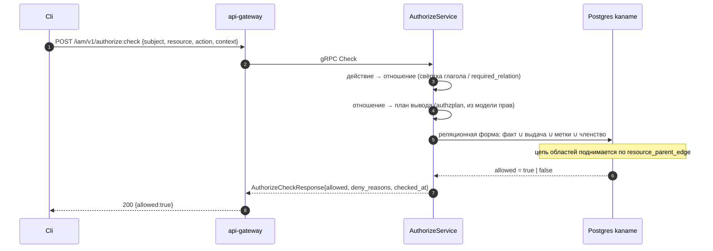

# 19. AuthorizeService (публичная проверка доступа)

## Назначение

**AuthorizeService** — синхронный endpoint, через который любой клиент (UI / CLI /
другие сервисы) спрашивает «может ли субъект X выполнить действие A над ресурсом
R?».

Это **проверка в момент запроса** без выполнения действия. Сервисы платформы
(`kacho-vpc`, `kacho-compute`, `kacho-nlb`) на пер-RPC гейте зовут не его, а
`InternalIAMService.Check` (см. [`21-internal-iam.md`](21-internal-iam.md));
`AuthorizeService` — для явных обращений арендатора: предпросмотр прав в консоли,
вспомогательные вызовы SDK.

Путь ответа:

1. **действие → отношение** — свёртка глагола (`get`/`list` → `viewer`,
   `create`/`update` → `editor`, `delete` → `admin`) либо явное поле
   `required_relation` (`internal/authzmap`).
2. **вердикт реляционной формы** — запрос к собственной базе `kaname`: прямой
   факт ∪ выдача роли на область ∪ выдача по меткам ∪ членство в группе. Разбор —
   [`29-relational-verdict.md`](29-relational-verdict.md).

Отказ возвращает `deny_reasons` — короткий упорядоченный перечень причин.

**Ограничения:**
- синхронный, только чтение (конверта `Operation` нет);
- fail-closed: база `kaname` недоступна → `UNAVAILABLE`, никогда «разрешено»
  (см. [`../architecture/failure-domains.md`](../architecture/failure-domains.md)).

> [!note] До стадии S6 решение принимал внешний движок отношений — его нет
> Прежняя редакция описывала вторым шагом обращение к внешнему движку и
> перечисляла его переменные окружения, его сроки, его отказы. Движка нет: ни
> клиента, ни хранилища, ни очереди к нему. Вопрос решается запросом к своей же
> базе, поэтому «движок недоступен» перестало быть отдельной причиной отказа, а
> сроки и адреса движка сняты вместе с ним.
>
> Здесь же стояли два утверждения, снятых вместе со своим предметом: глагол
> `ListObjects` (снят с контракта, см. ниже) и предупреждение о переключателе
> `KACHO_AUTHZ_LISTOBJECTS`, у которого не было читателей. Предупреждению больше
> нечего предупреждать: нет ни глагола, ни ручки.

## Поверхность

### Публичный gRPC (порт 9090)

| RPC | Синхронность | Описание |
|---|---|---|
| `Check` | sync | разрешено/нет + `deny_reasons` |
| `BatchCheck` | sync | до 100 проверок одним вызовом; результат по каждой в порядке запроса |
| `ListSubjects` | sync | обратный вопрос: кто имеет право на этом ресурсе |
| `ExpandRelations` | sync | из чего складывается право — плоский перечень оснований |
| `WhoAmI` | sync | личность вызывающего + срез прав (загрузка консоли) |

**`ListObjects` снят с контракта** (стадия S6). Глагол существовал ради
перечисления объектов внешним движком: движок отвечал на него собственным
обходом своего хранилища, у ответа был жёсткий серверный предел и не было
продолжения. Реляционная форма перечисляет доступное **страницей своей базы** —
это внутренний путь списочных обработчиков, а не отдельный публичный глагол.
Номер и имя в контракте зарезервированы; маршрута края
`/iam/v1/authorize:listObjects` больше нет.

### Форма запроса и ответа

```protobuf
message AuthorizeCheckRequest {
  string subject = 1;                  // "user:usr_alice"
  ResourceRef resource = 2;            // {type:"project", id:"prj_yyy"}
  string action = 3;                   // "compute.instance.create"
  google.protobuf.Struct context = 4;  // {acr_value, amr_claims, mfa_at, client_ip, ...}
  string trace_id = 5;                 // корреляция
  string required_relation = 6;        // явное отношение вместо свёртки глагола
}
message AuthorizeCheckResponse {
  bool allowed = 1;
  repeated string deny_reasons = 2;    // ["mfa_fresh: acr=2 (need 3)"] | ["no path"]
  reserved 3;                          // authorization_model_id — снято, см. ниже
  reserved "authorization_model_id";
  google.protobuf.Timestamp checked_at = 4;
}
```

**`authorization_model_id` снято с контракта, номер и имя зарезервированы.** Поле
несло версию модели, которую **внешний движок** чеканил для копии, лежавшей в его
собственном хранилище. Движка нет, значит такую версию никто не чеканит и
заполнить поле нечем — оно отвечало бы каждому вызывающему постоянной пустой
строкой. Сама **модель прав никуда не делась**: она остаётся источником, из
которого выводится реляционная форма. Не стало версии хранилища, которого нет.

### Отображение в REST

| HTTP | Путь | gRPC |
|---|---|---|
| POST | `/iam/v1/authorize:check` | `AuthorizeService.Check` |
| POST | `/iam/v1/authorize:batchCheck` | `AuthorizeService.BatchCheck` |
| POST | `/iam/v1/authorize:listSubjects` | `AuthorizeService.ListSubjects` |
| POST | `/iam/v1/authorize:expandRelations` | `AuthorizeService.ExpandRelations` |
| GET | `/iam/v1/me` | `AuthorizeService.WhoAmI` |

## `ExpandRelations` — ответ ОДНОУРОВНЕВЫЙ

```protobuf
message ExpandRelationsRequest {
  ResourceRef resource = 1;
  string relation = 2;
  reserved 3;                 // max_depth — снято
  reserved "max_depth";
}

message UsersetTree {
  repeated string leaves = 1; // субъекты, у которых отношение разрешается
  reserved 2, 3;              // computed, tuple_to_userset — снято
  reserved "computed", "tuple_to_userset";
  bool truncated = 4;         // перечень усечён серверным пределом
}
```

Перечень оснований **плоский, ровно один уровень, рёбер нет** — потому что таков
**источник**: основание права в реляционной форме есть плоская запись (прямой
факт · выдача роли · выдача по меткам · членство в группе). У плоской записи не
бывает глубины, спускаться не во что, и ограничивать нечего.

Отсюда два снятия, и оба — следствие формы источника, а **не урезание
возможности**:

- **графовые рёбра** (`computed`, `tuple_to_userset`) описывали спуск в
  под-множества графа. Ни одно из них нечем заполнить: записи, из которой такое
  ребро выводилось бы, не существует. Номера и имена зарезервированы, сообщения
  `ComputedUsersetEdge` и `TupleToUsersetEdge` сняты — заводить их под теми же
  именами нельзя;
- **`max_depth`** ограничивал глубину спуска, пока ответ был деревом. Глубина для
  одноуровневого ответа не определена, и поле не читал бы никто. Принять число,
  на которое сервер не смотрит, значило бы обещать ручку, которой нет, — поэтому
  оно снято, а не игнорируется молча.

Имя типа `UsersetTree` осталось историческим: менять его значило бы ломать форму
на проводе ради названия. Форма — перечень, не дерево.

## Диаграмма — путь проверки



## Настройка

Отдельных переменных окружения у проверки доступа **нет**. Вердикт складывается
той же базой, что и остальные чтения службы, и берёт её из общей настройки
подключения (`KANAME_DB_*`). Переменные внешнего движка —
`KANAME_OPENFGA_ENDPOINT`, `KANAME_OPENFGA_STORE_ID`,
`KANAME_OPENFGA_MODEL_ID`, `KANAME_FGA_CHECK_TIMEOUT_MS`,
`KANAME_FGA_LIST_OBJECTS_TIMEOUT_MS`, `KANAME_FGA_WRITE_TIMEOUT_MS` — сняты
вместе с движком: у них не осталось читателя.

## Как пользоваться

```bash
# Проверка.
curl -X POST http://localhost:18080/iam/v1/authorize:check \
  -H "Authorization: Bearer $TOKEN" \
  -d '{
    "subject":"user:usr_alice",
    "resource":{"type":"project","id":"prj_yyy"},
    "action":"compute.instance.create",
    "context":{"mfa_at":"2026-05-25T10:00:00Z","client_ip":"10.0.0.1"}
  }'
# → {"allowed":true, "deny_reasons":[], "checked_at":"2026-05-25T10:00:01Z"}

# Из чего складывается право (плоский перечень оснований).
curl -X POST http://localhost:18080/iam/v1/authorize:expandRelations \
  -H "Authorization: Bearer $TOKEN" \
  -d '{"resource":{"type":"project","id":"prj_yyy"},"relation":"viewer"}'
# → {"tree":{"leaves":["user:usr_alice","group:grp_ops#member"],"truncated":false}}
```

### Типичные ошибки

| Сценарий | gRPC-код | HTTP | Текст |
|---|---|---|---|
| база `kaname` недоступна | `UNAVAILABLE` | 503 | фиксированный текст, без деталей драйвера |
| действие не найдено в каталоге | `INVALID_ARGUMENT` | 400 | `Illegal argument action: unknown` |
| субъект пуст | `INVALID_ARGUMENT` | 400 | `Illegal argument subject: required` |

## Подробности реализации

- **служба:** `internal/service/authorize_service.go`
- **обработчик:** `internal/apps/kaname/api/authorize/handler.go`
- **реляционная форма:** `internal/repo/kaname/pg/relverdict/`
- **план вывода из модели:** `services/iam/internal/authzplan/`
- **свёртка глагола:** `internal/authzmap/permissions_to_relations.go`

## Связанные компоненты

- [`21-internal-iam.md`](21-internal-iam.md) — сервисы платформы зовут внутренний вариант.
- [`29-relational-verdict.md`](29-relational-verdict.md) — как складывается вердикт.
- [`../architecture/failure-domains.md`](../architecture/failure-domains.md) — домены отказа.

## Ссылки на код

- `internal/service/authorize_service.go`
- `internal/apps/kaname/api/authorize/handler.go`
- `internal/repo/kaname/pg/relverdict/`
- `internal/authzmap/`, `services/iam/internal/authzplan/`
