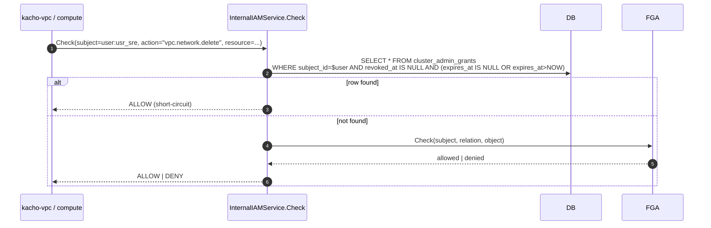

# 20. InternalAuthorizeService

## Назначение

**InternalAuthorizeService** — internal-only (порт 9091) RPC для admin- и
inter-service operation'ов на OpenFGA store / model:

- `ReadTuples` — debug/admin: list tuples по фильтру.
- `ReloadModel` — hot-reload Authorization Model + condition-каталог после
  `WriteAuthorizationModel`.
- `GetFGAStoreInfo` — store_id / model_id / tuple_count / model age.

Использование:

- Admin-UI / oncall tooling через port-forward (`ReadTuples` / `GetFGAStoreInfo`).
- `openfga-bootstrap-job` после `WriteAuthorizationModel` вызывает `ReloadModel`.

**Сервис ЧИТАЮЩИЙ — писать кортёж им нельзя.** Здесь стоял `WriteTuples`
(батч-запись прямо в движок) и строка «outbox-worker — единственный легитимный
`tuple_writer`». Вторая была неверна о первой: worker пишет в движок СВОИМ
дренажом, а этот RPC не звал никто. RPC снят (#788) — запись кортежа выражается
строкой журнала `kacho_iam.fga_outbox` и ничем другим.

Cluster-admin grant дает **short-circuit** в `InternalIAMService.Check`: если
subject имеет ACTIVE `cluster_admin` grant — allowed без обращения к FGA.

**Ограничения:**
- Internal-only (запрет #6).
- Не выставлять на external TLS.

## API surface

### Internal gRPC (порт 9091) — InternalAuthorizeService

| RPC                | Sync/Async       | Описание                                          |
|--------------------|------------------|---------------------------------------------------|
| `ReadTuples`       | sync             | List tuples по фильтру.                           |
| `ReloadModel`      | sync             | Hot-reload model + condition-каталог; pin new model_id. |
| `GetFGAStoreInfo`  | sync             | store_id, model_id, tuple_count, model age.       |

**Нет REST mapping** — internal-only.

## Диаграммы записи здесь больше нет

Тут стояла последовательность `WriteTuples`: администратор → сервис → движок →
строка операции. Она описывала путь, снятый вместе с RPC (#788). Живой путь записи
кортежа — журнал `kacho_iam.fga_outbox` и его дренаж; он описан у
[`28-relationhook.md`](28-relationhook.md) и держится гейтом
`tools/authzenginecensus/engineplaces/journaldoor_test.go`.

## Sequence diagram — cluster-admin short-circuit (InternalIAMService.Check)



## Конфигурация

См. [`19-authorize.md`](19-authorize.md) — те же OpenFGA env vars.

## Как пользоваться

```bash
kubectl -n kacho port-forward svc/kacho-iam 9091:9091 &

# ReadTuples by filter.
grpcurl -plaintext -d '{"object":"project:prj_yyy"}' localhost:9091 \
  kacho.cloud.iam.v1.InternalAuthorizeService/ReadTuples

# Reload model после WriteAuthorizationModel.
grpcurl -plaintext -d '{"new_model_id":"01HXXXX..."}' localhost:9091 \
  kacho.cloud.iam.v1.InternalAuthorizeService/ReloadModel

# Get store info.
grpcurl -plaintext -d '{}' localhost:9091 \
  kacho.cloud.iam.v1.InternalAuthorizeService/GetFGAStoreInfo
```

## Подробности реализации

- **Handler:** `internal/apps/kacho/api/internal_authorize/handler.go`.
- **FGATupleWriter:** `internal/service/fga_tuple_writer.go` — обертка над
  `clients.OpenFGAHTTPClient`.
- **Cluster-admin short-circuit:** `internal/service/authorize_service.go`
  (`cluster_admin_grants` lookup перед FGA Check).
- **OpenFGA HTTP client:** `internal/clients/openfga_*.go`
  (`openfga_read.go`, `openfga_expand.go`, `openfga_write.go`).

## Связанные компоненты

- [`19-authorize.md`](19-authorize.md) — public read-side.
- [`21-internal-iam.md`](21-internal-iam.md) — потребитель cluster-admin short-circuit.
- [`29-openfga-check.md`](29-openfga-check.md) — propagation chain.

## Ссылки на код

- `internal/apps/kacho/api/internal_authorize/handler.go`
- `internal/service/fga_tuple_writer.go`
- `internal/service/authorize_service.go`, `internal/clients/openfga_*.go`
