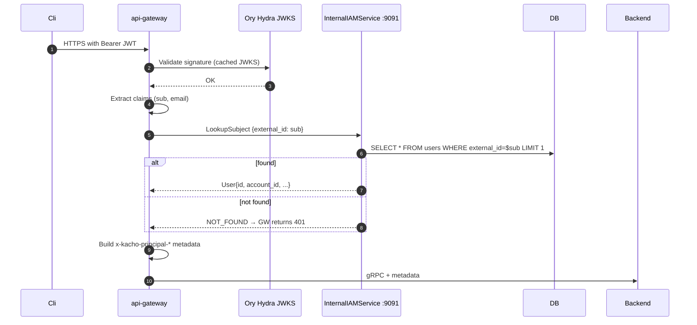
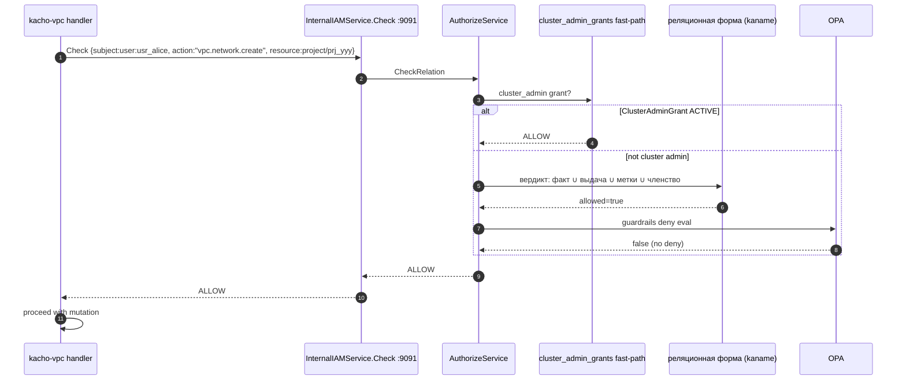
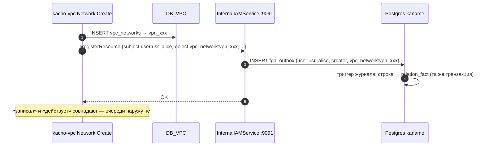

# 21. InternalIAMService

## Назначение

**InternalIAMService** — основной internal-only RPC, через который **все
остальные** Kachō-сервисы (api-gateway, kacho-vpc, kacho-compute,
kacho-loadbalancer) общаются с kaname:

- `LookupSubject(by external_id | id | email)` — api-gateway auth-interceptor
  ищет User/SA по subject из JWT.
- `UpsertFromIdentity(external_id, email, ...)` — OIDC-callback создает /
  обновляет User row.
- `Check(subject, action, resource)` — per-RPC authorization gate (как и
  AuthorizeService.Check, но с Cascade fast-path и principal-prop).
- `ListPermissions` — catalog-mode listing (все permissions из IAM-domain).
- `PollSubjectChanges(since_id, limit)` — для api-gateway authz-cache
  invalidation poll (см. [`29-relational-verdict.md`](29-relational-verdict.md)).
- `RegisterResource` / `UnregisterResource` — постановка и снятие иерархического
  указателя для ресурса чужого сервиса. Намерение ложится строкой журнала
  `kaname.fga_outbox`, и триггер журнала складывает из неё прямой факт **в той же
  транзакции**: дренажа наружу нет — применять не к чему и некому.

**Use-cases:**
- api-gateway: validate JWT → LookupSubject → resolve principal → propagate to backend.
- kacho-vpc: per-RPC authz gate через Check.
- kacho-compute: after-Create → RegisterResource для нового instance.

**Ограничения:**
- Internal-only (запрет #6).
- gRPC-direct (не через api-gateway restmux — loop-prevention).
- `Check` делегирует AuthorizeService (тот же FGA + OPA pipeline).

## API surface (internal, порт 9091)

| RPC                     | Sync/Async       | Описание                                        |
|-------------------------|------------------|-------------------------------------------------|
| `LookupSubject`         | sync             | Find User/SA by external_id | id | email.        |
| `UpsertFromIdentity`    | async (sync-LRO) | Create/update User (+ bootstrap Account/Project)|
| `Get`                   | sync             | Admin Get User.                                 |
| `Check`                 | sync             | per-RPC authz gate (Cascade + FGA + OPA).       |
| `ListPermissions`       | sync             | Catalog all permissions (debug).                |
| `PollSubjectChanges`    | sync             | Drain subject_change_outbox (since_id ledger).  |
| `RegisterResource`      | sync             | Постановка иерархического указателя через журнал. |
| `UnregisterResource`    | sync             | Снятие того же указателя.                        |

> [!note] Здесь стоял `WriteCreatorTuple` — RPC снят (#788)
> Он писал кортёж создателя в движок НАПРЯМУЮ, мимо журнала `kaname.fga_outbox`,
> поэтому проекция `relation_fact` (инвариант миграции 0098) его не увидела бы никогда.
> Вызывающих не осталось ни одного: все пять соседей ушли на `RegisterResource`, у
> которого намерение сперва ложится в журнал. Имя держит надгробие `retiredRPCSurface`
> в `internal/repohygiene` — вернуть его молча нельзя.

## Sequence diagram — LookupSubject (api-gateway flow)



## Sequence diagram — Check (peer-call от kacho-vpc)



## Sequence diagram — RegisterResource (kacho-vpc post-create)



## Конфигурация

Своих переменных окружения у службы нет: вердикт и запись намерения идут в ту же базу,
что и остальное состояние (см. [`19-authorize.md`](19-authorize.md) §Настройка).

## Как пользоваться

```bash
kubectl -n kacho port-forward svc/kaname 9091:9091 &

# LookupSubject by external_id (OIDC sub from Ory).
grpcurl -plaintext -d '{"external_id":"ory-sub-xyz"}' localhost:9091 \
  kaname.cloud.iam.v1.InternalIAMService/LookupSubject

# Check. Тройка называется subject_id / relation / object — все три строки в
# FGA-форме "<тип>:<id>"; глагола вида "vpc.network.create" на входе нет,
# спрашивается ОТНОШЕНИЕ модели.
grpcurl -plaintext -d '{
  "subject_id":"user:usr_alice","relation":"editor","object":"project:prj_yyy"
}' localhost:9091 kaname.cloud.iam.v1.InternalIAMService/Check

# UpsertFromIdentity (api-gateway после OIDC).
grpcurl -plaintext -d '{
  "external_id":"ory-sub-xyz","email":"alice@example.com","display_name":"Alice"
}' localhost:9091 kaname.cloud.iam.v1.InternalUserService/UpsertFromIdentity

# PollSubjectChanges (api-gateway cache invalidation poll).
grpcurl -plaintext -d '{"since_id":0,"limit":100}' localhost:9091 \
  kaname.cloud.iam.v1.InternalIAMService/PollSubjectChanges
```

## Подробности реализации

- **Handler:** `internal/apps/kaname/api/internal_iam/handler.go`.
- **LookupSubject:** `lookup_subject.go`.
- **ListPermissions:** RPC **снят** — в `proto/kaname/cloud/iam/v1/internal_iam_service.proto`
  на его месте стоит надгробие с прямым запретом заводить метод под тем же именем. Файла
  обработчика нет; имя не воспроизводится как координата.
- **Check delegation:** narrow port `authorizer` over `*service.AuthorizeService`.
- **PollSubjectChanges:** narrow port `subjectChanger` over `*service.SubjectChangeService`.
- **Порты обработчика:** `Authorizer`, `subjectChanger`, `relationWriteGate`,
  `resourceRegistrar`, `roleCompiledReader`. Отдельного порта ЗАПИСИ среди них нет:
  `relationWriter` снят вместе с `WriteCreatorTuple` (#788) намеренно — тип без него
  нельзя переоткрыть одной строкой вызова. Запись идёт через `resourceRegistrar`,
  который кладёт строку журнала в собственной транзакции.
- **Auth-interceptor:** реализован на стороне api-gateway (валидация JWT +
  propagation principal в backend).

## Gotchas / известные ограничения

- **gRPC-direct, не restmux** — иначе loop через api-gateway.
- **LookupSubject — hot-path** — рекомендуется api-gateway cache на ~30s.
- **Указатель действует С КОММИТА, а не «когда доедет»** — `RegisterResource` кладёт
  намерение строкой журнала, и триггер складывает из неё прямой факт в той же
  транзакции. Вердикт о доступе читает ту же строку, поэтому «принято» означает
  «закоммичено», а не «поставлено в очередь»; окна материализации у этого пути нет,
  и ban #9 к нему неприменим — гейтить нечего.
  Ручной дописи указателя не существует: прямой путь снят вместе с `WriteTuples`
  (#788), а внешнего хранилища, мимо которого можно было бы писать, больше нет.
- **Check без principal context** — caller обязан передать subject параметром.

## Связанные компоненты

- [`03-user.md`](03-user.md) — User mirror.
- [`19-authorize.md`](19-authorize.md) — Public Check.
- [`29-relational-verdict.md`](29-relational-verdict.md) — родительский указатель, журнал намерений и сброс кэша края.

## Ссылки на код

- `internal/apps/kaname/api/internal_iam/handler.go`, `lookup_subject.go`,
  `register_resource.go`, `force_logout.go`, `get_role_compiled.go`
- `internal/service/authorize_service.go`, `subject_change_service.go`
- `internal/repo/kaname/pg/creator_tuple_writer.go`, `internal/repo/kaname/pg/relverdict/`
