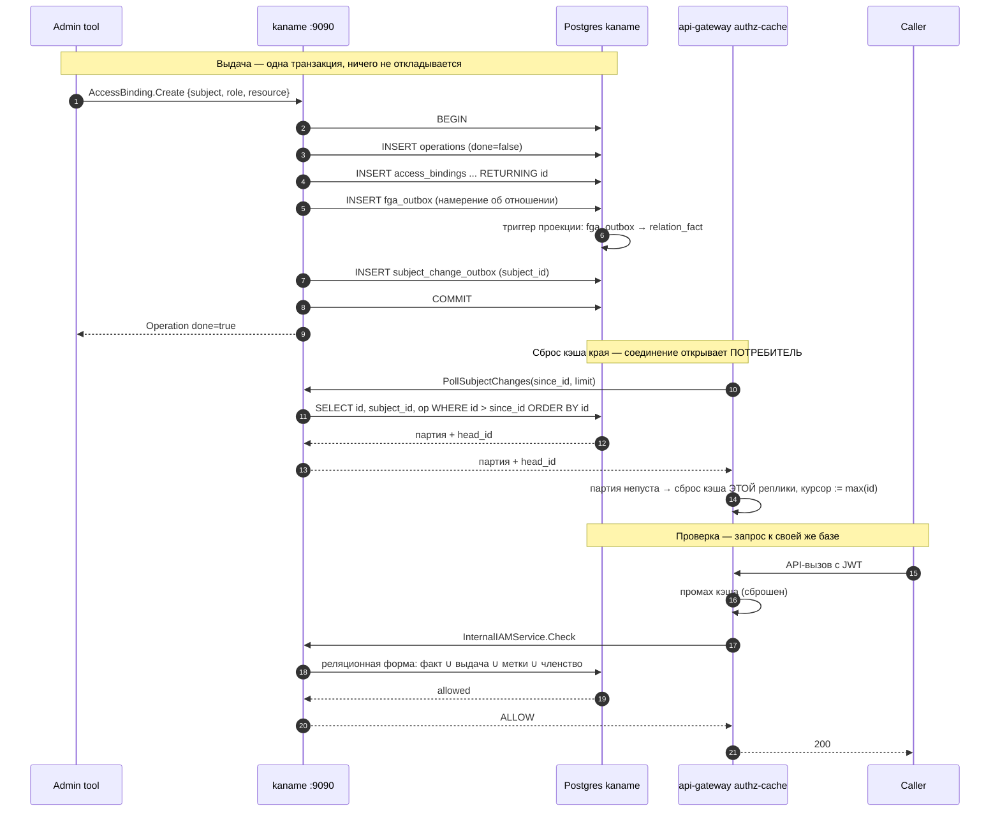

# 29. Вердикт о доступе реляционной формой + журнал намерений

## Назначение

Это самый важный сквозной поток: **как именно** `AccessBinding.Create`
превращается в `allowed=true` для последующего `Check` на затронутую область.

Решение о доступе вычисляет **реляционная форма в собственной базе `kaname`**
(`internal/repo/kaname/pg/relverdict`). Внешнего движка отношений, к которому
прежде уходил вопрос, **нет**: ни клиента, ни его хранилища, ни очереди к нему,
ни окна рассогласования между «выдача закоммичена» и «выдача действует».

> [!note] До стадии S6 здесь была другая цепь — и её тут больше нет
> Прежняя редакция описывала четырёхэтапный конвейер: запись в журнал в той же
> транзакции → дренаж журнала во внешний движок → сброс кэша края → `Check`,
> уходящий в движок. Из четырёх этапов сегодня существуют первый и третий;
> второго нет (дренажа нет — потреблять журнал наружу некому), а четвёртый
> отвечает запросом к своей базе. Бюджет задержки «выдал → действует» из-за
> этого перестал быть свойством очереди: см. §«Задержка».

## Из чего складывается вердикт

Форма отвечает на один вопрос — «может ли ЭТОТ субъект сделать ЭТОТ глагол над
ЭТИМ объектом» — и складывает ответ из **четырёх** источников. Все четыре живут
в схеме `kaname`:

| # | Источник | Таблицы |
|---|---|---|
| 1 | **прямой факт** — владение, поставленное при создании, указатель на предка, подстановочный субъект | `relation_fact` |
| 2 | **выдача роли на область** — сама область объекта либо любой её предок | `access_bindings` × `role_verb`, цепь `resource_parent_edge` |
| 3 | **выдача по меткам** — то же плюс совпадение меток объекта с селектором | `access_binding_selector` × `resource_mirror.labels` |
| 4 | **членство в группе** — субъектом выдачи бывает группа | `group_members` |

**Почему запрос, а не материализация.** Материализовать — значит хранить
произведение «субъекты × объекты». Выдача по меткам делает это произведение
комбинаторным по числу ключей меток, а смена ОДНОЙ метки заставила бы
пересчитывать доступ для всех субъектов с меточными выдачами. Здесь не хранится
ничего: предикат проверяется для того объекта, о котором спросили, поэтому смена
метки — один `UPDATE`, а не пересчёт.

**Вывод отношений берётся из модели, а не из имени.** Право читателя следует из
права редактора, право редактора — из права администратора, право администратора
аккаунта распространяется на всё внутри аккаунта. Форма, ищущая имя отношения
буквально, ответила бы «нет» держателю права, которое модель ему даёт. Поэтому
вопрос сначала компилируется в набор источников (`services/iam/internal/authzplan`, план
выводится из `fga_model.fga`), и запрос спрашивает про каждый из них.

**Одна раскладка на все четыре вопроса.** `Check` (можно ли), `ListSubjects`
(кто имеет право), `ExpandRelations` (из чего складывается) и внутреннее
перечисление доступных объектов раскладываются одной функцией и потому не могут
разойтись в том, что считают источником права. Отличается только направление
обхода: прямой вопрос идёт от объекта к источникам, обратные — от источника к
объектам и субъектам.

## Журнал намерений остался — исчез его потребитель

`kaname.fga_outbox` — **живая таблица**, и она по-прежнему принимает каждое
намерение об отношении в той же транзакции, что и сама мутация. Изменилось то,
что происходит со строкой дальше: её больше **никто не вывозит наружу**.

Вместо дренажа работает **триггер проекции**: из строки журнала складывается
прямой факт (`relation_fact`) **в той же транзакции**. Поэтому у вызывающего
«записал» и «действует» совпадают, а не разделены очередью.

**Почему схемой, а не ещё одним писателем в коде.** Производителей кортежа
много и они разной природы: use-case, реконсайлер, посев старта, сырой SQL
миграции. Писатель, добавленный в код, не покрывает SQL вовсе, а перечень «кто
ещё обязан писать факт» разошёлся бы с деревом при первой же новой миграции —
причём молча. Здесь наполнение привязано к единственному месту, через которое
проходят все четверо, — к строке журнала. Появится пятый производитель — он
попадёт в проекцию by construction, не зная о ней.

**Что в проекцию не идёт, и это не упущение.** Отношение-**глагол** (`v_*`) не
переносится: глагол форма **выводит** из выдачи (роль → тип × глагол → область).
Скопировать глагол фактом значило бы хранить копию того, что вычисляется, — и
именно в том месте, где расхождение копии с вычислением было бы не видно.

Миграции проекции: `0083_relation_fact.sql`, `0098_relation_fact_follows_the_journal.sql`,
`0100_relation_fact_reads_the_whole_grant.sql`.

## Таблицы

- `kaname.fga_outbox(id, event_type, payload, created_at)` — журнал намерений; ключ
  кортежа лежит **внутри** `payload` (jsonb), отдельных колонок `user`/`relation`/`object`
  у таблицы нет. DDL — `0001_initial.sql`. Четыре колонки, и это весь журнал: величин
  доставки (`sent_at` / `attempt_count` / `last_error`) и ключа упорядочивания
  (`tuple_key`) у него **больше нет** — они существовали ради клейма дренажа, который
  применял строки к внешнему движку прав. Движка не стало (стадия S6 эпика #747), колонки
  и частичные индексы клейма сняты миграцией 20260822160000 (задача #917), триггер ключа —
  20260823001000 (задача #1033).

  Практическое следствие ровно то же, что у соседа ниже: считать по этому журналу
  «непринятые» строки **нечем и не нужно** — потребитель у него один, триггер проекции, и
  он складывает прямой факт В ТОЙ ЖЕ транзакции, что и вставку. Право действует **с
  коммита**, а не «когда доедет»; запрос `WHERE sent_at IS NULL` отвергается базой.
- `kaname.relation_fact` — проекция журнала, из которой форма читает прямой факт.
- `kaname.subject_change_outbox(id, subject_id, op, created_at, event_type, payload)`
  — **журнал** смены субъекта, который край читает курсором по возрастанию `id`;
  DDL — `0001_initial.sql`. Шесть колонок, и это весь журнал: величин доставки у него
  **больше нет**.
  Журнал усыхал дважды, и оба раза снималось то, у чего не было ни писателя, ни читателя:
  - величины предмета (`resource_type` / `resource_id`) — их писала каждая мутация выдачи,
    а читателя не было ни одного. Сняты миграцией
    `20260829124512_subject_change_journal_drops_the_unread_scope_hint.sql` (задача #1462);
  - величины доставки (`sent_at` / `attempt_count` / `last_error` / `notified_at`) вместе
    с частичным индексом `subject_change_pending_v2_idx` по `sent_at IS NULL` — они
    остались от прежней формы (очередь с доставкой) и не двигались никем после снятия
    толчка к краю. Сняты миграцией
    `20260829181500_subject_change_journal_drops_the_delivery_columns.sql` (задача #1396).

  Практическое следствие: считать по этому журналу отставание **нечем и не нужно** —
  колонки `sent_at` нет, а запрос по ней теперь отвергается базой, а не возвращает
  весь журнал молча. Отставание живёт у читателя (см. `33-runbook.md`).
- `kaname.resource_scope_edge` — представление цепи областей (см.
  [`../architecture/scope-chain-reaches-the-root.md`](../architecture/scope-chain-reaches-the-root.md)).

`subject_change_outbox` **своего канала `NOTIFY` не несёт**: журнал читается курсором по
возрастанию `id`, и пробуждать в этой схеме некого.

> [!note] Канал у него был — и снят вместе со своим слушателем (задача #1398)
> Уведомление `kacho_iam_subject_outbox_added` (триггерная функция
> `subject_change_outbox_notify()`, `0001_initial.sql`) будило дренаж очереди, который
> дозванивался до края. Дренаж снят вместе с ребром iam → край: направление развёрнуто,
> журнал читает потребитель. После этого уведомление производилось на каждой строке и не
> потребляется никем — то есть объявление пережило свой предмет.
>
> Слушателя ему не построить ни с одной стороны: потребитель слушать не может **по
> построению** (драйвера Postgres у него нет, прямое чтение базы iam — ban #8), а внутри
> владельца прав будить нечего — у чтения курсором пробуждения не бывает. Снято миграцией
> `20260828114308_subject_change_channel_retires_with_its_drainer.sql` по образцу
> `755001` / `795001`; таблица журнала осталась целиком.

## Диаграмма — выдача и последующая проверка



## Родительский указатель собственных ресурсов iam

Промежуточный слой шлюза резолвит область запроса в пообъектный объект модели
(`iam_user:<id>`, `iam_access_binding:<id>`, …) по `scope_extractor` каталога
прав. Чтобы вывод «отношение **от аккаунта**» (соотв. «от проекта») разрешился, у
объекта обязан существовать указатель на предка:

```
iam_user:<id>            #account  @account:<account_id>
iam_access_binding:<id>  #project  @project:<project_id>
```

> [!warning] Здесь стояло «без него шлюз НИКОГДА не авторизует пообъектный
> `Get`/`Update`/`Delete`» — и это перестало быть верным вместе со снятием внешнего движка
> Указатель был ребром, пока цепь читалась из графа движка. Сегодня недостающие звенья
> **достраивает представление** `kaname.resource_scope_edge`, и берёт оно их из СХЕМЫ:
> у личности — из таблицы членств (`kacho#944`), у группы, служебной учётки и роли — из
> колонки их собственной строки, у привязки — из пары колонок области (`kacho#785`).
> То есть пообъектное чтение авторизуется и без строки указателя в журнале.
>
> Утверждение оставлено разобранным, а не стёртым: оно повторялось в трёх местах дерева
> (двух комментариях кода и здесь), и каждое читалось как действующее ограничение —
> то есть звало «починить» отсутствие указателя там, где чинить нечего. Живой ли сам
> указатель и есть ли у него читатель — отдельный предмет, `kacho#946`.

Указатель по-прежнему эмитируется на путях появления человека; чем именно
разрешается вывод «отношение **от аккаунта**» сегодня — сказано в выноске выше.

**Указатель приезжает тем же путём, что и всё остальное** — строкой журнала, из
которой триггер складывает прямой факт. Отдельного помощника для этого нет:
перечень «кто ещё обязан записать указатель» разошёлся бы с деревом на первой же
новой миграции. Для **чужих** сервисов тот же предмет закрывает
`InternalIAMService.RegisterResource` (см. [`21-internal-iam.md`](21-internal-iam.md)).

> [!note] Здесь была отдельная глава про пакет-помощник — предмета у неё нет
> До стадии S6 в этом каталоге лежала глава про помощник, которым iam якобы писал
> родительский указатель своим ресурсам. Функции, которую она описывала, **в дереве
> нет и не было** — предикат прогоняется одной командой и даёт пусто:
> `grep -rl WriteHierarchyTuple --include='*.go' .`
>
> Поучительно, чем глава была к моменту снятия: она уже несла предупреждение о том,
> что ПРЕЖНЯЯ её редакция описывала несуществующий пакет, и заменяла одну выдумку
> другой — с выдуманной сигнатурой и выдуманным перечнем вызовов. Документ,
> объявивший себя недостоверным и оставленный, занимает место работающей главы и
> отчитывается за неё. Глава снята; действительный механизм описан выше.

**Что делать оператору, если указателя нет.** Симптом — отказ в доступе владельцу
на **своём** свежем ресурсе, не проходящий сам собой (в отличие от короткого окна
сброса кэша края).

```sql
-- 1. Убедиться, что указателя нет.
SELECT * FROM kaname.relation_fact
 WHERE object_type = 'iam_user' AND object_id = '<user_id>';

-- 2. Посмотреть, дошло ли намерение до журнала.
SELECT id, event_type, payload, created_at
  FROM kaname.fga_outbox
 WHERE payload::text LIKE '%<user_id>%'
 ORDER BY id DESC LIMIT 10;
```

Строка в журнале без строки в проекции означает дефект триггера проекции —
предмет разбирается по миграции `0098_relation_fact_follows_the_journal.sql`.
Нет строки и в журнале — намерение не эмитировано, и чинить надо производителя,
а не проекцию.

## Домены отказа

**Деградация Postgres службы прав означает отказ в доступе целиком.** Запаса
«движок жив, база нет» больше нет — ни на практике, ни в принципе.

Это **признание уже наступившего, а не ухудшение**: решение и раньше требовало
этой базы. Факты каскада супер-доступа (администратор облака, бутстрап-учётка,
администратор аккаунта) читались из её строк, и на недоступной базе вердикт не
складывался и тогда — просто отказ приходил из другого места.

Взамен исчез целый компонент со своим хранилищем, своей очередью и своим окном
рассогласования: **доменов отказа стало меньше, а не больше**. Полный разбор
решения — [`../architecture/failure-domains.md`](../architecture/failure-domains.md).

## Задержка «выдал → действует»

| Участок | Цель | Худший случай |
|---|---|---|
| фиксация выдачи (вместе с проекцией факта) | < 10 мс | < 100 мс |
| сброс кэша края — реплика, обслужившая мутацию | сразу | сразу (самосброс) |
| сброс кэша края — остальные реплики | один интервал опроса (`2s`) | два интервала |
| промах кэша → вердикт формы | < 50 мс | < 500 мс |

**Материализации в этом бюджете нет.** Прямой факт складывается той же
транзакцией, что и выдача, поэтому строка «дренаж очереди» из таблицы ушла
вместе с дренажом. Оставшийся хвост — про **кэш края**, а не про видимость
права: вызов, идущий мимо кэша, видит выдачу сразу после фиксации.

Величину хвоста задаёт **интервал опроса края**
(`KACHO_API_GATEWAY_SUBJECT_CHANGE_POLL_INTERVAL`, умолчание `2s`), а не настройка iam:
iam о крае не знает и на этот срок не влияет. Прежняя редакция называла здесь `30 с` —
число описывало запасной опрос снятого дренажа и с фактическим умолчанием края
расходилось на порядок.

## Подробности реализации

### Выдача — эмиссия в той же транзакции

`access_binding/create.go` зовёт
`writerSession.AccessBindingsW().EmitRelationWrite(ctx, …)` внутри writer-tx —
это `INSERT` в `fga_outbox`, из которого триггер тут же складывает факт.
Аналогично `EmitSubjectChangeEvent()`
(`internal/repo/kaname/pg/access_binding_repo.go`) — `INSERT` в
`subject_change_outbox`.

### Вердикт — запрос

`internal/repo/kaname/pg/relverdict`: `query.go` (прямой вердикт), `list.go`
(перечисление объектов), `subjects.go` (перечисление субъектов), `expand.go`
(разбор оснований), `labelaxis.go` (меточная ветвь), `condition.go` (условия).
План вывода компилируется из модели — `services/iam/internal/authzplan`.

Дверь решения для собственных стражей `kaname` — `internal/authzcascade`:
композиционный корень выдаёт **одно** значение каждому стражу, поэтому страж не
может спросить мимо формы.

### Сброс кэша края — со стороны iam его НЕТ

iam только **дописывает** строку в `subject_change_outbox` (`EmitSubjectChangeEvent`,
`internal/repo/kaname/pg/access_binding_repo.go`) и отдаёт журнал по запросу:
`InternalIAMService.PollSubjectChanges(since_id, limit)` →
`internal/service/subject_change_service.go` → `internal/repo/kaname/pg/subject_change_repo.go`.
Ни клиента к краю, ни дренажа, ни апплаера у iam нет.

Читатель — сам край: `gateway/internal/watcher/subject_change_watcher.go` держит курсор в
памяти **своей реплики** и зовёт `PollSubjectChanges` раз в
`KACHO_API_GATEWAY_SUBJECT_CHANGE_POLL_INTERVAL` (умолчание `2s`); непустая партия ⇒ сброс
кэша этой реплики. Свежий процесс инициализирует курсор по `head_id` и историю не
переигрывает.

> [!note] Здесь стояла настройка дренажа — параметров больше нет
> Раздел перечислял размер партии, запасной опрос, число повторов, отступ и срок применения
> (`drainer.Config`), а рядом — шесть ручек `KANAME_GATEWAY_INTERNAL*` с адресом края и
> клиентским mTLS до него. Всё снято вместе с дренажом: ни одной из этих величин не
> существует. Единственная величина, задающая сходимость, живёт **у края**, а не здесь.
>
> Ручка адреса была вдобавок **обязательной**, поэтому владелец прав не поднимался там, где
> края нет вовсе, — именно это делало вынос iam отдельным продуктом невыразимым.

Отдельных переменных окружения под вердикт **нет**: сроки движка
(`KANAME_FGA_CHECK_TIMEOUT_MS`, `…_LIST_OBJECTS_…`, `…_WRITE_…`), адрес
движка и идентификаторы его хранилища сняты вместе с движком.

## Известные ограничения

- **`subject_change_outbox` не каскадит на удаление пользователя** —
  осиротевшие события сброса безвредны (сброс несуществующего субъекта — no-op).
- **Журнал читают ВСЕ реплики края, и это норма, а не гонка.** Чтение курсором не
  захватывает строк и ничего не помечает, поэтому одну и ту же строку законно видят все
  реплики: сброс кэша — событие процесса, а не кластера. Разведи опрос по одной выбранной
  реплике — кэш остальных не сбросится вовсе, то есть отозванный доступ продолжит действовать.
- **Журнал смены субъекта усекается ПО СРОКУ, а не по курсорам.** Строки не
  помечаются доставленными, поэтому «строк много» здесь **не означает** «сброс не
  доехал». Усечение по нижней границе курсоров по-прежнему невыразимо — курсоры
  живут в памяти реплик края, и iam их не видит, — поэтому уборка снимает
  **префикс по возрасту**, а читатель, чей курсор оказался ниже удержанного,
  получает явный отказ с возобновимой позицией вместо молчаливо неполной
  страницы. Величина удержания объявлена у самого читателя
  (`pkg/subjectchange`, `JournalRetention`); разбор —
  [`../architecture/journal-retention-is-a-policy.md`](../architecture/journal-retention-is-a-policy.md).
- **Журнал растёт** — строки намерений остаются как след выдачи. Наблюдать
  `count(*) FROM kaname.fga_outbox`, но «строки копятся» здесь больше **не
  означает** «право не доехало»: право доезжает фиксацией, а не вывозом строки.

## Связанные компоненты

- [`08-access-binding.md`](08-access-binding.md) — производитель намерения.
- [`19-authorize.md`](19-authorize.md) — публичный `AuthorizeService`.
- [`21-internal-iam.md`](21-internal-iam.md) — `InternalIAMService.Check` + `PollSubjectChanges`.
- [`32-observability.md`](32-observability.md) — метрики.
- [`../architecture/failure-domains.md`](../architecture/failure-domains.md) — домены отказа.

## Ссылки на код

- `internal/repo/kaname/pg/relverdict/` — реляционная форма
- `internal/authzcascade/` — дверь решения
- `services/iam/internal/authzplan/` — компиляция плана вывода из модели
- `internal/repo/kaname/pg/fga_outbox/` — эмиссия намерения
- `internal/repo/kaname/pg/creator_tuple_writer.go` — кортеж создателя строкой журнала
- `internal/clients/cache_invalidation_applier.go`
- `internal/migrations/0001_initial.sql` — DDL обеих очередей
- `internal/migrations/0098_relation_fact_follows_the_journal.sql` — триггер проекции
- `pkg/outbox/drainer/`
