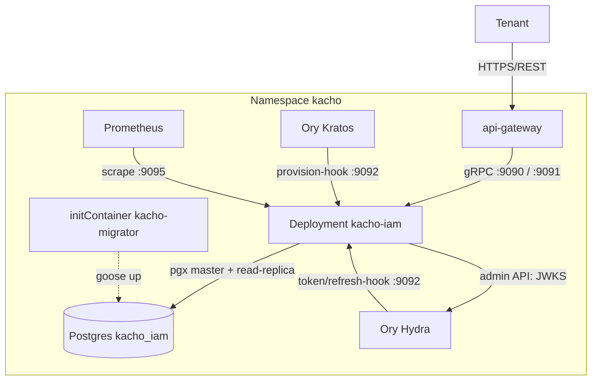
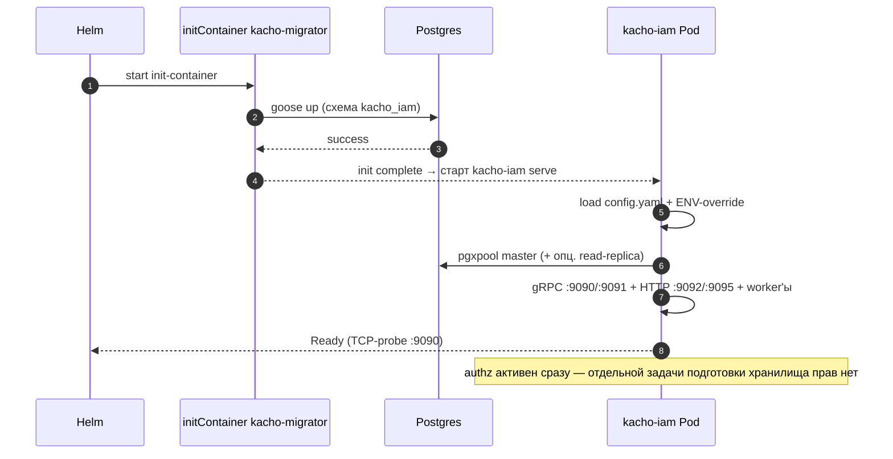

# 31. Deployment Guide

## Назначение

Гайд по развертыванию `kacho-iam`: образ и бинарники, listener-порты,
helm-chart, config + секреты, миграции и порядок запуска. Все факты сверены
с `deploy/` и `cmd/kacho-iam/`.

## Состав образа

Один контейнерный образ несет три бинарника:

| Бинарник | Назначение |
|---|---|
| `kacho-iam` | gRPC API-сервер (`serve`) — основной процесс Deployment'а |
| `kacho-migrator` | CLI миграций БД (`up`/`down`/`status`/`create`), запускается init-контейнером |

`kacho-iam` обслуживает только `serve` — миграции вынесены в отдельный
`kacho-migrator` (cmd-binary не смешивает обязанности). Попытка
`kacho-iam migrate ...` падает с подсказкой использовать `kacho-migrator`.

## Listener-порты

`kacho-iam serve` поднимает шесть независимых listener'ов:

| Порт | Протокол | Назначение | TLS |
|---|---|---|---|
| `:9090` | gRPC | публичный API (tenant-facing, через api-gateway) | per-edge TLS; обязателен в production |
| `:9091` | gRPC | cluster-internal API (`Internal*`, service→service) | `RequireAndVerifyClientCert`; обязателен в production |
| `:9092` | HTTP | webhooks Ory (Hydra `token`/`refresh`, Kratos `provision`) + `/healthz`, `/readyz` | per-edge, server-TLS опционально |
| `:9095` | HTTP | Prometheus `/metrics` | per-edge, server-TLS опционально |
| `:9096` | HTTP | docker-token (`/iam/token`) для плоскости данных реестра | server-TLS (односторонняя) |
| `:9097` | HTTP | **cluster-internal**: публикуемые наборы проверочных ключей + авторитет отзыва наших токенов | server-TLS (односторонняя), внутренний Service |

Порты конфигурируемы (`api-server.endpoint`, `api-server.internal-endpoint`,
`authn.hooks-http-endpoint`, `api-server.metrics-endpoint`); значения в таблице —
дефолты. `/metrics` живет на отдельном cluster-internal порту, а не на публичной
gRPC-поверхности — иначе утекла бы внутренняя кардинальность метрик.

### Сервисы по listener'ам

**Публичный `:9090`** (`registerPublicServices`): `OperationService`,
`AccountService`, `ProjectService`, `UserService`, `ServiceAccountService`,
`GroupService`, `RoleService`, `AccessBindingService`, `AuthorizeService`
(`Check`/`BatchCheck`/`ListSubjects`/`ExpandRelations`/`WhoAmI`), `PermissionCatalogService` (grantable `<module>.<resource>.<verb>`
taxonomy), `SAKeyService` (SA OAuth-ключи через Ory Hydra).

**Internal `:9091`** (`registerInternalServices`, только cluster-internal —
запрет #6): `InternalIAMService` (`Check` + `RegisterResource`/`UnregisterResource`
владение чужими ресурсами), `InternalClusterService`
(cluster-admin gранты — time-bombed/permanent), `InternalUserService`
(`UpsertFromIdentity`), `InternalOperationsService`,
`InternalSessionRevocationsService`. `AuthorizeService` дополнительно
регистрируется и здесь — чтобы сервисы платформы (vpc/compute/nlb) спрашивали
вердикт по уже доверенному mTLS-ребру `:9091`, не открывая отдельный публичный
коннект.

**HTTP `:9092`** (`iamhooks`): `POST /iam/v1/hooks/token`,
`POST /iam/v1/hooks/refresh` (Hydra OAuth2-хуки), `POST /iam/v1/hooks/provision`
(Kratos registration/login → `UpsertFromIdentity`), `GET /healthz` (liveness),
`GET /readyz` (readiness — ping БД + готовность LRO-worker'а).

**HTTP `:9097`** — **только cluster-internal** (выставлен на внутреннем Service,
на внешнюю поверхность не публикуется, запрет #6). Три маршрута, и у каждого свой
предмет:

| маршрут | что отдаёт | кто спрашивает |
|---|---|---|
| канонический well-known | **зеркало** публичного набора прежнего издателя, дословно | всякий, кто сегодня пиннут на прежнего издателя |
| `authn.token-signing.key-set-path` (умолчание `/.well-known/kacho/jwks.json`) | **НАША** запись: публичные половины ключей ключницы | тот, кто проверяет токен НАШЕЙ чеканки |
| `/internal/tokens/introspect` | действительность предъявленного НАШЕГО токена — суждение `active`, и только оно | поверхность приёма — на КАЖДОМ предъявлении |

**Почему записей две, а не одна объединённая.** Объединение наборов дешевле и
уничтожает ровно ту защиту, ради которой развязка «издатель → источник набора»
заводится: ключ одного издателя проверял бы токен, объявляющий другого. Каждый
принимаемый издатель имеет СВОЮ запись, и путь записи **объявляется**, а не
выводится из издателя — производный путь получался бы у всякого издателя, поэтому
состояние «записи источника нет» не наступало бы никогда, и страж старта стал бы
тождественно истинным.

**Почему авторитет отзыва живёт здесь, а не на выдаче.** Контроль, действующий на
ВЫДАЧЕ и не действующий на ПРЕДЪЯВЛЕНИИ, отзывом не является: он лишь не выдаёт
нового, а предъявленное продолжает проходить до истечения срока. Это состояние
**не сходится само** — в отличие от задержки распространения, — и потому окно
отзыва равнялось бы сроку токена, а не сроку, который выбрали мы. Спрашивают об
этом НАС: про наши токены не знает больше никто.

Форма ответа выбрана стандартной намеренно (`{"active": …}`, RFC 7662): своя форма
заставила бы переписывать каждого спрашивающего. Ответ не рассказывает, ЧЕМ токен
негоден: различение подсказывало бы предъявителю, какая половина неверна.

**Аутентификации на маршрутах публикации набора нет — и это ЗАДОКУМЕНТИРОВАННОЕ
исключение, а не пропуск.** Обоснование смотри ниже, в разделе про чеканку.

## Архитектура deployment'а

`kacho-iam` — Deployment в namespace `kacho` (одна реплика на dev-стенде,
несколько на production).



## Helm-chart

Chart лежит в `deploy/` (под-chart umbrella-релиза `kacho-umbrella` (`deploy/helm/umbrella/`)). Шаблоны:
`templates/deployment.yaml`, `templates/configmap.yaml`, `templates/service.yaml`.

```bash
helm upgrade --install iam ./deploy -n kacho --create-namespace \
  --values deploy/values.yaml \
  --values deploy/values.dev.yaml      # dev-overlay для kind-стенда
```

`deploy/values.yaml` (база):

```yaml
name: iam
replicas: 1
image: kacho-iam:dev
imagePullPolicy: IfNotPresent
ports:
  grpc: 9090
  internalGrpc: 9091
  metrics: 9095
db:
  host: kacho-umbrella-pg-iam
  port: "5432"
  user: iam
  name: kacho_iam
  passwordSecretName: kacho-umbrella-pg-iam
  passwordSecretKey: password
logger:
  level: INFO
apiServer:
  gracefulShutdown: 10s
metrics:
  enable: true
healthcheck:
  enable: true
repository:
  postgres:
    maxConns: 80
    sslMode: disable
authn:
  mode: dev
```

`templates/deployment.yaml` запускает init-контейнер `migrate`
(`kacho-migrator up`) перед основным контейнером `iam` (`kacho-iam serve`).
Pod hardened: `runAsNonRoot` (uid 65532), `readOnlyRootFilesystem`,
`drop: ["ALL"]`, `seccompProfile: RuntimeDefault`. Readiness/liveness — TCP-probe
на gRPC-порт. `Service` публикует `grpc` (9090) и `grpc-internal` (9091).

База chart'а — dev-профиль для локального kind-стенда (`authn.mode: dev`,
`sslMode: disable`, mTLS выключен). Production-деплой обязан переопределить:
`authn.mode: production` (или `production-strict`), включить server-side mTLS
обоих gRPC-listener'ов (иначе `kacho-iam` fail-fast'ит на старте и отказывается
подниматься на незащищенных `:9090`/`:9091`) и задать `sslMode: require` (или
`verify-full`).

## Config + ENV-override

`kacho-iam` читает YAML-config из `/etc/kacho-iam/config.yaml` (рендерится
`templates/configmap.yaml`). Любой ключ переопределяется ENV по схеме
`KACHO_IAM_<SECTION>__<KEY>` (двойное подчеркивание между секцией и ключом).
Отрендеренный config:

```yaml
logger:
  level: INFO

api-server:
  endpoint: "tcp://0.0.0.0:9090"
  internal-endpoint: "tcp://0.0.0.0:9091"
  metrics-endpoint: "tcp://0.0.0.0:9095"   # дефолт; через configmap не рендерится
  graceful-shutdown: "10s"

metrics:
  enable: true
healthcheck:
  enable: true

repository:
  type: POSTGRES
  postgres:
    url: "postgres://iam@kacho-umbrella-pg-iam:5432/kacho_iam"
    slave-url: ""                  # опц. read-replica; пусто → Reader-TX на master
    max-conns: 80
    ssl-mode: disable
    password-from-env: KACHO_IAM_DB_PASSWORD

authn:
  mode: dev                        # dev | production | production-strict
  domain: api.kacho.cloud
  hydra-issuer: ""                 # пусто → выводится из domain
  hook-shared-secret-env: KACHO_IAM_HOOK_TOKEN
  # Ключ ОБЁРТКИ приватной половины подписного ключа (см. ниже).
  jwks-encryption-key-hex-env: KACHO_IAM_JWKS_ENC_KEY
  hooks-http-endpoint: "tcp://0.0.0.0:9092"
  # Своя чеканка токенов. Блок рендерится ТОЛЬКО при enabled: пока чеканка
  # выключена, её настройки не требуются — страж, требующий того, чем не
  # пользуются, отказывал бы в старте без предмета.
  token-signing:
    enabled: false
    issuer: ""                                    # пусто при enabled ⇒ отказ в старте
    algorithm: ""                                 # RS256 | ES256 | EdDSA
    allowed-algorithms: ""                        # через запятую; считаются ЭЛЕМЕНТЫ
    key-set-path: "/.well-known/kacho/jwks.json"  # путь НАШЕЙ записи набора
    key-lifetime: "2160h"                         # срок ключа ключницы
```

`authn.mode` безопасен по умолчанию (`production` в дефолтах кода —
anonymous fail-closed); dev-стенд явно опускает его до `dev` через
`values.dev.yaml`. DSN автоматически дополняется `sslmode=<mode>` и
`options=-c search_path=kacho_iam,public`.

### Секреты и env-переменные

Секреты не кладутся в YAML/ConfigMap — только через `secretKeyRef` и
`password-from-env`-мост:

| ENV | Назначение |
|---|---|
| `KACHO_IAM_DB_PASSWORD` | пароль Postgres (`password-from-env`) |
| `KACHO_IAM_HOOK_TOKEN` | shared secret HMAC для Ory-webhooks |
| `KACHO_IAM_JWKS_ENC_KEY` | 32-байтный ключ (hex) ОБЁРТКИ приватной половины подписного ключа в ключнице (смысл ручки сменился, имя — нет; см. ниже) |
| `KACHO_IAM_HYDRA_ADMIN_TOKEN` | Bearer для Hydra admin API (опц.) |
| `KACHO_IAM_BOOTSTRAP_ROOT_EMAIL` | если задан — bootstrap-admin reconciler выдает `system_admin@cluster` этому юзеру (опц.) |

> [!note] До стадии S6 здесь стояли четыре переменные внешнего движка прав
> `KACHO_IAM_OPENFGA_ENDPOINT`, `KACHO_IAM_OPENFGA_STORE_ID`,
> `KACHO_IAM_OPENFGA_MODEL_ID`, `KACHO_IAM_AUTHZ_PROVIDER` и три срока
> (`KACHO_IAM_FGA_CHECK_TIMEOUT_MS`, `…_LIST_OBJECTS_…`, `…_WRITE_…`). Ни у одной
> не осталось читателя: движок снят вместе со своим клиентом. Выставлять их не
> нужно и бессмысленно — процесс их не читает.

Вердикт о доступе складывается **той же базой**, что и остальное состояние службы,
и настраивается общими `KACHO_IAM_DB_*`. Отдельного бэкенда авторизации нет.

## Внешние зависимости

- **Postgres** (`kacho_iam`) — master-pool обязателен; read-replica (`slave-url`)
  опциональна (CQRS Reader-TX, иначе fallback на master).
- **Ory Kratos** — identity-provider; `provision`-хук создает/активирует
  Account/Project/AccessBinding для нового identity (`UpsertFromIdentity`).
- **Ory Hydra** — OAuth2/OIDC; `token`/`refresh`-хуки обогащают claims и проверяют
  ревокации; admin API публикует ротируемые JWKS.

## In-process worker'ы

`kacho-iam serve` поднимает фоновые задачи параллельно с listener'ами; падение
критичной задачи триггерит graceful-shutdown всего пода:

- **LRO worker** (`operations`-таблица из corelib) — async-исполнение мутаций +
  orphan-reconciler, добивающий осиротевшие `done=false` операции умершего процесса.
- **bootstrap-admin reconciler** — повторяет выдачу `system_admin@cluster`, пока
  user-mirror не появится (best-effort, non-fatal; no-op без env).
- **resource-scoped AccessBinding reconciler** — membership label-selector'ов +
  containment + истечение TTL-грантов.

> [!note] Дренажа сброса кэша края здесь больше нет
> В перечне стоял worker, вычитывавший `subject_change_outbox` и звавший край на его
> internal-порту. Снят вместе с ребром: журнал остаётся, но читает его **сам край**
> (`InternalIAMService.PollSubjectChanges`, курсор). iam своих потребителей не знает и
> ни одного исходящего вызова к ним не делает — он лист графа рёбер.

## Миграции

Миграции исполняет отдельный `kacho-migrator` (init-контейнер
`templates/deployment.yaml`), а не основной бинарник. Схема — `kacho_iam`,
набор goose-миграций (`internal/migrations/0001_initial.sql` и далее по
возрастанию).

```bash
# Применить до latest.
kacho-migrator up

# Статус (applied / pending).
kacho-migrator status

# Откат на одну версию назад.
kacho-migrator down

# Источник DSN: --dsn > ENV KACHO_MIGRATOR_DSN > viper-config kacho-iam.
KACHO_IAM_DB_PASSWORD=secret kacho-migrator up
```

## Своя чеканка токенов: ключница, ротация, публикация, отзыв

**Платформа чеканит свои токены сама** (задача #897). Прежняя редакция этого
раздела утверждала обратное — «iam не чеканит токены и не верифицирует их своим
ключом» — и была верна ровно до этой фазы; здесь она заменена, а не дополнена,
чтобы не осталось двух мест об одном предмете.

Что при этом **не** изменилось: подпись RFC 7523 `client_assertion` по-прежнему
делается **предъявленным** SA-ключом (либо env-ключом OAuth-клиента) и к ключнице
не сводится. Основание — не владелец ключа, а **адресат и то, кто диктует форму**:
утверждение адресовано третьей стороне под её же регистрацией, и алгоритм,
адресата и идентификатор ключа выбирает она. Подписант чеканки производит НАШ
токен для НАШИХ поверхностей, где все три величины выбираем мы. Общей делается
**политика** (закрытый словарь алгоритмов, запрет подписи-пустышки, форма
заголовка, требование `kid`), а не подписывающая функция.

### Что настраивается

Блок `authn.token-signing` (значения чарта — `config.authn.tokenSigning.*`):

| настройка | значение | пусто при включённой чеканке |
|---|---|---|
| `enabled` | включена ли своя чеканка | — |
| `issuer` | НАШ издатель; попадает в каждый токен и в привязку «издатель → источник набора» | **отказ в старте**: «не сужаем» означало бы, что токен любого происхождения принимается как наш |
| `algorithm` | алгоритм, закрепляемый за порождаемым ключом 1:1 | **отказ в старте**; умолчания у подписи нет — оно было бы решением за оператора |
| `allowed-algorithms` | перечень допустимых алгоритмов ПРИЁМА, через запятую | **отказ в старте**: пустой перечень означает «любой», и на нём же держится сверка «алгоритм токена равен алгоритму ключа» |
| `key-set-path` | путь НАШЕЙ записи публикуемого набора | **отказ в старте** вместо вывода пути из издателя |
| `key-lifetime` | срок ключа ключницы | берётся умолчание |

Страж считает **элементы** перечня, а не длину строки: одинокая запятая непуста
по длине и пуста по существу. Алгоритм чеканки обязан входить в перечень приёма —
иначе мы выпускали бы то, что сами же отвергаем.

Асимметрия, из которой это выведено: слишком строгая настройка даёт **отказ в
старте** — видимый сразу, с именем настройки в тексте; слишком слабая даёт
принимаемый чужой токен, не видимый никогда.

### Ключ обёртки: смысл сменился, имя — нет

`KACHO_IAM_JWKS_ENC_KEY` (`authn.jwks-encryption-key-hex-env`) остаётся
обязательным в production-режиме, и теперь у него **есть потребитель, причём
единственный**: им оборачивается приватная половина подписного ключа в ключнице.
Приватная половина ложится в базу, класть её открытым текстом нельзя — значит ключ
обёртки нужен по существу.

Прежде эта ручка описывалась как не имеющая потребителя вовсе: она шифровала
строки хранилища, приватную половину которого не читал обратно никто. Хранилище
снято миграцией; ручка сохранена.

#### Ключ обёртки ОБЯЗАН пережить пересоздание стенда (задача #1062)

Тем, что этой ручкой обёрнуто, распоряжается ровно она: смена значения делает
**все уже записанные приватные половины нечитаемыми навсегда** — пути
переобёртывания нет. Отказ при этом был бы **тихим**: служба поднималась,
набор ключей отвечал, а ключница, не найдя подписывающего, заводила новый —
то есть «пересоздали стенд» и «потеряли все подписи» выглядели одинаково.

Теперь сервис доказывает обратное **при старте**: ключница читается ПЕРВОЙ, и
предъявленный ключ обязан развернуть каждый ключ публикуемого набора. Не
разворачивает — **отказ в старте** с именем ручки и перечнем неоткрывшихся
ключей, и ни одной новой строки не заводится:

```
подписывающий ключ: ручка authn.jwks-encryption-key-hex (ENV KACHO_IAM_JWKS_ENC_KEY)
не открывает уже записанные подписные ключи. Служба ОТКАЗЫВАЕТСЯ стартовать: …
Верните прежнее значение ручки: signingkeys: the wrapping key does not open the
stored signing keys: 1 of 1 keys in the key set do not open (kacho-…)
```

Стенд, который не поднимается после смены секрета, сообщает ровно это: прежнее
значение — единственное, чем набор открывается. Восстановление — вернуть его;
пустая ключница (свежая база) поднимается любым ключом, потому что открывать
нечего.

Посев локального стенда `deploy/scripts/dev-prod-secrets.sh` порождает ключ
**однажды** и дальше переиспользует; дисциплину держит гейт
`deploy/tests/helm/secret-material-survives-recreation-test.sh` (он же называет
числом, что не судит).

**Имя намеренно НЕ переименовано.** Переименование стоило бы правки **каждого**
профиля развёртывания и дало бы окно, в котором старое имя молча игнорируется:
профиль, задавший прежнее имя, выглядел бы настроенным, а процесс читал бы пустоту.
Сменился смысл — он записан здесь, в godoc самой ручки и в значениях чарта.

**Второй ручки об этом предмете не заводится.** Две ручки об одном предмете дают
ту, что неизбежно окажется необязательной. Форма совпадает: страж уже требовал
ровно 32 байта, то есть размер ключа симметричного шифра, которым обёртка и
делается.

Изменилось и то, ЧТО перестаёт работать при отсутствии ключа: не «ничего» (как
было, пока читателя не существовало), а чеканка токенов.

#### Ручка принимает ПЕРЕЧЕНЬ: первый оборачивает, все открывают

У секрета обязан быть путь смены — утёк, скомпрометирован носитель, сменился
владелец, истёк срок политики. Одно значение такого пути не даёт **вовсе**: новое
не открывает ни одной уже записанной приватной половины, и вернуть их нечем;
значит ключ, однажды выбранный, не менялся бы никогда (задача #1065).

Поэтому значение ручки — перечень через запятую, читаемый **общим** предикатом
перечней настройки (`ParseCommaList`, считаются элементы, а не длина строки):
первый ключ делает **каждую** новую обёртку, все годятся для снятия. Перечень из
одного — сегодняшнее значение всякого профиля, и ни один из них не меняется.

Смена — это правка значения, а не миграция: новый ключ ставится первым, прежний
остаётся в перечне, хранилище не трогается, окна не требуется. Дальше хранилище
переезжает на новый ключ **само**, по мере того как ключница порождает ключи по
своему сроку (`tokenSigning.keyLifetime`) и снимает выведенные после отсрочки.

Повтор одного значения в перечне **отвергается**: он означает смену, которой не
было, и делал бы печатаемое при старте число ключей неверным.

Чего перечень **не** даёт, и это названо прямо:

- **вывода ключа.** Утёкший ключ открывает написанное им, пока в наборе есть хоть
  одна строка, обёрнутая им; снять его из перечня раньше — потерять эти подписные
  ключи. «Замещён» и «выведен» — разные вещи, и путь есть только у первого.
  Второй — переобёртывание уже записанного, со своим окном и своим решением о
  срыве на середине;
- **признака, что хвост перечня пора снимать.** Хранилище переехало не раньше, чем
  каждый ключ, бывший в наборе на момент смены, выведен И снят: один
  `keyLifetime` плюс отсрочка снятия. Никто этого пока не измеряет.

Перечень поэтому только растёт, пока его не укоротят намеренно, — и число
названных ключей печатается при **каждом** старте (`private-half wrapping keys
declared keys=N`), чтобы рост был виден снаружи, а не обнаруживался при разборе.

Порядок смены для оператора и то, что происходит при смене значения внешним
источником, — README чарта `kacho-iam`, раздел «Changing the wrapping key».

### Ротация: порядок, который обязан соблюдаться

Ротация живёт **внутри службы**; отдельного задания для неё нет и не заводится.
Состояний у ключа пять, и «скомпрометирован» существует **отдельно** от «выведен»:
первое снимает ключ из набора немедленно, принимая отказ живых токенов, второе —
нет. Глагол, делающий и то и другое, лишил бы оператора одного из двух решений.

- «Подписывает ровно один» — **инвариант базы** (частичный уникальный индекс), а
  не проверка в коде: программная последовательность «прочитать → убедиться →
  записать» под конкуренцией даёт двух подписывающих, и это состояние ничем не
  отличимо от исправного, пока кто-нибудь не спросит.
- Порядок «в наборе → подписывает» верен **по построению**: публикуемый набор есть
  ПРОЕКЦИЯ ключницы, поэтому состояния «ключ подписывает, а в наборе его нет» не
  существует — его не допускает схема.
- **Обратная ошибка тихая, и она главная.** Снять ключ, пока живы подписанные им
  токены, — отказ наступит не сразу: у каждого потребителя кэш набора отвечает
  «да» ещё некоторое время. Проявится это у разных потребителей в разное время и
  уже без связи с действием. Поэтому отсрочка снятия **вычисляется** из срока
  выпускаемого токена и потолка кэша набора у потребителя, а не выбирается.

### Публикация набора и почему маршрут остаётся внутренним

Наборы публикуются на cluster-internal `:9097` (маршруты — в разделе про
listener-порты выше). Публикация идёт **целиком либо никак**: набор с пропущенным
ключом отвергает живые токены, ничем себя не выдавая.

**Аутентификации на этих маршрутах нет, и это задокументированное исключение из
«authN на каждом слушателе».** Обоснование **переписано этой фазой**: прежде оно
опиралось на то, что публикуется **чужое зеркало** — чужой публичный документ, за
содержимое которого мы не отвечаем. Теперь по тем же маршрутам едут и **наши**
ключи, и обоснованием служит другое, более прямое: на проводе **только публичный
материал проверки подписи**, а поверхность **внутренняя**. Ни секретов, ни данных
арендатора, ни инфраструктурных подробностей там нет — приватная половина типом,
которым ключ публикуется, **не выражается**.

Маршрут **остаётся** cluster-internal. Вынести набор наружу значит пересмотреть это
обоснование, а не «поменять адрес», — такое решение принимается отдельно и
владельцем, со своей приёмкой. При этом фаза не делает внешнюю выставленность
невозможной: документ, который отдаёт публикатор, стандартен по форме, чтобы
будущее решение было решением о поверхности, а не переписыванием публикатора.

### Что снято и не возвращается

Прежнее хранилище подписных ключей снято миграцией; вместе с ним — задание
ротации (оно к тому же звало подкоманду, которой в бинаре нет, и падало в 100%
запусков), репозиторий ключей, доменный тип и методы публикации ключа у
admin-клиента провайдера. Причина снятия — определяющая и для порядка работ этой
фазы: **приватную половину не читал обратно никто**, а запись в хранилище
удавалась, поэтому оно выглядело исправным всю свою жизнь. Отсюда порядок фазы,
обратный привычному: сперва проба «прочитанный ключ подписывает», и только под неё
схема.

Ключница задачи #897 названа **иначе** намеренно: совпадение имён сделало бы стража
ведомости дропов красным справедливо — он увидел бы воскресшую таблицу, которую сам
же считает снятой.

RPC отчёта о состоянии JWKS **снят с контракта целиком** — и объявление тоже. Он
сообщал содержимое снятой таблицы, после чего мог отвечать только пустым набором —
навсегда; вызывающих у него не было ни одного. На его месте в контракте стоит
комментарий, объясняющий снятие.

Резервировать при этом было нечего: protobuf знает `reserved` только для номеров и
имён **полей**, но не для методов сервиса и не для имён сообщений верхнего уровня.
От повторного занятия имени защищает `buf breaking` и объявление ломающего
изменения в сообщении коммита — не запись в схеме.


## Порядок запуска



## Smoke-проверки

```bash
# 1. Pod готов.
kubectl -n kacho rollout status deployment/iam --timeout=60s

# 2. Liveness / readiness на hooks-порту.
kubectl -n kacho exec deploy/iam -- wget -qO- http://localhost:9092/healthz
kubectl -n kacho exec deploy/iam -- wget -qO- http://localhost:9092/readyz

# 3. gRPC reflection публичного API (через api-gateway).
kubectl -n kacho port-forward svc/api-gateway 18080:8080 &
grpcurl -plaintext localhost:18080 list | grep kacho.cloud.iam.v1

# 4. Bootstrap-юзер через UpsertFromIdentity (internal-порт).
kubectl -n kacho port-forward svc/iam 9091:9091 &
grpcurl -plaintext -d '{"external_id":"bootstrap-admin","email":"admin@kacho.cloud","display_name":"bootstrap"}' \
  localhost:9091 kacho.cloud.iam.v1.InternalUserService/UpsertFromIdentity
```

## Связанные компоненты

- [`32-observability.md`](32-observability.md) — метрики (`:9095`), логи, алерты.
- [`33-runbook.md`](33-runbook.md) — реакция на инциденты.
- `deploy/` — helm-chart (`values.yaml`, `templates/`).

## Ссылки на код

- `cmd/kacho-iam/{main,serve,wiring,env,grpc_register,hooks_mux}.go`
- `cmd/migrator/main.go`
- `internal/apps/kacho/config/`
- `internal/migrations/0001_initial.sql`
- `deploy/Chart.yaml`, `deploy/values.yaml`, `deploy/templates/`
- `Dockerfile`, `Makefile`
